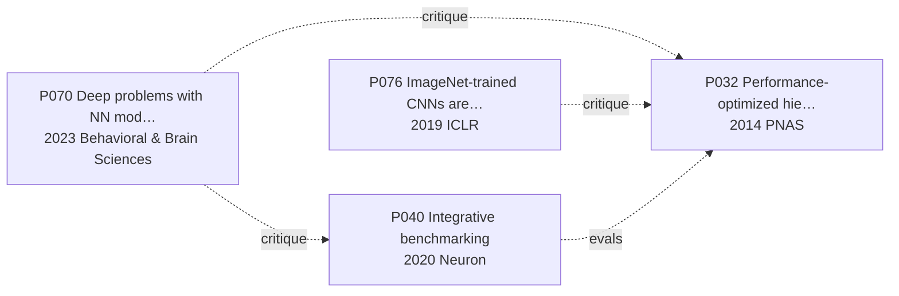

```mermaid
graph LR
  P032["P032 Performance-optimized hie…<br/>2014 PNAS"]
  P040["P040 Integrative benchmarking<br/>2020 Neuron"]
  P070["P070 Deep problems with NN mod…<br/>2023 Behavioral & Brain Sciences"]
  P076["P076 ImageNet-trained CNNs are…<br/>2019 ICLR"]
  P070 -.->|critique| P032
  P070 -.->|critique| P040
  P076 -.->|critique| P032
  P040 -.->|evals| P032
```
