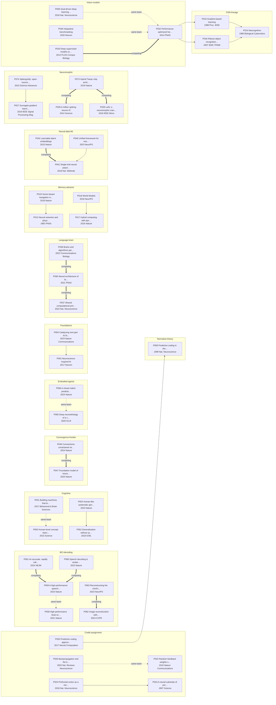

```mermaid
graph LR
  subgraph BCI_decoding["BCI-decoding"]
    P058["P058 High-performance brain-to…<br/>2021 Nature"]
    P059["P059 A high-performance speech…<br/>2023 Nature"]
    P060["P060 Speech decoding & avatar…<br/>2023 Nature"]
    P061["P061 An accurate, rapidly cali…<br/>2024 NEJM"]
    P062["P062 Image reconstruction with…<br/>2023 CVPR"]
    P063["P063 Reconstructing the mind's…<br/>2023 NeurIPS"]
  end
  subgraph CNN_lineage["CNN-lineage"]
    P014["P014 Neocognitron<br/>1980 Biological Cybernetics"]
    P015["P015 Gradient-based learning<br/>1998 Proc. IEEE"]
    P016["P016 Robust object recognition…<br/>2007 IEEE TPAMI"]
  end
  subgraph Cognitive["Cognitive"]
    P050["P050 Human-level concept learn…<br/>2015 Science"]
    P051["P051 Building machines that le…<br/>2017 Behavioral & Brain Sciences"]
    P052["P052 Generalization without sy…<br/>2018 ICML"]
    P053["P053 Human-like systematic gen…<br/>2023 Nature"]
  end
  subgraph Convergence_frontier["Convergence-frontier"]
    P046["P046 Connectome-constrained ne…<br/>2024 Nature"]
    P047["P047 Foundation model of neura…<br/>2025 Nature"]
  end
  subgraph Credit_assignment["Credit-assignment"]
    P020["P020 Predictive coding approxi…<br/>2017 Neural Computation"]
    P022["P022 Random feedback weights s…<br/>2016 Nature Communications"]
    P023["P023 A neural substrate of pre…<br/>1997 Science"]
    P024["P024 Prefrontal cortex as a me…<br/>2018 Nat. Neuroscience"]
    P026["P026 Backpropagation and the b…<br/>2020 Nat. Reviews Neuroscience"]
  end
  subgraph Embodied_agents["Embodied-agents"]
    P065["P065 Deep neuroethology of a v…<br/>2020 ICLR"]
    P066["P066 A virtual rodent predicts…<br/>2024 Nature"]
  end
  subgraph Foundations["Foundations"]
    P002["P002 Neuroscience-Inspired AI<br/>2017 Neuron"]
    P004["P004 Catalyzing next-gen AI th…<br/>2023 Nature Communications"]
  end
  subgraph Language_brain["Language-brain"]
    P036["P036 Neural architecture of la…<br/>2021 PNAS"]
    P037["P037 Shared computational prin…<br/>2022 Nat. Neuroscience"]
    P038["P038 Brains and algorithms par…<br/>2022 Communications Biology"]
  end
  subgraph Memory_attractor["Memory-attractor"]
    P013["P013 Neural networks and physi…<br/>1982 PNAS"]
    P017["P017 Hybrid computing with dyn…<br/>2016 Nature"]
    P018["P018 World Models<br/>2018 NeurIPS"]
    P019["P019 Vector-based navigation w…<br/>2018 Nature"]
  end
  subgraph Neural_data_ML["Neural-data-ML"]
    P041["P041 Single-trial neural popul…<br/>2018 Nat. Methods"]
    P042["P042 Learnable latent embeddings<br/>2023 Nature"]
    P045["P045 Unified framework for neu…<br/>2023 NeurIPS"]
  end
  subgraph Neuromorphic["Neuromorphic"]
    P027["P027 Surrogate gradient learni…<br/>2019 IEEE Signal Processing Mag."]
    P028["P028 Loihi: a neuromorphic man…<br/>2018 IEEE Micro"]
    P029["P029 A million spiking-neuron IC<br/>2014 Science"]
    P073["P073 Hybrid Tianjic chip archi…<br/>2019 Nature"]
    P074["P074 SpikingJelly: open-source…<br/>2023 Science Advances"]
  end
  subgraph Normative_theory["Normative-theory"]
    P008["P008 Predictive coding in the…<br/>1999 Nat. Neuroscience"]
  end
  subgraph Vision_models["Vision-models"]
    P006["P006 Goal-driven deep learning…<br/>2016 Nat. Neuroscience"]
    P032["P032 Performance-optimized hie…<br/>2014 PNAS"]
    P033["P033 Deep supervised models ex…<br/>2014 PLOS Comput. Biology"]
    P040["P040 Integrative benchmarking<br/>2020 Neuron"]
  end
  P015 --> P014
  P016 --> P014
  P032 --> P015
  P032 --> P016
  P006 -.->|same-team| P032
  P040 -.->|same-team| P032
  P033 ==>|competing| P032
  P024 --> P023
  P020 --> P008
  P026 -.->|same-team| P022
  P019 --> P013
  P018 --> P017
  P051 -.->|same-team| P050
  P053 --> P052
  P042 ==>|competing| P041
  P045 --> P041
  P059 -.->|same-team| P058
  P061 ==>|competing| P059
  P060 ==>|competing| P059
  P063 ==>|competing| P062
  P066 -.->|same-team| P065
  P074 --> P027
  P073 ==>|competing| P029
  P073 ==>|competing| P028
  P036 ==>|competing| P037
  P038 ==>|competing| P036
  P046 ==>|competing| P047
  P004 --> P002
```
