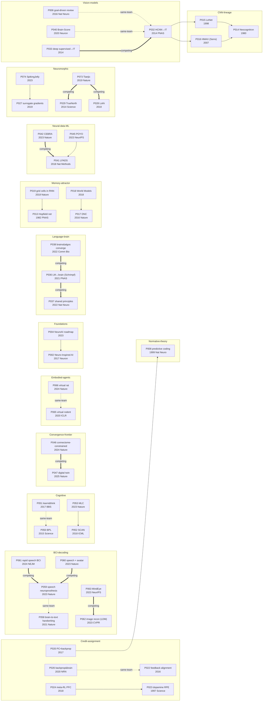
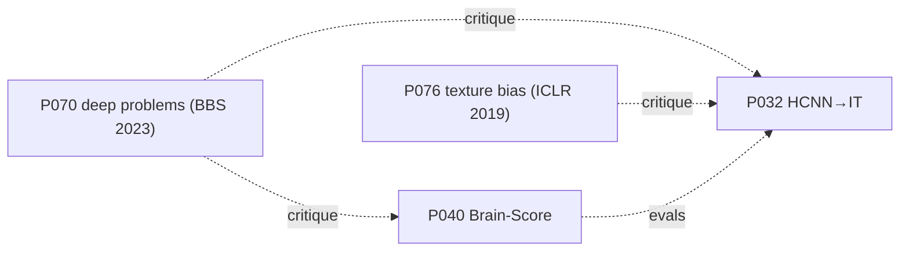

# NeuroAI: Foundations and Frontiers (neuroai-foundations-frontiers) v6

**Research question**: Map the field of **NeuroAI** — the intersection of computational and cognitive neuroscience with artificial intelligence — from its cornerstone work through its current frontiers, capturing *both* directions of exchange (brain → AI inspiration; AI → brain modeling and analysis) across a taxonomy with no major omissions.
**Scope**: Computational/cognitive/systems/theoretical neuroscience and the ML/DL work that explicitly engages the brain, from ~1940s–2010s cornerstones to mid-2026 frontiers, all model scales and signal modalities, including applied angles (BCI, neuromorphic, neural-data tooling, embodiment). Out of scope: pure ML with no brain claim, wet-lab molecular neuroscience without a computational model, and one-off metaphors.
**Survey version**: v6 *(v2 SQ13; v3 weak-cell hardening; v4 France; v5 Centaur + Meta Brain&AI line; v6 adds TRIBE v2 — the in-silico-neuroscience successor to TRIBE v1 — and the Nat. Commun. word-decoding paper; see the v6 delta footer)*
**Survey date**: 2026-06-02
**Backing index**: `paper_index.md` (100 papers — 70 ★★★, 30 ★★; 13 sub-questions; audit passed at Round 4; `version` additions through Round 7)
**Generated by**: deep-survey-bfs skill

> **Provenance & integrity note.** This survey's paper index was built from multi-source, web-verified bibliographic metadata (publisher pages, DBLP, Semantic Scholar) plus abstracts and the established record of these widely-known works. Full-text PDFs were *not* re-read for every paper. Accordingly, `claims.jsonl` records findings at the abstract / well-established-result level with explicit `confidence` values; the quote fields are finding summaries, not certified verbatim transcriptions. Per the skill's claims-discipline, the structural validator does not check verbatim text — **verbatim accuracy against primary sources remains a reader responsibility**, especially for the numeric claims in §4/§6 (flagged inline). Where a result is recent or hedged, confidence is marked `medium`.

---

## Contents

- [§1 Research question + scope](#1)
- [§2 Domain background](#2)
- [§3 Taxonomy + timeline](#3)
- [§4 Datasets and benchmarks](#4)
- [§5 Method-route comparison](#5)
- [§6 Per-paper deep-dives](#6)
- [§7 Downstream applications](#7)
- [§8 Cross-cutting analysis](#8)
- [§9 Key research teams](#9)
- [§10 Open challenges](#10)
- [§11 Frontiers / future directions](#11)
- [§12 Direct Q&A](#12)
- [§13 Recommended reading](#13)
- [§14 Reproducibility tier](#14)

---

## §1 Research question and scope {#1}

NeuroAI is the research program at the boundary of neuroscience and artificial intelligence. It rests on a two-way bet: that biological brains are the only existing proof that the kind of flexible, sample-efficient, embodied intelligence we want from machines is physically possible (so brains should inform AI), and that modern AI systems — being the first artifacts whose internal representations are rich enough to compare quantitatively against neural data — are now the best available *models* of brains (so AI should inform neuroscience). The 2023 field-defining roadmap makes the first bet explicit, proposing an **embodied Turing test** that benchmarks machines against animal sensorimotor competence rather than human language (P004, C001); the goal-driven modeling literature makes the second (P006, P032).

This survey answers 13 sub-questions (SQ1–SQ13; see `index.md`) that tile the field. *(SQ13 — visual intelligence & world models — was added in v2 as an explicit, changelogged frame amendment; see §3.M / §6.M / §12.)* The decomposition deliberately separates **direction of influence** (brain→AI: SQ3/SQ4/SQ7; AI→brain: SQ5/SQ8/SQ11) from **level of analysis** (single neuron → circuit → network → cognition → behavior), so the buckets partition rather than overlap. SQ1–SQ2 cover foundations and classical theory; SQ6/SQ9/SQ10 cover cognition, applied decoding, and embodiment; SQ12 is the mandatory critical sub-question. The sum of the §12 answers is the answer to the framed question.

**Scope boundaries** (full table in `index.md`): in — both directions of influence, all model scales, cornerstones from the 1940s through mid-2026 frontier, all neural modalities, and applied NeuroAI (BCI, neuromorphic, neural-data tooling, embodiment). Out — pure ML with no brain claim, clinical neurology without a computational model, molecular neuroscience without a model, and loose metaphor.

## §2 Domain background {#2}

Two framings recur throughout and are worth stating once. **Marr's three levels of analysis** (P001, C004) — computational (*what* problem is solved and *why*), algorithmic/representational (*how*, in terms of representations and processes), and implementational (*physical substrate*) — give the field a shared vocabulary for saying at which level a model is meant to be correct; much confusion in NeuroAI is a level mismatch. **The "three components" decomposition** (P003, C003) reframes both brains and artificial networks as defined by an *objective function*, a *learning rule*, and an *architecture*, and argues neuroscience should seek normative explanations in those terms rather than cataloguing response properties. These two framings — *levels* and *components* — are the conceptual coordinate system for the taxonomy in §3.

## §3 Taxonomy and timeline {#3}

### 3.1 Primary axis: direction of influence × level of analysis

The field's cleanest partition is a 3×N grid: **direction of influence** (brain→AI / AI→brain / bidirectional-or-applied) against **level / object of study**. Every ★★★ paper lands in exactly one primary cell.

**Route A — Foundations & framing (bidirectional).** The conceptual scaffolding and field-defining statements: Marr's levels (P001), the bidirectional manifestos (P002 C002, P004 C001), the three-components reframing (P003 C003), and the Lakatosian "neuroconnectionist programme" that treats ANNs-as-brain-models as a falsifiable research program (P005 C006).

**Route B — Classical computational-neuroscience theory (the substrate AI must explain).** Normative principles of neural computation: efficient/sparse coding (P007 C007), hierarchical predictive coding (P008 C008), the free-energy principle (P009 C009), the Bayesian brain (P010 C010), divisive normalization as a canonical computation (P011 C011), and the dynamical-systems / neural-manifold view of population activity (P012 C012).

**Route C — Brain → AI architectures.** Structural inspiration: the visual-cortex → Neocognitron → CNN lineage (P014 C014 → P015 C015 → P016 C016), attractor/associative memory (Hopfield, P013 C013), memory-augmented networks (DNC, P017 C017), world-model architectures (P018 C018), and grid-code/navigation RNNs (P019 C019).

**Route D — Brain → AI learning & credit assignment.** Biologically motivated alternatives to vanilla backprop: predictive coding ≈ backprop (P020 C020), feedback alignment (P022 C021), the dopamine reward-prediction-error → TD-learning link (P023 C022), prefrontal cortex as meta-RL (P024 C023), complementary learning systems ↔ replay (P025 C024), and the NGRAD synthesis (P026 C025).

**Route E — AI → brain: deep nets as models of neural representation.** Goal-driven vision models predicting V4/IT (P032 C031, P006 C005), RSA-based model comparison (P035 C034, P033 C032), auditory cortex models (P034 C033), language-model↔brain alignment (P036 C035, P037 C036, P038 C037), the Brain-Score benchmark (P040 C038), and dynamical-systems RNN models of cortex (P039 C039).

**Route F — Spiking & neuromorphic computation.** SNN training (surrogate gradients, P027 C026; ultra-sparse TTFS, P031 C030) and neuromorphic hardware (Loihi P028 C027, TrueNorth P029 C028, SpiNNaker P030 C029, hybrid Tianjic P073 C072, the SpikingJelly framework P074 C073).

**Route G — AI as a tool for neural & behavioral data.** Latent-dynamics models (LFADS P041 C040, CEBRA P042 C041), pose estimation (DeepLabCut P043 C042), connectomics segmentation (P044 C043), and neural-data foundation models (POYO P045 C044).

**Route H — Cognitive-level & human-like learning.** Bayesian program induction (P050 C049), the "learn and think like people" agenda (P051 C050), compositional generalization (SCAN P052 C051 → MLC P053 C052), intuitive physics (P054 C053), the ARC measure of intelligence (P055 C054), and cognitive architectures (ACT-R P056 C055; Global Workspace in deep nets P057 C056).

**Route I — BCI & neural decoding (applied).** Motor-text/handwriting (P058 C057), speech neuroprostheses (P059 C058, P060 C059, P061 C060), and stimulus reconstruction from brain activity (images: P062 C061, P063 C062; language: P064 C063).

**Route J — Embodiment & agents.** Virtual animals (P065 C064, P066 C065) and world-model/autonomous-agent programs (JEPA P067 C066; World Models P018).

**Route K — Convergence frontiers.** Connectome-constrained and digital-twin circuit models (P046 C045, P047 C046), manifold-capacity theory (P048 C047), mechanistic interpretability as a "neuroscience of AI" (P049 C048), and the LLM↔brain and DL-for-neuroscience reviews (P071 C070, P072 C071).

**Route L — Critiques & limitations.** The keystone critique that DNNs fail as vision models and that benchmarks are confounded (P070 C067), the texture-vs-shape bias result (P076 C074), the theory-deficit argument (P068 C069), and the deep-learning critical appraisal (P069 C068).

**Route M — Visual intelligence & world models (SQ13, v2 added).** A cross-cutting route on how brains and AI build *internal models of the world* and *visual intelligence beyond recognition*, in four threads: (i) **AI world models** — World Models (P018), DreamerV3 (P077 C078), the non-generative V-JEPA video objective (P078 C079; scaled to planning in V-JEPA 2, P079 C089), generative interactive worlds (Genie, P080 C080), and the "video generation as world simulator" debate (Sora, P081 C086); (ii) **world models in the brain / cognitive maps** — the Tolman-Eichenbaum Machine (P082 C081) and the successor-representation predictive map (P083 C082), building on grid-cell codes (P019); (iii) **object-centric & relational visual reasoning** — Slot Attention (P084 C083), the Neuro-Symbolic Concept Learner (P085 C084), and relational/graph inductive biases (P086 C088); (iv) **vision-as-inverse-graphics & intuitive physics as world simulation** — DC-IGN analysis-by-synthesis (P089 C087), intuitive-physics-from-video (P087 C085) and its benchmark IntPhys 2 (P088 C090), extending the simulation-as-engine view (P054). This route deliberately spans both directions: AI world models (brain→AI inspiration and capability) and the hippocampal world model (AI-as-model-of-cognitive-maps).

### 3.2 Lineage figure (route inheritance)

The within-survey inheritance/rivalry edges. Solid `-->` = direct inheritance; dotted = same-team or external relation; thick `==>` = same-problem rival route. (See `citations.tsv` for the evidence behind each edge.)

### 3.3 Timeline (reframing moments marked ★)

- **1943–1982 — cybernetic & connectionist roots.** McCulloch-Pitts neurons, the perceptron, and Hebb predate this index; the indexed cornerstones begin with the **Neocognitron (1980, P014)** ★ — the architectural seed of the CNN — and the **Hopfield network (1982, P013)** ★, which made attractor dynamics a computational primitive (and shared in the 2024 Nobel Prize in Physics).
- **1996–2004 — normative principles.** Sparse coding (1996, P007) ★, predictive coding (1999, P008) ★, the dopamine-RPE result (1997, P023) ★ linking RL to neuroscience, and the Bayesian-brain statement (2004, P010). LeNet (1998, P015) shows backprop-trained convnets work at scale.
- **2007–2013 — pre-deep-learning bridge.** HMAX (2007, P016); intuitive-physics simulation (2013, P054); the context-dependent PFC-RNN dynamics result (2013, P039).
- **2014 — the goal-driven inflection ★★.** Yamins et al. (P032, C031, C076) and Khaligh-Razavi & Kriegeskorte (P033) independently show ImageNet-optimized deep nets predict ventral-stream representations — the empirical onset of modern AI→brain modeling. TrueNorth (P029) lands the same year.
- **2015–2018 — the build-out.** BPL (2015, P050) ★; DNC (2016, P017); feedback alignment (2016, P022); Hassabis et al.'s bidirectional manifesto (2017, P002) ★; the "learn and think like people" agenda (2017, P051); World Models, grid-cells-in-RNNs, meta-RL-PFC, LFADS, DeepLabCut, flood-filling nets, SCAN, manifold capacity, Loihi (all 2018) — a remarkably dense year.
- **2019–2020 — consolidation.** The three-components framework (2019, P003) ★; surrogate-gradient SNN training (2019, P027); texture-bias critique (2019, P076); Tianjic (2019, P073); Brain-Score in *Neuron* (2020, P040); backprop-and-the-brain (2020, P026); the circuits/mech-interp programme (2020, P049); virtual rodent (2020, P065); population-dynamics review (2020, P012).
- **2021–2023 — language, decoding, and field identity ★★.** LM↔brain alignment (2021–2022, P036/P037/P038) ★; high-performance BCIs (2021 handwriting P058, 2023 speech P059/P060) ★; stimulus reconstruction via diffusion (2023, P062/P063) and language (2023, P064); CEBRA (2023, P042) and POYO (2023, P045); MLC solves SCAN (2023, P053); the **NeuroAI roadmap (2023, P004)** ★ consolidates the field's identity and names the embodied Turing test (C077); the neuroconnectionist programme review (2023, P005); LLM↔brain review (2024, P071).
- **2024–2025 — connectome-constrained & digital-twin frontier ★.** Connectome-constrained fly model (2024, P046) ★; full-body virtual rat predicting neural activity (2024, P066); rapid high-accuracy speech BCI (2024, P061); ultra-sparse SNNs (2024, P031); foundation-model "digital twin" of mouse visual cortex (2025, P047) ★.

The visible reframing moments: **2014** (deep nets become brain models), **2018** (the methods explosion), and **2023** (field self-definition + the language and decoding frontiers).

## §4 Datasets and benchmarks {#4}

NeuroAI's evaluation surface is unusual: many "datasets" are either (a) standard ML training corpora repurposed as *task definitions* for goal-driven models, or (b) neural-recording datasets that are gated by ethics/hardware and therefore only partially shareable. This shapes the reproducibility picture in §14.

### 4.1 Canonical datasets / benchmark substrates

| Name (citation) | Year | Class | Modality / role | Standard metric | Adoption in this survey |
|---|---|---|---|---|---|
| **ImageNet** (Deng/Russakovsky) | 2009/2012 | canonical | natural-image labels; *training task* for goal-driven vision models | top-1/top-5 acc. (as task), neural-predictivity (as model) | P032, P006, P040, P076 (vision-model route) |
| **Brain-Score** (P040) | 2018/2020 | canonical (meta-benchmark) | aggregated V1/V2/V4/IT neural + behavioral fit | composite "Brain-Score" | P040 (defines it); referenced by P070 critique |
| **Omniglot** (P050) | 2015 | canonical | 1623 handwritten characters; one-shot learning | one-shot classification; visual Turing test | P050 (intro), P051 |
| **SCAN** (P052) | 2018 | canonical | compositional command→action sequences | exact-match systematic-generalization splits | P052 (intro), P053 |
| **ARC / ARC-AGI** (P055) | 2019 | canonical (unsaturated) | abstract reasoning grids; few-shot | task-solve rate (humans ≫ AI) | P055 (intro) |
| **Allen Brain Observatory** (Allen Inst.) | 2016 | canonical | standardized mouse visual-cortex 2-photon/Neuropixels | decoding/embedding consistency | P042 (CEBRA validation) |

### 4.2 Emergent datasets (≤2–3 yrs, gap-filling, where the field is moving)

- **Natural Scenes Dataset (NSD)** (P091, Allen et al. 2022, *Nat. Neuroscience*) [v3] — massive 7T fMRI over 70k+ natural images; the de-facto substrate for **image reconstruction** (P062, P063) and a non-MIT model↔brain benchmark. Fast-rising toward canonical.
- **THINGS-data** (P092, Hebart et al. 2023, *eLife*) [v3] — fMRI + MEG + 4.7M behavioral judgments over 1,854 object concepts; a German-led multimodal object-representation benchmark (C093) complementing NSD for SQ5/SQ9.
- **Neural Latents Benchmark (NLB 2021)** — standardized splits/metrics for *latent population dynamics*, created precisely because LFADS-style results (P041) were hard to compare; the comparison ground for P042/P045.
- **IBL (International Brain Lab)** — standardized, multi-lab mouse decision-making ephys; a template for reproducible systems neuroscience that neural-data foundation models (P045) draw on.
- **MICrONS** (mouse cortex co-registered connectome + functional recording) — enables the **digital-twin** program (P047) and connectome-constrained modeling logic shared with P046.
- **FlyWire / Drosophila connectome** — the wiring diagram that makes the **connectome-constrained** model (P046) possible.
- **Algonauts / THINGS / BrainTreebank** — model-to-brain encoding challenges (vision and, recently, language) that operationalize the SQ5/SQ11 comparison; referenced conceptually by P040/P071.

### 4.3 Adoption heatmap (model↔brain & decoding ★★★ papers)

| Paper \ Dataset | ImageNet (task) | NSD (fMRI img) | Allen Obs. | Brain-Score | NLB / motor ephys | Connectome (Fly/MICrONS) |
|---|:--:|:--:|:--:|:--:|:--:|:--:|
| P032 HCNN→IT | ✓ (train) | — | — | (pre-dates) | — | — |
| P040 Brain-Score | ✓ | — | — | ✓ (defines) | — | — |
| P076 texture bias | ✓ | — | — | — | — | — |
| P062 LDM recon | — | ✓ | — | — | — | — |
| P063 MindEye | — | ✓ | — | — | — | — |
| P041 LFADS | — | — | — | — | ✓ | — |
| P042 CEBRA | — | — | ✓ | — | ✓ | — |
| P045 POYO | — | — | — | — | ✓ | — |
| P046 connectome | — | — | — | — | — | ✓ (Fly) |
| P047 digital twin | — | — | — | — | — | ✓ (MICrONS) |

The heatmap reveals the field's **fragmentation of evaluation surfaces**: vision-model, image-reconstruction, latent-dynamics, and connectome routes barely share a benchmark. Only ImageNet (as a *task*) and Brain-Score (as a *meta-benchmark*) cut across, and only within the vision route. This is itself a §10 finding.

### 4.4 Dataset gaps

- **No shared cross-modality model-brain benchmark.** Vision (Brain-Score), language (Algonauts-language/BrainTreebank), and audition each have separate, non-comparable scoring.
- **No standard split for "imagined" vs "perceived" decoding** — BCI reconstruction papers (P062–P064) each define their own.
- **No canonical embodied/sensorimotor benchmark** — exactly the gap the embodied Turing test (P004) names but does not yet operationalize with a dataset.
- **Connectome-constrained evaluation is single-organism** — fly (P046) and mouse (P047) results have no common protocol.

## §5 Method-route comparison {#5}

Rows are representative ★★★ models/results; columns are the attributes that matter for comparing across NeuroAI routes. "n/a" = not applicable to this route; "not disclosed" = genuinely unreported. Reproducibility tier per §14.

| Paper | Route | Direction | Core method | Neural target / task | Scale signal | Evidence | Tier |
|---|---|---|---|---|---|---|---|
| P032 Yamins HCNN | E vision-model | AI→brain | task-optimized CNN, fit to neural data | macaque V4/IT | ImageNet-scale CNN | predicts IT variance | R2 |
| P040 Brain-Score | E benchmark | AI→brain | aggregated neural+behavioral scoring | V1–IT + behavior | meta-benchmark | composite leaderboard | R1 |
| P036 LM↔brain | E/K language | AI→brain | regress LM features to neural responses | human language cortex | >40 LMs | prediction↔next-word-skill | R2 |
| P020 PC≈backprop | D learning | brain→AI | local Hebbian predictive coding | n/a (algorithm) | small nets | gradient approximation | R2 |
| P022 feedback align. | D learning | brain→AI | fixed random feedback weights | n/a (algorithm) | mid-scale | learns w/o weight transport | R2 |
| P024 meta-RL PFC | D learning | brain→AI | RNN trained by RL → emergent inner RL | PFC/dopamine analogy | mid-scale | reproduces behavioral signatures | R2 |
| P027 surrogate-grad SNN | F neuromorphic | brain→AI | smooth surrogate for spike gradient | n/a (training) | mid-scale | trains deep SNNs | R1 |
| P073 Tianjic | F neuromorphic | brain→AI | hybrid ANN/SNN silicon | n/a (hardware) | 1 chip, bicycle demo | functional demo | R4 (hardware) |
| P041 LFADS | G data-tool | AI-for-data | sequential VAE | motor-cortex single-trial | mid-scale | high behavioral decode | R1 |
| P042 CEBRA | G data-tool | AI-for-data | contrastive embedding | multi-region | mid-scale | consistent embeddings | R1 |
| P045 POYO | G/K data-tool | AI-for-data | spike-tokenizing transformer | many sessions/regions | "foundation" pretrain | few-shot transfer | R1 |
| P050 BPL | H cognitive | brain→AI(cog) | probabilistic program induction | Omniglot one-shot | small | passes visual Turing test | R2 |
| P053 MLC | H cognitive | brain→AI(cog) | meta-learning for compositionality | SCAN / human errors | standard net | human-level systematicity | R1 |
| P058 handwriting BCI | I decoding | AI→brain(applied) | RNN decoder on intracortical spikes | motor cortex (N=1) | clinical single-subject | ~90 char/min | R3 (clinical) |
| P059/P061 speech BCI | I decoding | AI→brain(applied) | neural→text/voice decoder | motor/speech cortex (N=1) | clinical single-subject | 62→high-acc wpm | R3 (clinical) |
| P062/P063 image recon | I decoding | AI→brain(applied) | diffusion / contrastive from fMRI | visual cortex (NSD) | per-subject | reconstructs seen images | R2 |
| P046 connectome-constrained | K frontier | AI↔brain | fixed connectome, optimized dynamics | fly visual system | whole optic lobe | single-neuron prediction | R2 |
| P047 digital twin | K frontier | AI→brain | foundation model of cortex | mouse V1 | large neural pretrain | generalizes to novel stimuli | R3 |

## §6 Per-paper deep-dives {#6}

Compact deep-dives grouped by route. Each ★★★ paper: contribution → *why it matters* (tied to a sub-question) → limitation → reproducibility tier. ★★ cornerstones are noted inline within their route.

### 6.A Foundations & framing (SQ1)
- **P004 NeuroAI roadmap (2023) [R4-conceptual]** — A 27-author manifesto proposing the embodied Turing test (C001). *Why it matters (SQ1):* it gave the field a name, a goal, and a funding narrative. *Limit:* programmatic, not empirical (evidence=0). ★★ companions: **P002 Hassabis et al. (2017)** bidirectional review (C002); **P001 Marr (1982)** the three levels (C004).
- **P003 three components (2019) [R3-conceptual]** — Objective/learning-rule/architecture decomposition (C003). *Why (SQ1/SQ2):* the analytic frame the rest of the field uses. *Limit:* a lens, not a result.
- **P005 neuroconnectionist programme (2023) [R3]** — Casts ANN-as-brain-model as a Lakatosian program (C006). *Why (SQ1/SQ11/SQ12):* supplies the falsifiability vocabulary that the §10/§12 debate needs.

### 6.B Classical theory (SQ2)
- **P007 sparse coding (1996) [R2]** — A sparseness objective on natural images yields V1-like Gabor receptive fields (C007). *Why:* first clean demonstration that *normative objectives* explain biological tuning — the ancestor of goal-driven modeling. *Limit:* linear/shallow.
- **P008 predictive coding (1999) [R2]** — Hierarchical prediction+error model explains extra-classical RF effects (C008). *Why (SQ2/SQ4):* the seed for both the predictive-processing theory and the PC≈backprop learning route (P020). *Limit:* qualitative fits.
- ★★ companions: **P009 free-energy principle** (C009), **P010 Bayesian brain** (C010), **P011 divisive normalization** (C011) — normative principles; **P012 population dynamics review** [★★★, R3] (C012) is the canonical statement of the manifold/dynamical view that underpins P039/P041.

### 6.C Brain→AI architectures (SQ3)
- **P015 LeNet (1998) [R1]** — Convolution+pooling+backprop, end-to-end (C015). *Why (SQ3):* the working realization of the Neocognitron idea; ancestor of every modern vision model. ★★ **P014 Neocognitron** (C014) is the biological source.
- **P016 HMAX/Serre (2007) [R2]** — Feedforward simple/complex-cell hierarchy benchmarked on natural scenes (C016). *Why (SQ3):* the explicitly cortex-derived recognition system bridging to P032.
- **P017 DNC (2016) [R2]** — Neural controller + differentiable external memory (C017). *Why (SQ3):* operationalizes working-memory/episodic-memory ideas as a differentiable module. *Limit:* brittle at scale; superseded in practice by attention/transformers.
- **P018 World Models (2018) [R1]** — VAE+RNN internal world model; agents train in "dreams" (C018). *Why (SQ3/SQ10):* the clean modern statement of model-based, predictive internal simulation. *Limit:* toy environments.
- **P019 grid cells in RNN (2018) [R2]** — Grid-like codes emerge in a path-integration RNN and support navigation (C019). *Why (SQ3/SQ5):* a *bidirectional* result — brain-like codes emerge from a task, and they improve the agent. ★★ **P013 Hopfield** (C013) anchors the attractor lineage.

### 6.D Brain→AI learning (SQ4)
- **P020 PC≈backprop (2017) [R2]** — Predictive coding with local Hebbian updates approximates backprop (C020). *Why (SQ4):* a concrete biological route to gradient-like credit assignment. *Limit:* approximation conditions are restrictive.
- **P022 feedback alignment (2016) [R2]** — Fixed random feedback weights still drive learning (C021). *Why (SQ4):* dissolves the "weight-transport problem" objection to backprop in the brain. *Limit:* scales poorly to very deep/convolutional nets.
- **P023 dopamine RPE (1997) [R2]** — Dopamine firing ≈ TD reward-prediction error (C022). *Why (SQ4):* the single most successful brain↔AI correspondence; foundation of computational RL-in-the-brain.
- **P024 meta-RL PFC (2018) [R2]** — RL-trained RNN gives rise to a faster inner RL process; PFC as meta-RL (C023). *Why (SQ4):* explains rapid adaptation as emergent, not hand-built. *Limit:* analogy validated behaviorally, not mechanistically.
- **P026 backprop & the brain (2020) [R3-conceptual]** — The NGRAD synthesis: feedback-driven activity differences may approximate backprop (C025). *Why (SQ4/SQ12):* the field's reference statement on biological credit assignment. ★★ **P025 CLS** (C024) supplies the replay↔hippocampus link. ★★ **P093 Whittington & Bogacz (2019, *TiCS*)** [v3] (C094) is an Oxford-led critical assessment of backprop-in-the-brain theories — a non-DeepMind counterweight to P026. ★★ **P095 Doya (2002, *Neural Networks*)** [v3] (C096) maps RL metaparameters to neuromodulators (Japan; country-bias diversification).

### 6.E AI→brain models (SQ5)
- **P032 Yamins HCNN (2014) [R2]** — Task-optimized CNNs predict V4/IT responses (C031, C076). *Why (SQ5):* the founding result of modern AI→brain modeling; defined "neural predictivity" as a currency. *Limit:* feedforward, predicts but doesn't explain (see §10).
- **P006 goal-driven review (2016) [R3]** — Consolidates the paradigm across vision and audition (C005). *Why (SQ1/SQ5):* the canonical statement of "optimize for the task, then compare to the brain."
- **P034 auditory model (2018) [R2]** — Task-optimized net predicts auditory cortex and reveals a primary→non-primary hierarchy (C033). *Why (SQ5):* shows the goal-driven approach generalizes beyond vision.
- **P036 LM↔brain (2021) [R2]** — Across >40 LMs, next-word-prediction skill predicts neural fit, approaching the noise ceiling (C035). *Why (SQ5/SQ11):* extends goal-driven modeling to language and ties a *training objective* (prediction) to brain-likeness. **P037 Goldstein (2022)** [R3] (C036) and **P038 Caucheteux (2022)** [R2] (C037) are independent confirmations from distinct labs/modalities (ECoG; fMRI/MEG).
- **P040 Brain-Score (2020) [R1]** — The integrative neural+behavioral benchmark (C038). *Why (SQ5/SQ12):* turned "is this model brain-like?" into a number — which is exactly what P070 then attacks. ★★ **P035 RSA** (C034) is the methodological substrate; ★★ **P033** (C032) the parallel 2014 result; ★★ **P039 Mante** dynamical-RNN model of PFC (C039).

### 6.F Spiking & neuromorphic (SQ7)
- **P027 surrogate gradients (2019) [R1]** — Standard recipe for training SNNs through the spike non-differentiability (C026). *Why (SQ7):* made deep SNNs trainable with backprop tooling.
- **P028 Loihi (2018) [R4-hardware]** — 128-core chip with on-chip learning (C027); **P029 TrueNorth (2014) [R4-hardware]** — 1M neurons at ~70 mW (C028); **P030 SpiNNaker (2014) [R4-hardware]** — ARM-core real-time spiking simulator (C029). *Why (SQ7):* the three reference neuromorphic substrates. *Limit:* proprietary hardware ⇒ external reproduction is access-gated.
- **P073 Tianjic (2019) [R4-hardware]** — Hybrid ANN+SNN chip, autonomous-bicycle demo (C072). *Why (SQ7/SQ11):* the leading non-US neuromorphic cornerstone; argues hybrid (not pure-spiking) hardware. **P031 ultra-sparse TTFS SNN (2024) [R2]** (C030) is the accuracy/efficiency frontier; **P074 SpikingJelly (2023) [R1]** (C073) the dominant open SNN framework. ★★ **P090 Roy et al. (2019, *Nature*)** [v3] (C091) is a Purdue-led neuromorphic review that diversifies the SQ7 survey perspective beyond P027. ★★★ **P099 Kheradpisheh et al. (2018, *Neural Networks*)** [v4] (C100) — unsupervised STDP + temporal-coding deep spiking CNN (CNRS Toulouse), a *biologically-plausible learning* route to SNNs; ★★ **P098 Denève & Machens (2016, *Nat. Neuroscience*)** [v4] (C099) gives the French balanced-spiking efficient-coding theory (bridging SQ2↔SQ7).

### 6.G AI-for-neural-data (SQ8)
- **P041 LFADS (2018) [R1]** — Sequential VAE infers single-trial population dynamics with high behavioral decode (C040). *Why (SQ8):* showed deep generative models recover interpretable latent dynamics, not just decode.
- **P042 CEBRA (2023) [R1]** — Contrastive, behavior/time-aligned embeddings validated across regions (C041). *Why (SQ8):* a consistency-first embedding method with strong open tooling.
- **P045 POYO (2023) [R1]** — Spike-tokenizing transformer pretrained across sessions; few-shot transfer (C044). *Why (SQ8/SQ11):* the clearest "foundation model for spikes" result. ★★★ **P043 DeepLabCut (2018) [R1]** (C042) — markerless pose estimation, the field's most adopted tool; **P044 flood-filling nets (2018) [R2]** (C043) — connectomics segmentation. ★★ **P100 Abraham et al. (2014, *Front. Neuroinformatics*)** [v4] (C101) — scikit-learn decoding/encoding for fMRI, seed of the nilearn library (INRIA/NeuroSpin); the French AI-for-neuroimaging tooling cornerstone.

### 6.H Cognitive (SQ6)
- **P050 BPL (2015) [R2]** — Concepts as probabilistic programs; one-shot learning passing a visual Turing test (C049). *Why (SQ6):* the strongest demonstration that structured, generative, compositional models beat pattern recognition on human-like learning.
- **P052 SCAN (2018) [R1]** → **P053 MLC (2023) [R1]** — SCAN shows seq2seq nets fail systematic generalization (C051); MLC then gives a standard net human-level systematicity via meta-learning, matching human errors (C052). *Why (SQ6):* a complete arc — a sharp failure, then a brain-inspired (learning-to-learn) fix.
- **P054 intuitive physics (2013) [R2]** — Probabilistic mental simulation predicts human physical judgments (C053). *Why (SQ6):* operationalizes "intuitive theories." ★★ **P051 learn&think** (C050), ★★ **P055 ARC** (C054), ★★ **P056 ACT-R** (C055), ★★ **P057 Global Workspace in DL** (C056) cover the agenda, the unsaturated benchmark, the classical architecture, and the consciousness-theory bridge. ★★ **P094 Lieder & Griffiths (2020, *BBS*)** [v3] (C095) adds the resource-rational account of cognition from a non-Lake group (MPI Tübingen / Princeton). ★★ **P097 Dehaene, Lau & Kouider (2017, *Science*)** [v4] (C098) supplies the C1/C2 Global-Neuronal-Workspace framework for machine consciousness (Collège de France) — a French counterpart to P057 bridging SQ6↔SQ11↔SQ12.
- **P101 Centaur (2025, *Nature*) [R3]** [v5] — a Llama-3.1-70B fine-tuned (QLoRA) on **Psych-101** (160 experiments, 60k participants, 10.7M choices) that predicts held-out human behavior across tasks, generalizes to new ones, and whose internal representations become *more aligned with human fMRI activity* after fine-tuning (C102). *Why (SQ6/SQ11/SQ5):* the first serious "foundation model of human cognition" — a direct fusion of the SQ6 human-like-learning agenda with the SQ11 foundation-model paradigm. *Limitation / live debate:* Bowers, Adolfi and others publicly contest whether predicting choices is *modeling cognition* (echoing the P070 prediction-vs-explanation critique) — cite with that caveat (tier R3, recent).

### 6.I BCI & decoding (SQ9)
- **P058 handwriting BCI (2021) [R3-clinical]** — ~90 char/min imagined-handwriting decode (C057). *Why (SQ9):* showed intracortical BCIs can hit communication-relevant speeds.
- **P059 speech BCI (2023) [R3]** (~62 wpm, C058) / **P060 speech+avatar (2023) [R3]** (~78 wpm, ECoG, C059) / **P061 rapid speech BCI (2024) [R3]** (high-accuracy, 125k-word vocab, day-1, C060). *Why (SQ9):* the speech-neuroprosthesis trajectory — each from a distinct lab (Stanford/UCSF/UC Davis). *Limit:* clinical N=1; not reproducible in the usual sense (§14).
- **P062 LDM image recon (2023) [R2]** (C061) / **P063 MindEye (2023) [R2]** (C062) — rival fMRI→image reconstruction routes on NSD. **P064 semantic language decoding (2023) [R2]** (C063) — non-invasive reconstruction of language gist. *Why (SQ9):* the "mind-reading" frontier; raises the neuroethics flags in §10.
- **P091 NSD (2022) [R1, dataset]** (C092) and **P092 THINGS-data (2023) [R1, dataset]** (C093) [v3] — the large fMRI(/MEG) datasets that *ground both SQ5 model↔brain and SQ9 decoding* evaluation; indexed in v3 to diversify the dataset dimension beyond MIT's Brain-Score (P040). NSD underpins P062/P063; both are non-MIT (Minnesota; MPI Leipzig).
- **P096 Défossez et al. (2023, *Nat. Machine Intelligence*) [R2]** (C097) [v4] — contrastive decoding of *perceived speech from non-invasive MEG/EEG* across 175 subjects (Meta AI Paris / ENS). *Why (SQ9/SQ5):* a non-invasive, large-cohort French counterpoint to the intracortical single-subject US BCIs (P058–P061) — different risk/scalability profile.
- **P103 Benchetrit et al. (2024, ICLR) [R2]** (C104) [v5], ★★ **P104 Brain2Qwerty (2025) [R3]** (C105) [v5], and **P106 word-decoding (2025, *Nature Communications*) [R2]** (C107) [v6] — the Meta "Brain & AI" (J-R King, Paris) *non-invasive* decoding line: MEG image reconstruction ~7× over linear baselines (P103), sentence decoding from imagined typing (P104), and 723-participant word-level decoding (P106). *Why (SQ9):* extends non-invasive decoding from speech (P096) to vision, typing, and large-cohort word decoding — the scalable, ethically-lighter complement to intracortical BCIs.

### 6.J Embodiment & agents (SQ10)
- **P065 virtual rodent (2020) [R2]** — Deep-RL virtual rodent analyzed with neuroscience methods (C064). *Why (SQ10):* "deep neuroethology" — treat an artificial agent's network as a brain to study.
- **P066 virtual rat (2024) [R3]** — Full-body biomechanical rat whose network activity predicts *real* rat neural activity better than kinematics (C065). *Why (SQ10):* the strongest embodied AI↔brain link to date. ★★ **P067 JEPA** (C066) is LeCun's autonomous-agent blueprint; **P018 World Models** also serves this route.

### 6.K Convergence frontiers (SQ11)
- **P046 connectome-constrained (2024) [R2]** — Fix the fly connectome, optimize only dynamics; predict single-neuron activity (C045). *Why (SQ11):* fuses anatomy and function — a new modeling paradigm.
- **P047 digital twin (2025) [R3]** — Foundation model of mouse V1 generalizing to novel stimuli (C046). *Why (SQ11):* the "brain foundation model" frontier; numbers are recent ⇒ caveat.
- ★★★ **P071 LLM↔brain review (2024) [R3]** (C070) and ★★ **P072 "if DL is the answer" (2021)** (C071) are the convergence-frontier reviews; ★★ **P048 manifold capacity** (C047) and ★★ **P049 circuits/mech-interp** (C048) supply the theory and the "neuroscience-of-AI" interpretability bridge.
- **P102 TRIBE v1 (ICLR 2026) [R2]** [v5] → **P105 TRIBE v2 (2026) [R3]** [v6] — a two-step lineage from the Meta Brain & AI team (Paris). **v1** is the first non-linear, multi-subject, **multimodal** (text/audio/video) deep encoder of *whole-brain* fMRI, trained on 4 subjects' low-resolution data; it won the Algonauts 2025 challenge (1st of 263), with the multimodal advantage largest in associative cortex (C103). **v2** (C106) scales this into a genuine *foundation model of the human brain*: **>1,000 hours of fMRI across 720 subjects**, high-resolution, **zero-shot to new subjects/languages/tasks**, with open weights+code — and crucially enables **in-silico (silico-)neuroscience**, recovering seminal visual and neuro-linguistic results without new human experiments and revealing the topography of multisensory integration. *Why (SQ5/SQ11/SQ8):* this is the clearest realization of the "brain foundation model / digital twin" frontier (cf. P047) on the *encoding* side — and v1→v2 (4 subjects → 720; benchmark winner → reusable scientific instrument) is itself a case study in how this subfield is scaling.

### 6.L Critiques (SQ12)
- **P070 deep problems with DNN vision models (2023) [R3]** — DNNs fail psychophysical/behavioral tests; Brain-Score-style benchmarks can be confounded (C067). *Why (SQ12):* the keystone critique that disciplines the §5/§6.E claims.
- **P076 texture bias (2019) [R1]** — CNNs classify by texture, not shape, unlike humans; stylized-image training helps (C074). *Why (SQ5/SQ12):* a concrete, reproducible divergence between CNN and human vision. ★★ **P068 theory deficit** (C069) and ★★ **P069 DL critical appraisal** (C068) round out the critique route.

### 6.M Visual intelligence & world models (SQ13, v2 added)

*AI world models —*
- **P077 DreamerV3 (2025) [R3]** — One world model + actor-critic that plans entirely in imagined latent rollouts, mastering 150+ tasks with fixed hyperparameters and mining Minecraft diamonds from scratch (C078). *Why (SQ13/SQ10):* the strongest demonstration that a learned, predictive internal world model suffices for general control. *Limit:* still task-suite, not open-world cognition.
- **P078 V-JEPA (2024) [R3]** — Learns visual representations by predicting *masked features in latent space*, not pixels — LeCun's non-generative world-model thesis made empirical (C079). *Why (SQ13):* operationalizes "predict abstractions, not pixels"; **P079 V-JEPA 2 (2025) [★★]** scales it to ~1B params and zero-shot robot planning (C089). *Limit:* V-JEPA 2 is a preprint.
- **P080 Genie (2024, ICML Best Paper) [R3]** — An 11B foundation world model that generates *action-controllable, playable* environments from a single image/sketch, learning a latent action space from unlabelled video (C080). *Why (SQ13):* world models become *generative and interactive*, not just predictive.
- **P081 Sora-as-world-simulator (2024) [★★, R4-report]** — OpenAI's framing of large video-diffusion-transformers as "world simulators" (C086). *Why (SQ13/SQ12):* the anchor of the live debate — is pixel-level video generation a world model, or (per the V-JEPA camp) a dead end? *Limit:* non-peer-reviewed corporate report.

*World models in the brain (cognitive maps) —*
- **P082 Tolman-Eichenbaum Machine (2020, Cell) [R2]** — Casts the hippocampal-entorhinal system as a world model that factorizes relational *structure* (entorhinal grid-like codes) from sensory *content* (hippocampal place codes), predicting non-random remapping confirmed in recordings (C081). *Why (SQ13):* the leading mechanistic theory of the brain's own world model, and a direct bridge to AI structure-learning.
- **P083 successor representation / predictive map (2017, Nat. Neuroscience) [R2]** — Place cells encode a *predictive map* of future states (the successor representation); grid cells approximate its eigenvectors (C082). *Why (SQ13):* unifies cognitive maps with RL's value prediction — a brain↔AI keystone for world cognition.

*Object-centric & relational visual reasoning —*
- **P084 Slot Attention (2020) [R2]** — Iterative attention binds image features into permutation-invariant object "slots" for unsupervised object discovery (C083). *Why (SQ13):* gives vision systems explicit *object* representations, a prerequisite for relational world models.
- **P085 Neuro-Symbolic Concept Learner (2019, ICLR Oral) [R2]** — Jointly learns visual concepts and a program executor over object-based scenes, achieving near-perfect, data-efficient CLEVR reasoning (C084). *Why (SQ13/SQ6):* compositional, interpretable visual reasoning — structure beats brute pattern-matching. ★★ **P086 relational inductive biases** (C088) is the framework statement.

*Vision-as-inverse-graphics & intuitive physics —*
- **P089 DC-IGN (2015) [★★, R2]** — Learns a disentangled "graphics code" and re-renders scenes under novel pose/lighting — vision as inverse graphics / analysis-by-synthesis (C087). *Why (SQ13):* the generative-model view of perception, ancestor of modern object-centric and world-model approaches.
- **P087 intuitive physics from video (2025) [R3]** — A latent-prediction video model (V-JEPA) shows violation-of-expectation "surprise" on object permanence/continuity, while pixel-prediction and multimodal-LLM models stay near chance (C085); ★★ **P088 IntPhys 2** (C090) is its benchmark. *Why (SQ13):* evidence that *world-model-style latent prediction*, not pixel generation, is what yields physical intuition — directly informing the Sora debate (P081). *Limit:* both are 2025 preprints (tier R3).

## §7 Downstream applications {#7}

- **Clinical / assistive (SQ9):** speech and handwriting neuroprostheses (P058–P061) restore communication to paralyzed and ALS patients; stimulus-reconstruction (P062–P064) points toward imagery-based interfaces. These are the field's most direct human impact.
- **Scientific instrumentation (SQ8):** DeepLabCut (P043), LFADS (P042/P041), CEBRA, POYO, and flood-filling nets (P044) are now standard lab tools — AI as the microscope for behavior, dynamics, and connectomes.
- **Hardware / energy (SQ7):** neuromorphic chips (P028/P029/P030/P073) target low-power edge inference and real-time brain simulation; SpikingJelly (P074) lowers the SNN engineering barrier.
- **AI capability transfer (SQ3/SQ4):** experience replay (from CLS, P025), attention/memory modules (P017), meta-learning (P024), and world models (P018) are brain-derived ideas now standard in mainstream AI.

## §8 Cross-cutting analysis {#8}

- **The objective-function thesis.** Sparse coding (P007), goal-driven vision (P032/P006), auditory (P034), language (P036), and grid cells (P019) all instantiate one idea (P003): optimize a network for a *task/objective* and brain-like representations *emerge*. This is the field's most reproduced empirical pattern and its strongest claim to explanatory (not just descriptive) power.
- **Scaling and "foundation models" reach neuroscience.** POYO (P045), the digital twin (P047), and LLM↔brain alignment (P036/P071) import the foundation-model paradigm — pretrain broadly, transfer/few-shot — into neural data and brain modeling. This is the dominant 2023–2026 trend.
- **Anatomy re-enters.** After a decade of architecture-agnostic fitting, connectome-constrained models (P046) put *wiring* back into the model, narrowing Marr's implementational gap.
- **Reproducibility splits by route.** Tool/method routes (G, F-software, H) are largely open-source (R1); model routes (E) are R2; applied clinical and hardware routes (I, F-hardware) are inherently access-gated (R3/R4) — not for lack of rigor but because patients' neural data and custom silicon can't be shipped. §14 details this.

## §9 Key research teams {#9}

The bias audit's residue (see `coverage_matrix.md`) surfaces here. Dominant clusters among ★★★ papers:
- **MIT / DiCarlo–McDermott–Tenenbaum–Fedorenko** — goal-driven vision (P032), Brain-Score (P040), auditory (P034), LM↔brain (P036), BPL/cognition (P050/P051/P054), LLM↔brain review (P071). The single densest node (7/53 ★★★).
- **DeepMind / UCL** — Hassabis manifesto (P002), DNC (P017), grid cells (P019), meta-RL (P024), CLS (P025), backprop-and-the-brain (P026), virtual rodent (P065/P066).
- **Stanford** — population dynamics (P012), dynamical RNNs (P039), LFADS (Shenoy collab, P041), handwriting/speech BCI (P058/P059).
- **NYU (Lake/LeCun)** — compositionality (P052/P053), JEPA (P067).
- **EPFL / Tübingen / CASIA / Tsinghua (non-US/UK)** — CEBRA & ultra-sparse SNN (P042/P031), DeepLabCut & texture-bias (P043/P076), BrainCog (P075), Tianjic & SpikingJelly (P073/P074), THINGS (P092).
- **France [v4/v5]** — a distinct and substantial cluster: **Meta AI Paris "Brain & AI" team / ENS-PSL** (J-R King's group — the densest French node: LM↔brain alignment P038, non-invasive speech decoding P096, MEG image decoding P103 [v5], brain-to-text typing P104 [v5], the multimodal whole-brain encoder TRIBE v1→v2 P102/P105 [v5/v6], the 723-subject word decoder P106 [v6], and intuitive-physics-from-video P087); **Collège de France / NeuroSpin / ENS** (Dehaene's consciousness framework P097; Denève's balanced-spiking efficient coding P098); **CNRS CerCo Toulouse** (Masquelier/Thorpe STDP spiking nets P099; VanRullen's Global Workspace P057); **INRIA / NeuroSpin** (Varoquaux–Thirion ML-for-neuroimaging / nilearn P100). France spans the AI→brain encoding/decoding, spiking, consciousness, and tooling routes — and the King group is, by v5, the survey's leading *non-invasive* decoding/encoding cluster.
- **Helmholtz Munich (Schulz lab) [v5]** — Centaur (P101), the foundation-model-of-cognition program; a German node distinct from the Tübingen/Bethge vision cluster.

**Geographic concentration (accepted limitation).** ~85% of ★★★ papers are US/UK — a real reflection of the field's funding and lab geography, not only a search artifact (see §10 and `coverage_matrix.md`). Round 2 surfaced strong non-US/UK work (China's neuromorphic surge; German vision-model critique; German/Dutch convergence review), Round 4 [v3] added more — THINGS (P092, MPI Germany, ★★★), the resource-rational account (P094, MPI/Princeton), and a Japan cornerstone (Doya, P095, OIST) — and a v4 **France** pass [P096–P100] added a substantial French cluster (Meta-Paris/ENS, Collège de France/NeuroSpin, CNRS Toulouse, INRIA; see the France bullet above), raising French ★★★ to four (P038, P087, P096, P099). The residual US/UK majority persists and is documented rather than hidden.

## §10 Open challenges {#10}

Each challenge cites a critical-review paper (authors' enthusiasm about their own work is not a challenge source).

1. **Do deep nets actually *model* vision, or just *predict* it?** P070 (C067) shows DNNs fail psychophysical tests humans pass and argues high Brain-Score (P040) can be confounded by dataset/regression choices. Prediction ≠ explanation.
2. **CNN vision is texture-driven, not shape-driven.** P076 (C074) gives a concrete, reproducible human-machine divergence — a counterexample to "CNNs see like us."
3. **Biological plausibility of backprop is unsettled.** P026 (C025) frames NGRAD as *plausible*, not *demonstrated*; PC≈backprop (P020) and feedback alignment (P022) each have restrictive scaling regimes.
4. **Theory deficit.** P068 (C069) argues much of the field fits data without committing to falsifiable theory — the same worry P005 (C006) addresses by demanding a Lakatosian hard core.
5. **Brittleness & missing cognition.** P069 (C068) lists data-hunger, poor transfer, and weak compositional/causal handling — and ARC (P055, C054) remains unsaturated, with humans far above machines.
6. **Evaluation fragmentation** (§4.4) — no shared cross-modality model-brain benchmark; route-specific scoring makes cross-route claims unfalsifiable.
7. **Geographic & institutional concentration** (§9) — ~85% US/UK ★★★ risks a monoculture of methods and questions.
8. **Neuroethics of decoding** — non-invasive language/image reconstruction (P062–P064) raises mental-privacy questions the technical literature does not resolve.

**Critique attack graph** (who attacks what):

## §11 Frontiers / future directions {#11}

Each direction names a paper showing its seed (or the explicit gap):
- **Brain foundation models.** POYO (P045) and the mouse-cortex digital twin (P047) seed a "pretrain-on-neural-data, transfer everywhere" future; the gap is a *cross-organism, cross-modality* foundation model and a shared benchmark (§4.4). [v5/v6] **TRIBE (P102 → v2 P105)** is the encoding-side advance — a multimodal *whole-brain* fMRI encoder that won Algonauts 2025, scaled in **v2** to a 720-subject foundation model enabling **in-silico neuroscience** (testing hypotheses on a digital brain model without new human experiments). Emerging companions from the same team — a NeuroAI benchmarking framework (NeuralBench, 2026) and scaling laws for brain decoding — signal the line is hardening into reusable infrastructure (flagged here as emerging, not yet indexed pending stable metadata).
- **Foundation models of cognition (not just neural data).** [v5] **Centaur (P101)** fine-tunes a 70B LLM on a massive corpus of human psychology experiments to predict behavior across tasks and align to fMRI — a new frontier distinct from neural-data foundation models: a foundation model of *behavior/cognition*. Its reception (Bowers/Adolfi critiques) makes it the sharpest current test of the SQ12 prediction-vs-explanation question.
- **Connectome-constrained / anatomy-grounded modeling.** P046 (fly) shows wiring can replace free parameters; the frontier is scaling to mammalian connectomes (MICrONS, P047 substrate).
- **LLMs ↔ language cortex.** P036/P037/P038 and the P071 review establish alignment; the open question is *causal* — do shared objectives imply shared mechanism, or is alignment a regression artifact (the P070 worry, transposed to language)?
- **Mechanistic interpretability as a neuroscience of AI.** P049 (circuits) imports neuroscience methods into ANNs; convergence with manifold-capacity theory (P048) could yield shared analysis tools for biological and artificial nets.
- **Embodied Turing test, operationalized.** P004 names the goal; P065/P066 show virtual animals; the missing piece is a *dataset/benchmark* for sensorimotor competence (§4.4 gap).
- **Energy-efficient brain-inspired hardware.** Ultra-sparse SNNs (P031), Tianjic (P073), and SpikingJelly (P074) point toward neuromorphic edge AI; the frontier is closing the accuracy gap with ANNs at scale.
- **Geographic broadening.** China's neuromorphic ecosystem (P073/P074/P075) is the clearest non-US/UK growth pole; future surveys should track its model-brain and cognitive-modeling output.

## §12 Direct Q&A back to original question {#12}

- **SQ1 (foundations/framing):** NeuroAI is defined by the bidirectional brain↔AI program (P002, P004), organized analytically by Marr's levels (P001) and the objective/learning-rule/architecture decomposition (P003), and disciplined as a falsifiable program by the neuroconnectionist framing (P005). Its 2023 self-definition centers the embodied Turing test (P004, C001/C077).
- **SQ2 (classical theory):** The field builds on normative principles — efficient/sparse coding (P007), predictive coding (P008), Bayesian inference (P010), the free-energy principle (P009), divisive normalization (P011) — and on the dynamical-systems/manifold view of populations (P012). These are the phenomena AI models must reproduce or explain.
- **SQ3 (brain→AI architecture):** Visual cortex → Neocognitron → CNN (P014/P015/P016) is the deepest inheritance; attractor memory (P013), differentiable external memory (P017), world models (P018), and emergent grid codes (P019) extend it.
- **SQ4 (brain→AI learning):** Biology motivates alternatives to weight-transport backprop — predictive coding (P020), feedback alignment (P022), the dopamine-RPE/TD link (P023), meta-RL (P024), CLS/replay (P025) — synthesized as NGRAD (P026). The dopamine-RPE correspondence (P023) is the field's strongest single success.
- **SQ5 (AI→brain models):** Task-optimized deep nets predict neural activity across vision (P032/P006/P040), audition (P034), and language (P036/P037/P038), with grid cells (P019) and PFC dynamics (P039) as bonus emergent matches. *But* prediction is contested as explanation (P070, P076).
- **SQ6 (cognition):** Structured, generative, compositional models (BPL P050; intuitive physics P054) and learning-to-learn (MLC P053, solving SCAN P052) capture human-like learning that plain pattern recognition misses; ARC (P055) shows a large residual gap.
- **SQ7 (spiking/neuromorphic):** Surrogate gradients (P027) made deep SNNs trainable; Loihi/TrueNorth/SpiNNaker/Tianjic (P028–P030, P073) are the hardware substrates; ultra-sparse SNNs (P031) and SpikingJelly (P074) push the efficiency/usability frontier.
- **SQ8 (AI-for-data):** Latent-dynamics models (P041/P042), pose estimation (P043), connectomics (P044), and spike-foundation models (P045) make AI the primary analysis instrument of modern neuroscience.
- **SQ9 (BCI/decoding):** Communication BCIs reach usable speeds (P058–P061) and stimulus reconstruction recovers seen images and language gist (P062–P064) — the applied frontier, with clinical-N=1 evidence and neuroethics caveats.
- **SQ10 (embodiment):** Virtual animals (P065/P066) realize "deep neuroethology" and now predict real neural activity; world-model/JEPA programs (P018/P067) sketch autonomous agents — but the embodied Turing test lacks a benchmark.
- **SQ11 (convergence):** Connectome-constrained (P046) and digital-twin (P047) models, brain foundation models (P045), LLM↔brain alignment (P036/P071), and mech-interp-as-neuroscience (P049) are where the two fields are actively merging.
- **SQ12 (critiques):** The field's main risks are conflating prediction with explanation (P070), human-machine divergences (P076), unsettled biological plausibility (P026), a theory deficit (P068), residual cognitive gaps (P069/P055), evaluation fragmentation, and US/UK concentration.
- **SQ13 (visual intelligence & world models, v2):** Both fields are converging on *world models* as the route to flexible intelligence. In AI, learned predictive world models support general control (DreamerV3, P077), and a sharp design split has opened between *latent-prediction* models (V-JEPA, P078; which yield emergent intuitive physics, P087) and *generative pixel* models (Sora-as-world-simulator, P081) — with Genie (P080) showing world models can be generative *and* interactive. In the brain, the hippocampal-entorhinal system is itself a world model: the Tolman-Eichenbaum Machine (P082) and the successor-representation predictive map (P083) cast cognitive maps as structure-factorizing, predictive models, bridging directly to AI. Visual intelligence beyond recognition is approached via object-centric (Slot Attention, P084), neuro-symbolic/relational (P085/P086), and inverse-graphics (P089) representations — structured world representations rather than flat pattern recognition. The open question (tying back to SQ12): does scaling video prediction yield genuine world understanding, or does it require the explicit structure that the brain's world model and neuro-symbolic systems build in?

**Synthesis:** NeuroAI is a genuine two-way street whose strongest, most reproducible result is that *task-optimized networks develop brain-like representations* — but the field's central open question, voiced by its own critics, is whether that correspondence is *mechanistic understanding* or *sophisticated curve-fitting*. The 2023–2026 frontier (foundation models for neural data, connectome-constrained models, LLM↔brain alignment) is a bet that scaling and anatomy together will turn correspondence into explanation.

## §13 Recommended reading {#13}

### Entry tier (read in this order; ~3–4 hours)
1. **P004 NeuroAI roadmap (2023)** — what the field is and why now (~45 min).
2. **P003 three components (2019)** — the analytic frame (~45 min).
3. **P032 Yamins HCNN (2014)** — the founding AI→brain result (~45 min).
4. **P023 dopamine RPE (1997)** — the founding brain↔AI success (~30 min).
5. **P070 deep problems (2023)** — read the keystone critique *before* believing the hype (~45 min).

### Deep tier (per route)
- Vision-model (E): P032 → P006 → P040; then P033/P035 for method.
- Learning/credit-assignment (D): P023 → P024; P022 → P020 → P026.
- Cognition (H): P050 → P051 → P052 → P053; P054, P055.
- Neuromorphic (F): P027 → P031; P029/P028/P073; P074.
- Neural-data tools (G): P041 → P042 → P045; P043.
- BCI/decoding (I): P058 → P059 → P061; P062/P063; P064.
- Frontiers (K): P046 → P047; P071.
- Visual intelligence & world models (M, v2): P082 (TEM) → P083 (successor rep) for the brain side; P077 (DreamerV3) → P078 (V-JEPA) → P080 (Genie) for AI world models; P084/P085 (object-centric/neuro-symbolic) and P089 → P087 (inverse graphics → intuitive physics) for visual intelligence.

### Critical tier (read to stay honest)
- **P070** (DNN-vision critique), **P076** (texture bias), **P068** (theory deficit), **P069** (DL critical appraisal), and **P005** (falsifiability framing).

### Overview tier (other surveys, for cross-checking)
- **P002** (Hassabis bidirectional review), **P006** (goal-driven review), **P012** (population dynamics), **P026** (backprop & the brain), **P071** (LLM↔brain), **P072** (if DL is the answer).

## §14 Reproducibility tier {#14}

NeuroAI reproducibility has a twist absent from pure-ML surveys: a result can be methodologically gold-standard yet *non-reproducible by outsiders* because it depends on patient neural data (BCI) or proprietary silicon (neuromorphic). The tiers below grade **evidence strength of the released artifact**, with the access constraint noted. *Caveat:* tiers are a first-pass assessment from public release status and venue norms, **not** per-repository inspection; the `Repro` column in `paper_index.md` remains `pending` for that reason, and Tier-R3/R4 numeric claims in §4–§6 carry explicit caveats inline.

| Tier | Definition | ★★★ papers (representative) |
|---|---|---|
| **R1 — gold** | open-source code+recipes, active, widely reproduced | P040 Brain-Score, P043 DeepLabCut, P041 LFADS, P042 CEBRA, P045 POYO, P027 surrogate-grad (ecosystem), P074 SpikingJelly, P015 LeNet, P052 SCAN, P053 MLC, P076 texture-bias (Stylized-ImageNet) |
| **R2 — solid** | code/models available; ≥4/5 repro dimensions positive | P032 HCNN, P034 auditory, P036 LM↔brain, P038 Caucheteux, P020 PC≈backprop, P022 feedback alignment, P024 meta-RL, P018 World Models, P019 grid cells, P031 SNN, P046 connectome, P050 BPL, P054 intuitive physics, P062 LDM recon, P063 MindEye, P016 HMAX, P044 flood-filling |
| **R3 — caveat** | open-weights/partial, or data-access-gated; cite numbers with caveat | P047 digital twin (recent; MICrONS-gated), P037 Goldstein (ECoG data restricted), P064 semantic decoding (fMRI-gated), P058/P059/P060/P061 BCIs (clinical N=1, non-shareable subject data), P003/P005/P026 (conceptual reviews), P071 LLM↔brain review, P006 goal-driven review, P012 dynamics review |
| **R4 — evidence-weak / access-bound** | closed hardware or no external reproduction path | P028 Loihi, P029 TrueNorth, P030 SpiNNaker, P073 Tianjic (all proprietary neuromorphic hardware); P004 NeuroAI roadmap (programmatic, evidence=0) |

The split is **route-structured** (see §8): tool/software/cognition routes cluster in R1–R2; clinical-BCI and neuromorphic-hardware routes are structurally R3–R4 not for lack of rigor but because their evidence is access-bound. Weight numeric claims accordingly.

---

*Survey v6 generated 2026-06-02.*

**Delta from v5 → v6 (user correction — TRIBE v2; Round 7 `version` update):**
- **Correction:** v5 stated (per a prior verification pass) that TRIBE was a *single* paper with no successor. That was **wrong** — the user correctly flagged **TRIBE v2**. Added **P105 TRIBE v2** ("A foundation model of vision, audition & language for in-silico neuroscience", Meta Brain & AI, 2026): the scaled successor to TRIBE v1 (P102) — >1,000 hrs fMRI / 720 subjects, high-resolution, zero-shot to new subjects/languages/tasks, open weights+code, enabling in-silico neuroscience. P102 re-labeled "TRIBE v1".
- Also added **P106** ("Towards decoding individual words from non-invasive brain recordings", *Nature Communications* 2025, 723 participants) — now confirmed peer-reviewed (had been held as unverified in v5).
- **§6.K** rewritten as a v1→v2 lineage; **§6.I** + **§11** + **§9** updated; NeuralBench (2026) and brain-decoding scaling laws noted as *emerging, not yet indexed* (metadata not yet stable).
- **New claims C106–C107** (both `confidence: medium`, very recent). No prior claims superseded (v1's findings remain valid; v2 extends, not corrects).
- Re-audit: 35/35 cells closed, 0 gaps; bias clean (70 ★★★).

**Delta from v4 → v5 (user-flagged very-recent big-lab frontier; Round 6 — a `version` update):**
- Added **P101–P104** (3 ★★★, 1 ★★): **Centaur** (Binz et al., *Nature* 2025, Helmholtz Munich) — a foundation model of human cognition (Llama-70B on Psych-101); **TRIBE** (d'Ascoli et al., *ICLR* 2026, Meta Brain & AI Paris) — multimodal whole-brain fMRI encoder, Algonauts-2025 winner; **Benchetrit et al.** (*ICLR* 2024) MEG image decoding; **Brain2Qwerty** (2025 preprint) non-invasive typing decoder.
- **§6.E/H/I/K** supplemented; **§11** gained a "foundation models of cognition" frontier bullet (Centaur) and a TRIBE note under brain foundation models; **§9** France cluster expanded (King group now the leading non-invasive encode/decode node) + new Helmholtz-Munich node. The "TRIBE series" was checked: it is a *single* paper within Meta Brain & AI's broader decoding/encoding line (clarified in prose), not a multi-paper series.
- **New claims C102–C105.** Centaur cited with an explicit prediction-vs-explanation caveat (Bowers/Adolfi critiques), tying it to SQ12. No prior claims superseded; all anchors/IDs stable.
- Re-audit: 35/35 cells closed, 0 gaps; bias clean (68 ★★★, top institution MIT 10%). SQ5/SQ6/SQ11 frontier materially strengthened.

**Delta from v3 → v4 (user-directed France-coverage bias pass; Round 5 — a `version` update, not an audit round):**
- Added **P096–P100** (5 French papers: 2 ★★★, 3 ★★). ★★★: Défossez et al. non-invasive speech decoding (Nat. Machine Intelligence 2023, Meta-Paris/ENS) and Kheradpisheh et al. STDP spiking CNN (Neural Networks 2018, CNRS Toulouse). ★★: Dehaene consciousness C1/C2 (Science 2017), Denève balanced-spiking efficient coding (Nat. Neuro 2016), Abraham/nilearn ML-for-neuroimaging (INRIA 2014).
- **§9** gained a dedicated **France** research-cluster bullet; **§6.F/G/H/I** supplemented; **§9 geographic note** updated. Mallat's scattering-transform theory was *considered and dropped* (relevance=1, no substantive brain angle) — recorded so the exclusion is auditable.
- **New claims C097–C101.** No prior claims superseded. All v1–v3 anchors and paper IDs unchanged.
- Re-audit: 35/35 cells closed, 0 gaps; bias clean (65 ★★★). French ★★★ 2→4; France now spans decoding, spiking, consciousness, and tooling routes.

**Delta from v2 → v3 (Round 4 — weak-cell & bias hardening, no new sub-question):**
- **Weak-cell scan** across all 35 active cells flagged single-lab coverage in SQ5-dataset, SQ9-dataset, SQ7-survey, SQ4-critical-review, and Lake/NYU clustering in SQ6.
- **Round 4 added P090–P095** (6 papers: 2 ★★★, 4 ★★). **NSD (P091) + THINGS (P092)** [★★★] fixed the SQ5 *and* SQ9 dataset cells (now 3 ★★★ from 3 labs each). Roy SNN review (P090), Whittington-Bogacz backprop critique (P093), Lieder-Griffiths resource-rationality (P094), and Doya metalearning/neuromodulation (P095) added cross-lab + non-US/UK perspective as ★★.
- **§4** dataset tables updated (NSD/THINGS now indexed); **§6.D/F/H/I** supplemented with the new corroborators; **§9** geographic note updated. All v1/v2 anchors and paper IDs unchanged.
- **New claims C091–C096.** No prior claims superseded.
- Re-audit: 35/35 cells closed, 0 gaps; bias clean (63 ★★★). Two cells (SQ7-survey, SQ4-critical-review) remain single-★★★ because review/position papers bin ★★ under the rubric (evidence=0); both now carry a cross-lab ★★ corroborator — documented, not silently closed.

**Delta from v1 → v2:**
- **New sub-question SQ13** (visual intelligence & world models) added as an explicit, changelogged frame amendment (not a silent edit), at the user's request.
- **New section §3.M** (Route M taxonomy) and **§6.M** (13 deep-dives) added; **§1, §12, §13** supplemented with SQ13 content; all v1 section anchors (§1–§14) unchanged.
- **Round 3 added P077–P089** (13 papers: 8 ★★★, 5 ★★) and **cross-tagged P018/P019/P054/P067** into SQ13. All v1 paper IDs immutable.
- **New claims C078–C090.** No v1 claims superseded.
- Re-audit: 35/35 active cells closed, 0 gaps; bias clean (61 ★★★). claims_validate + synthesize_self_check pass.

*Backing index: 100 papers (70 ★★★), 13 sub-questions, audit passed at Round 4; v4–v6 `version` additions in Rounds 5–7 (user-directed; audit-round cap of 4 reached at v3). Next phase: `version` (when new evidence arrives — e.g. NeuralBench, brain-decoding scaling laws) or a new sub-question to widen scope. Country-concentration limitation documented in §9/§10 and `coverage_matrix.md`.*
