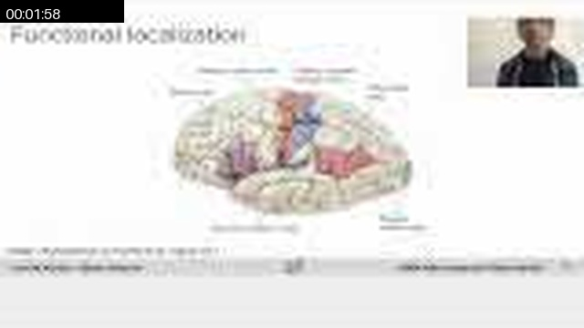
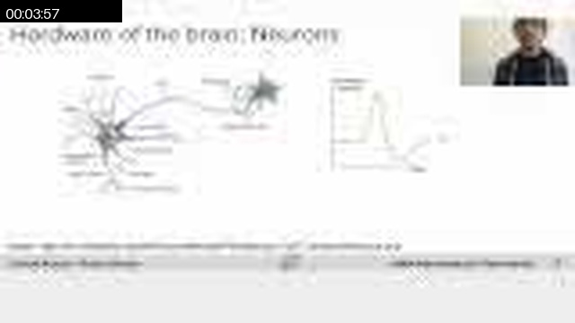
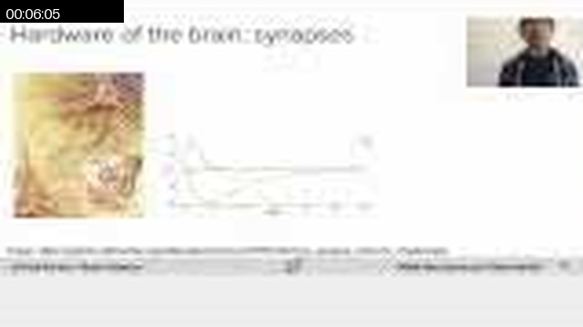
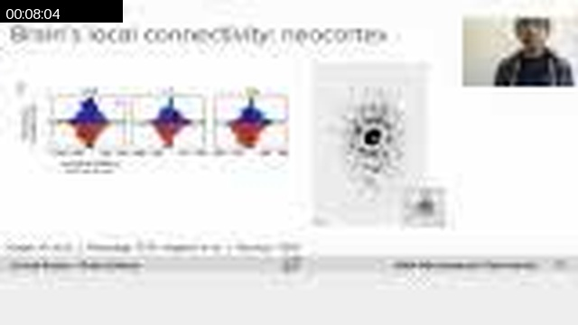
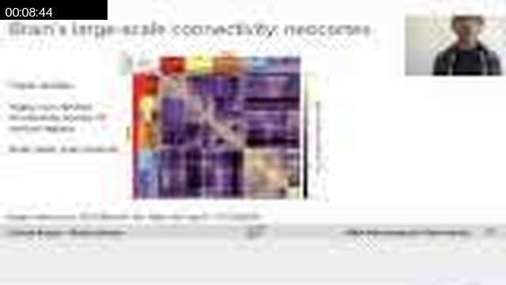
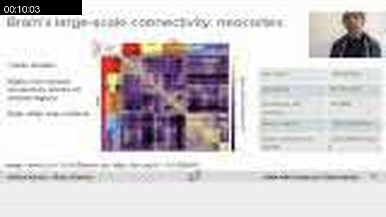
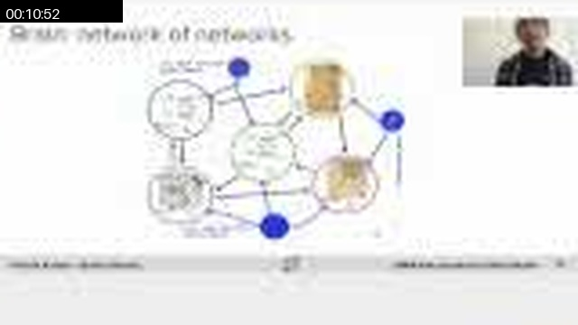
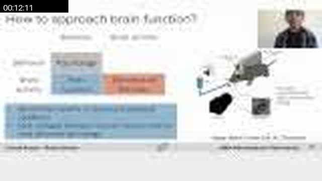
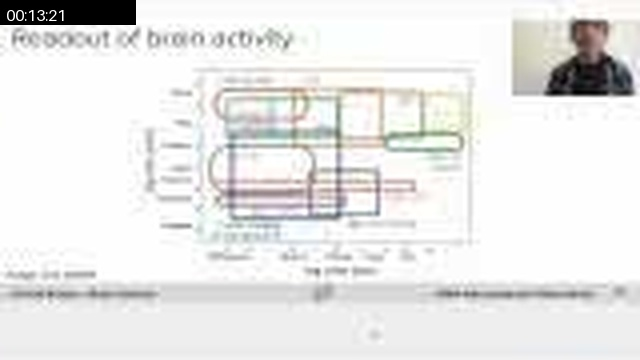
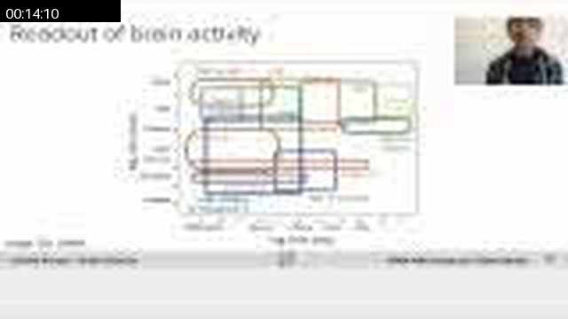

# W0D0 Intro - Structural Note / 结构化笔记

- Status / 状态: AI-generated draft based on the video captions; verify important scientific claims against primary sources. / 基于视频字幕生成的 AI 草稿；重要科学主张需回查一手来源。
- Course page / 课程页: https://compneuro.neuromatch.io/tutorials/W0D0_NeuroVideoSeries/student/W0D0_Tutorial1.html
- Video / 视频: https://youtube.com/watch?v=mZkujcMW1uI
- Caption basis / 字幕依据: `../summaries/01-intro.summary.bilingual.md`

## Core Problem / 核心问题
大脑由物质组成，其化学和生理学特性如何产生动力学，进而实现所谓的“心灵”？[00:00:56.800 - 00:01:28.640]  
How does matter—through its chemical and physiological properties—generate dynamics that realize the so‑called mind?

## Thesis / 核心论点
大脑的复杂性并非源于神经元数量，而是源于连接：每个神经元平均发出和接收约10,000个连接，这种规模的交互在已知系统中独一无二。[00:09:36.480 - 00:09:59.680]  
The brain’s complexity arises from its connectivity, not from neuron number: each neuron emits and receives about 10,000 connections, a scale of interaction unique among known systems.

## Argument Structure / 论证结构

1. **00:00:25.040 – 00:01:28.640** · 引入问题 · 中文：从大脑与心灵的二元性入手，指出物质动力学产生心灵是根本而复杂的问题，并以高能耗（20%全身氧气）暗示其功能重要性。  
   English: Start from the brain‑mind duality, stating that material dynamics yielding the mind is a fundamental and complex problem, and use the brain’s high oxygen consumption (20% of body) to hint at its functional importance.

2. **00:02:01.280 – 00:03:32.320** · 描述硬件基础 · 中文：介绍大脑分区（如初级视觉皮层、海马体、杏仁核）以及神经元的基本结构（树突、轴突、动作电位）。  
   English: Describe brain regions (e.g., primary visual cortex, hippocampus, amygdala) and the basic structure of neurons (dendrites, axons, action potentials).

3. **00:04:32.240 – 00:06:34.080** · 强调连接而非数量 · 中文：指出神经元数量（860亿）并非关键（线虫仅302个神经元），进而引入突触（电突触和化学突触）和Dale原则，说明连接才是复杂性的来源。  
   English: Point out that neuron count (86 billion) is not critical (C. elegans has only 302), then introduce synapses (electrical and chemical) and Dale’s principle, showing that connectivity, not number, is the source of complexity.

4. **00:07:03.280 – 00:08:58.880** · 展示连接规则 · 中文：以新皮层六层结构为例，说明层间和层内的连接模式（如第4层→第2/3层→第5/6层），以及短距离连接随距离递减、长距离呈斑块状连接的规律。  
   English: Using the six‑layer neocortex as an example, illustrate inter‑layer and intra‑layer connectivity patterns (e.g., layer 4 → layers 2/3 → layers 5/6) and the rules: short‑range connections decay with distance, long‑range connections form patches.

5. **00:08:58.880 – 00:10:57.360** · 连接决定复杂性 · 中文：展示区域间连接图（模块化、层次化），强调连接密度、延迟（传导速度约220英里/小时）和连接强度的动态变化共同构成大脑的复杂性。  
   English: Show an inter‑regional connectivity map (modular and hierarchical), and stress that connection density, delays (conduction velocity ~220 mph), and dynamic changes in strength together constitute brain complexity.

6. **00:10:58.720 – 00:12:13.280** · 方法论：相关与因果 · 中文：提出研究大脑功能的方法是将行为与活动关联，并通过扰动实验（如脑损伤、疾病）建立因果关系。  
   English: Propose that brain function is studied by linking behavior to neural activity and by establishing causal links through perturbation experiments (e.g., lesions, diseases).

7. **00:12:15.760 – 00:14:08.880** · 记录方法的多样性与类比 · 中文：介绍多种记录手段（单细胞spike、EEG、MEG、fMRI），并提到与机器学习算法（如强化学习）的类比用于设计实验。  
   English: Introduce diverse recording methods (single‑cell spikes, EEG, MEG, fMRI) and mention analogies with machine learning algorithms (e.g., reinforcement learning) to design experiments.

## Mechanism and Objects / 机制与对象

- **机制**：动作电位（spike）作为神经元间通信的货币[00:03:32.320 – 00:04:07.360]；化学突触通过神经递质释放引起兴奋性或抑制性突触后电位[00:05:55.120 – 00:06:17.360]；Dale原则（大多数神经元只表达一种神经递质）[00:06:19.760 – 00:06:34.080]；新皮层六层结构及层间连接规律[00:07:03.280 – 00:07:38.160]；短距离连接概率随距离衰减，长距离连接呈斑块状[00:07:40.000 – 00:08:18.960]；区域间连接具有模块和层次结构，主要由遗传决定[00:08:58.880 – 00:09:35.840]。  
  **Mechanisms**: Action potentials as currency of communication; chemical synapses producing EPSPs/IPSPs via neurotransmitters; Dale’s principle; six‑layer neocortex and inter‑layer connectivity; distance‑dependent short‑range and patchy long‑range connections; modular/hierarchical inter‑regional connectivity (largely genetic).

- **测量信号**：单细胞spike（高时空分辨率）、EEG/MEG（群体总和活动、良好时间分辨率但空间差）、fMRI（血氧依赖信号，时空分辨率较粗糙）[00:13:45.760 – 00:14:46.960]。  
  **Measured signals**: Single‑cell spikes (high spatiotemporal resolution), EEG/MEG (population summed activity, good temporal but poor spatial resolution), fMRI (blood‑oxygen level dependent, coarse spatiotemporal resolution).

- **计算/数学对象**：大脑被近似为“网络之网络”——局部区域有各自的连接规则，区域间有另一套连接规则[00:10:58.720 – 00:11:27.600]；归一化连接密度图表示区域间连接权重[00:08:58.880 – 00:09:35.840]。  
  **Computational/mathematical objects**: Brain approximated as a “network of networks” (local rules + inter‑regional rules); normalized connection density maps.

- **解释说明**：上述内容均为视频中明确的教学内容，无额外解读。  
  **Note**: All above are explicitly taught content from the video; no interpretation added.

## Evidence and Method / 证据与方法

- **行为‑活动关联**：训练动物执行任务并同步记录神经活动，通过相关性获得功能组织的线索[00:11:47.440 – 00:12:13.280]。  
  Train animals on tasks while recording neural activity; correlation yields clues about functional organization.

- **因果扰动实验**：利用脑损伤、疾病或可逆的特异性脑区/细胞类型损伤来揭示因果联系[00:12:15.760 – 00:12:45.680]。  
  Use lesions, disease, or reversible targeted inactivation to establish causal links.

- **多种记录方法**：从单细胞spike到EEG、MEG、fMRI，选择取决于时空分辨率需求[00:13:24.240 – 00:14:46.960]。  
  Multiple recording methods (spikes to fMRI) chosen based on spatiotemporal resolution needs.

- **与机器学习类比**：将大脑功能与强化学习等算法类比，用于设计检验大脑能否实现算法的实验[00:12:45.680 – 00:13:20.960]。  
  Analogize brain function to ML algorithms (e.g., reinforcement learning) to design experiments testing implementation.

- **连接组数据**：注射示踪剂显示轴突末端投射的斑块分布，并绘制43个皮层区域的连接图[00:08:02.240 – 00:08:58.880]。  
  Tracer injections reveal patchy axonal projections; connectivity map of 43 cortical areas.

## Limits and Misconceptions / 局限与易错点

- **相关≠因果**：行为与神经活动的相关性只能提供神经基础线索，必须通过扰动实验确立因果关系[00:12:15.760 – 00:12:45.680]。  
  Correlation does not imply causation; perturbation experiments are necessary for causal links.

- **神经元数量≠智力**：线虫仅302个神经元而大象超过2560亿，但人类并不因神经元最少而最不智能，复杂性来自连接[00:04:32.240 – 00:04:51.200]；人脑860亿个数目本身不足以解释功能[00:09:36.480 – 00:09:59.680]。  
  Neuron count is not a proxy for intelligence; complexity comes from connectivity, not from sheer number.

- **记录方法的取舍**：高时空分辨率（单细胞spike）与大规模群体活动（EEG/fMRI）不可兼得，选择需考虑科学问题[00:13:45.760 – 00:14:46.960]。  
  Trade‑offs between spatiotemporal resolution; choice depends on the scientific question.

- **连接图的变异性**：区域间连接具有物种特异性甚至个体差异[00:08:58.880 – 00:09:35.840]。  
  Inter‑regional connectivity shows species specificity and individual variability.

## NeuroAI Connection / NeuroAI 连接

视频中明确将现代机器学习算法（如强化学习）作为设计实验的类比工具，用以检验大脑是否能够实现类似的算法[00:12:45.680 – 00:13:20.960]。这一用法是方法论上的类比，而非声称大脑与AI等价。此外，视频中描述的“网络之网络”结构[00:10:58.720 – 00:11:27.600]与深度神经网络的多层次特征提取有结构性相似，但视频未作此比较，此处仅为解释性类比。  
The video explicitly uses modern ML algorithms (e.g., reinforcement learning) as an analogy to design experiments testing whether the brain implements similar algorithms. This is a methodological analogy, not a claim of equivalence. The “network of networks” description also shares structural similarity with hierarchical feature extraction in deep neural networks, though the video does not make that comparison—this is an interpretive analogy only.

## Review Questions / 复习问题

1. **中文**：根据讲座，大脑复杂性的主要来源是什么？为什么不是单纯由神经元数量决定？  
   **English**: According to the lecture, what is the main source of brain complexity, and why is it not simply the number of neurons?

2. **中文**：讲座中介绍了哪两种主要的实验手段来建立大脑活动与行为之间的因果关系？请分别说明其原理。  
   **English**: What two main experimental approaches were introduced to establish causal links between brain activity and behavior? Explain each principle.

3. **中文**：为什么说大脑可以近似为一个“网络之网络”？请结合新皮层的层结构以及区域间连接规则进行说明。  
   **English**: Why can the brain be approximated as a “network of networks”? Explain using the neocortical layer structure and inter‑regional connectivity rules.

## Key Slide Guide / 关键幻灯片导读

| Time | Role | Bilingual Cue |
|------|------|---------------|
| 00:00:25 – 00:01:28 | 提出问题 | 大脑‑心灵二元性；物质动力学如何产生心灵；大脑消耗20%氧气 / Brain‑mind duality; how material dynamics yields mind; brain consumes 20% oxygen |
| 00:02:01 – 00:03:32 | 介绍大脑分区与神经元基本结构 | 新皮层分区（视觉、听觉、运动等）；皮层下结构（海马体、杏仁核）；神经元结构（树突、轴突、spike） / Neocortical areas; subcortical structures; neuron structure (dendrites, axons, spike) |
| 00:04:32 – 00:05:26 | 驳斥“数量决定复杂性”谬误 | 人脑860亿 vs 线虫302 vs 大象2560亿；连接（突触）是第二个关键硬件 / Human 86B vs C. elegans 302 vs elephant 256B; synapses as second key hardware |
| 00:05:55 – 00:06:34 | 化学突触与Dale原则 | 神经递质释放；兴奋/抑制性突触后电位；Dale原则：一种神经元一种递质 / Neurotransmitter release; EPSP/IPSP; Dale’s principle: one neuron, one transmitter |
| 00:07:03 – 00:07

## Key Slide Screenshots / 关键幻灯片截图

These are representative frames from YouTube's public 10-second storyboard, not original-resolution stills. / 以下为 YouTube 公开 10 秒分镜中的代表帧，并非原始分辨率截图。

### 00:00:00

### 00:00:49

### 00:01:58

### 00:03:17

### 00:03:57

### 00:06:05

### 00:08:04

### 00:08:44

### 00:10:03

### 00:10:52

### 00:12:11

### 00:13:21

### 00:14:10

### 00:14:30

### 00:14:50

### 00:15:39

### 00:16:09

## Full Timeline Contact Sheet / 完整时间线联系表

