# W0D0 Human Psychophysics - Structural Note / 结构化笔记

- Status / 状态: AI-generated draft based on the video captions; verify important scientific claims against primary sources. / 基于视频字幕生成的 AI 草稿；重要科学主张需回查一手来源。
- Course page / 课程页: https://compneuro.neuromatch.io/tutorials/W0D0_NeuroVideoSeries/student/W0D0_Tutorial2.html
- Video / 视频: https://youtube.com/watch?v=F8gTfydUFjc
- Caption basis / 字幕依据: `../summaries/02-human-psychophysics.summary.bilingual.md`

## Core Problem / 核心问题

The core problem is that linking human perception to neural activity requires precise measurement of perception, but naive methods are confounded by decision criteria and response biases, making it impossible to isolate true sensitivity.  
核心问题在于，将人类感知与神经活动联系起来需要对感知进行精确测量，但朴素的方法会受到决策标准与反应偏误的混淆，无法分离出真实的敏感度。

## Thesis / 核心论点

Psychophysics provides rigorous techniques (e.g., two‑interval forced‑choice, method of constant stimuli) that measure sensitivity, bias, and thresholds independently of decision criteria, enabling accurate inference of neural representations.  
心理物理学提供了严谨的技术（如两间隔强制选择、恒常刺激法），能够在独立于决策标准的情况下测量敏感度、偏倚与阈值，从而实现对神经表征的准确推断。

## Argument Structure / 论证结构

1. **00:00:01.600 – 00:00:50.320**  
   *Role: Introduces psychophysics as the systematic study of stimulus–sensation relationships.*  
   **中文：** 心理物理学通过系统改变刺激属性来研究感知对体验的影响，精确测量是关键。  
   **English:** Psychophysics studies how altering stimulus properties affects perception; precise measurement is critical.

2. **00:00:51.280 – 00:02:39.040**  
   *Role: Historical examples show psychophysics can predict physiology (contrast sensitivity, trichromacy).*  
   **中文：** 对比敏感度函数用于量化人眼细节分辨，三原色理论由19世纪心理物理学建立并应用于现代显示技术。  
   **English:** The contrast sensitivity function quantifies visual detail; trichromacy was established by 19th‑century psychophysics and underlies modern displays.

3. **00:02:40.960 – 00:05:49.120**  
   *Role: The Weber‑Fechner law demonstrates how psychophysical laws can imply neural encoding.*  
   **中文：** 韦伯定律指出刚好可觉差与基线成正比，这暗示刺激强度被对数编码，内部信号需固定增量才能被检测。  
   **English:** Weber’s law states JND is proportional to baseline, suggesting logarithmic encoding; a fixed internal increment is required for detection.

4. **00:05:49.920 – 00:09:52.560**  
   *Role: Detection tasks reveal the confound of decision criterion with sensitivity.*  
   **中文：** 是/否检测任务中，内部噪声分布与决策标准共同决定心理测量函数，标准移动会偏移报告阈值，混淆真实敏感度。  
   **English:** In yes/no detection, internal noise distributions and a decision criterion determine the psychometric function; shifting the criterion distorts reported thresholds and confounds sensitivity.

5. **00:09:55.840 – 00:11:57.760**  
   *Role: The two‑interval forced‑choice task eliminates the criterion confound.*  
   **中文：** 两间隔强制选择任务通过比较两个间隔的内部信号，避免了决策标准影响，以75%正确率等阈值为敏感度指标。  
   **English:** The two‑interval forced‑choice task avoids criterion effects by comparing internal signals across two intervals; thresholds like 75% correct quantify sensitivity.

6. **00:11:57.760 – 00:15:41.360**  
   *Role: Practical methods for threshold measurement balance accuracy and efficiency.*  
   **中文：** 恒常刺激法为金标准但耗时（约300试次），阶梯法效率高（约30试次）但易受早期错误影响。  
   **English:** The method of constant stimuli is the gold standard but time‑consuming (~300 trials); the staircase method is efficient (~30 trials) but susceptible to early errors.

7. **00:16:11.520 – 00:20:54.800**  
   *Role: Discrimination tasks extend the framework to measure perceptual bias (PSE) and JND.*  
   **中文：** 辨别任务测量主观等优点与JND，通过恒定刺激法拟合心理测量函数，但必须随机化按键映射以避免反应偏误。  
   **English:** Discrimination tasks measure the point of subjective equality (PSE) and JND; the psychometric function is fitted via constant stimuli, but key mapping must be randomized to avoid response bias.

## Mechanism and Objects / 机制与对象

- **心理测量函数 (psychometric function)**：是/否任务中报告概率与刺激强度的关系，通常用累积高斯拟合。  
  **Psychometric function:** Relationship between report probability and stimulus intensity in yes/no tasks, typically fitted with a cumulative Gaussian.

- **决策标准 (decision criterion)**：内部噪声分布的阈值，低于则报“否”，高于则报“是”。  
  **Decision criterion:** Threshold on internal noise distribution; below it “not seen”, above it “seen”.

- **内部噪声分布 (internal noise distribution)**：无刺激时均值为零的高斯分布；刺激使均值右移。  
  **Internal noise distribution:** Gaussian with mean zero under no stimulus; stimulus shifts mean rightward.

- **刚好可觉差 (JND / just noticeable difference)**：韦伯定律中的恒定比例，用于量化辨别阈。  
  **JND:** Constant proportion in Weber’s law, used to quantify discrimination thresholds.

- **主观等优点 (PSE / point of subjective equality)**：两个刺激被感知为相等的点，反映感知偏倚。  
  **PSE:** Point where two stimuli are perceived as equal, reflecting perceptual bias.

- **对比敏感度函数 (contrast sensitivity function)**：人眼对不同空间频率对比度的敏感度曲线。  
  **Contrast sensitivity function:** Sensitivity of the human eye to contrast at different spatial frequencies.

- **三原色理论 (trichromacy)**：所有感知颜色可由三种基色合成。  
  **Trichromacy:** All perceived colors can be synthesized from three primary colors.

- **中心‑周围神经元 (center‑surround neurons)**：推测为视网膜或丘脑中编码亮度对比的神经相关物（讲授内容）。  
  **Center‑surround neurons:** Proposed neural correlates of luminance‑contrast coding in retina or thalamus (teaching content).

- **对数编码的推断 (interpretation)**：从韦伯定律推导出内部信号与物理刺激呈对数关系（解释性内容，非直接测量）。  
  **Logarithmic encoding (interpretation):** Inferred from Weber’s law – internal signal is a logarithmic function of physical stimulus; this is an interpretation, not a direct measurement.

## Evidence and Method / 证据与方法

- **经典光子检测实验**：单个光子被5个视杆细胞吸收即足以在特定条件下感知（经典论文结果）。  
  **Classic photon detection study:** A single photon absorbed by five rod cells suffices for perception under specific conditions.

- **是/否检测任务构建心理测量函数**：不同亮度闪现，受试者报告是否看见，拟合概率曲线。  
  **Yes/no detection task to construct psychometric function:** Flashes of varying brightness; subject reports seen/not seen; probability curve is fitted.

- **两间隔强制选择 (2IFC) 任务**：两个时间间隔中一个含刺激，受试者选择信号更强的间隔，避免决策标准混淆。  
  **Two‑interval forced‑choice (2IFC) task:** Stimulus appears in one of two intervals; subject chooses the interval with stronger signal; eliminates criterion confound.

- **恒常刺激法 (method of constant stimuli)**：预先选定固定强度，随机重复多次，拟合累积高斯后读出阈值。  
  **Method of constant stimuli:** Preselect fixed intensities, randomize trials, fit a cumulative Gaussian, read threshold.

- **阶梯法 (staircase method)**：从高强度开始，根据回答动态调整强度，逐步逼近阈值（约30试次）。  
  **Staircase method:** Start high, step down until error, reverse direction, dynamically approach threshold (~30 trials).

## Limits and Misconceptions / 局限与易错点

- 决策标准会左右移动心理测量函数，导致报告的阈值偏离真实敏感度；不同观察者的标准不同。  
  **Decision criterion shifts the psychometric function, causing reported thresholds to deviate from true sensitivity; criteria vary across observers.**

- 两间隔任务中阈值的定义（75% 或 84%）会影响数值，比较研究时需注意差异。  
  **Threshold definition (75% vs 84%) affects numerical values; this must be noted when comparing studies.**

- 阶梯法早期误按键会使序列跑偏且难以恢复，因此建议多次测量后取平均。  
  **Staircase method is susceptible to early key‑press errors causing drift and difficulty recovering; average across multiple measurements is recommended.**

- 对于单刺激的二元判断（如运动方向），无法区分感知偏倚和反应倾向，不适合测量PSE。  
  **For binary judgments on a single stimulus (e.g., motion direction), perceptual bias and response bias cannot be dissociated; measuring PSE is unsuitable.**

- 辨别任务中左右按键映射必须随机化，否则反应偏误可能被误测为主观等优点。  
  **In discrimination tasks, left/right key mapping must be randomized; otherwise response bias may be misidentified as PSE.**

## NeuroAI Connection / NeuroAI 连接

*Interpretation:* Psychophysics provides a blueprint for benchmarking AI perceptual systems. The signal‑detection theory underlying yes/no and 2IFC tasks is analogous to evaluating an AI’s discriminability versus its decision threshold. The constant‑stimuli and staircase methods correspond to designing efficient test sets for AI, while the distinction between sensitivity and bias mirrors the need to separate model capacity from decision‑rule confounds in AI evaluation.  
*解释：* 心理物理学为人工智能感知系统的基准测试提供了蓝图。是/否任务与2IFC任务背后的信号检测理论，与评估AI的辨别力vs其决策阈限类似。恒常刺激法和阶梯法对应于设计高效的AI测试集，而敏感度与偏倚的区分则反映了在AI评估中分离模型能力与决策规则混淆的必要性。

## Review Questions / 复习问题

1. (中文) 请解释决策标准是如何影响“是/否”检测任务的结果的，两间隔强制选择任务如何解决这一问题？  
   (English) Explain how the decision criterion affects results in a yes/no detection task and how the two‑interval forced‑choice task overcomes this issue.

2. (中文) 韦伯-费希纳定律的内容是什么？它暗示了神经编码的什么特性？  
   (English) What does the Weber‑Fechner law state, and what property of neural encoding does it imply?

3. (中文) 比较恒常刺激法和阶梯法在阈值测量中的优缺点。  
   (English) Compare the advantages and disadvantages of the method of constant stimuli and the staircase method for threshold measurement.

## Key Slide Guide / 关键幻灯片导读

| Time | Role | Bilingual Cue |
|------|------|---------------|
| 00:00‑00:50 | 定义与目标 / Definition & goal | 心理物理学：刺激‑感觉关系 / Psychophysics: stimulus‑sensation relationship |
| 00:51‑02:40 | 历史成就 / Historical achievements | 对比敏感度函数、三原色理论 / Contrast sensitivity function, trichromacy |
| 02:41‑05:50 | 韦伯定律 / Weber’s law | JND与基线成正比，暗示对数编码 / JND proportional to baseline → logarithmic encoding |
| 05:51‑09:00 | 检测任务与决策标准 / Detection task & decision criterion | 内部噪声分布、决策标准偏移心理测量函数 / Internal noise, criterion shifts psychometric function |
| 09:01‑11:50 | 两间隔强制选择 / 2IFC | 消除标准混淆，75%阈值定义 / Eliminates criterion confound, 75% threshold |
| 11:51‑15:40 | 阈值测量方法 / Threshold methods | 恒常刺激法（金标准但慢） vs 阶梯法（高效但有漂移风险） / Constant stimuli (gold standard but slow) vs staircases (efficient but drift‑prone) |
| 15:41‑17:40 | 辨别任务基础 / Discrimination basics | 检测为JND特例，PSE反映感知偏倚 / Detection as special JND, PSE reflects perceptual bias |
| 17:41‑20:10 | 测量PSE的关键 / Key for PSE | 随机化按键映射，避免反应偏误 / Randomize key mapping to avoid response bias |
| 20:11‑20:55 | 总结JND测量 / JND measurement summary | 从心理测量函数的50%到阈值水平（75%或84%） / From 50% PSE to threshold level (75% or 84%) |
| 20:56‑21:52 | 神经科学重要性 / Importance for neuroscience | 精确测量感知是连接神经活动与人类体验的前提 / Precise perception measurement is prerequisite to link neural activity to human experience |

## Key Slide Screenshots / 关键幻灯片截图

These are representative frames from YouTube's public 10-second storyboard, not original-resolution stills. / 以下为 YouTube 公开 10 秒分镜中的代表帧，并非原始分辨率截图。

### 00:00:00

### 00:00:29

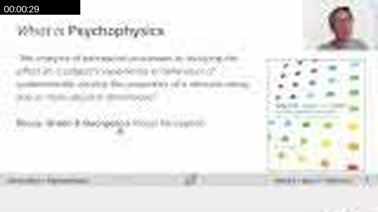

### 00:01:38

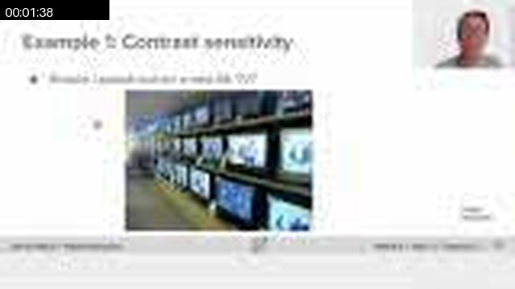

### 00:01:58

### 00:02:37

### 00:04:06

### 00:04:46

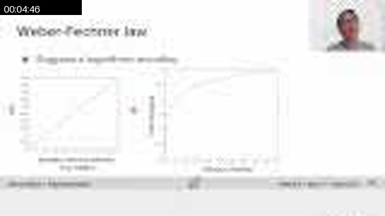

### 00:05:25

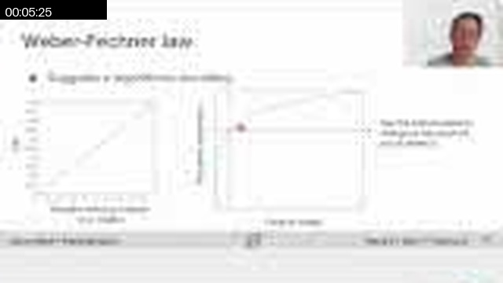

### 00:06:05

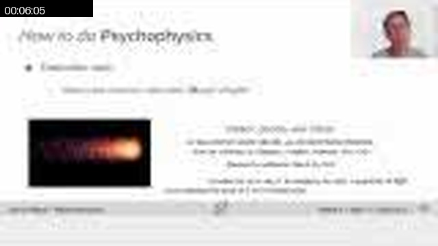

### 00:06:34

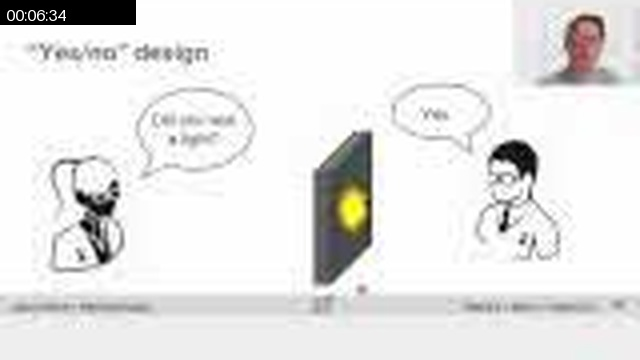

### 00:08:13

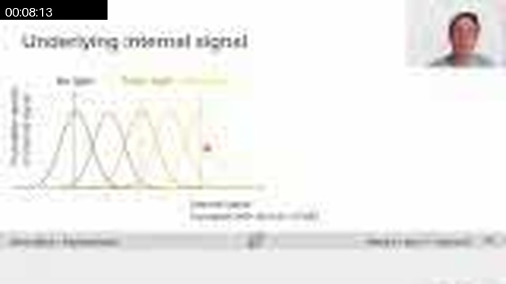

### 00:10:51

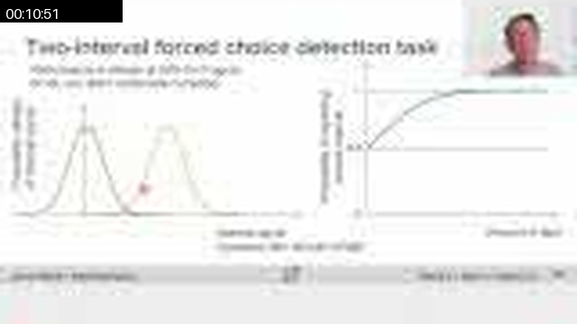

### 00:13:29

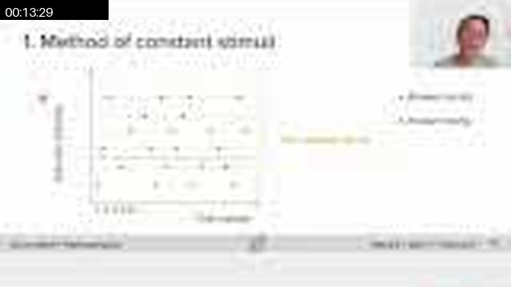

### 00:16:17

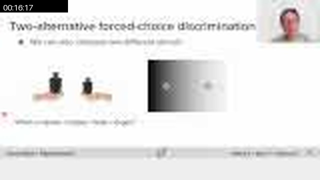

### 00:16:37

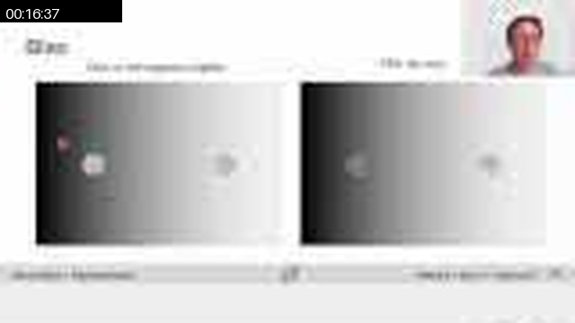

### 00:16:56

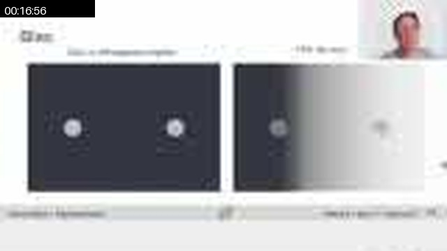

### 00:17:16

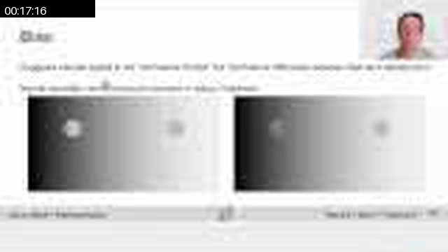

### 00:17:36

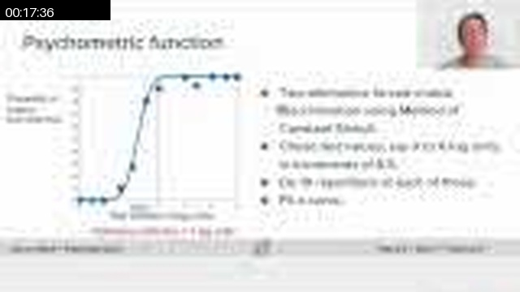

### 00:19:05

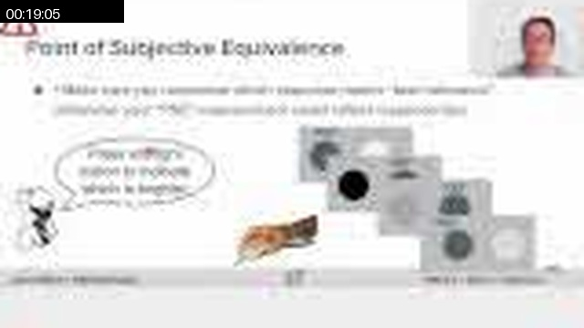

### 00:21:43

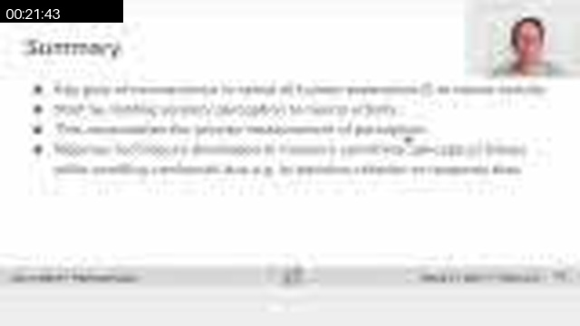

## Full Timeline Contact Sheet / 完整时间线联系表

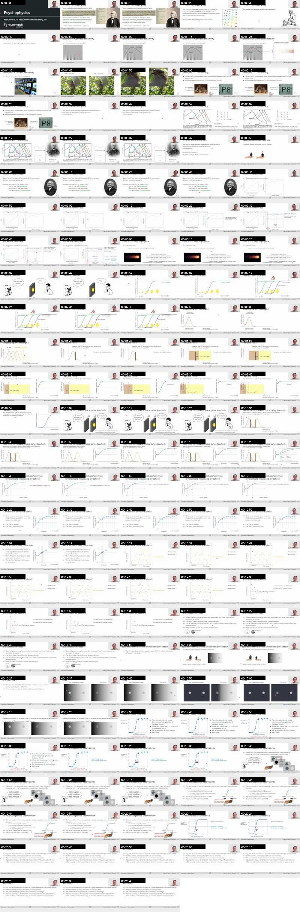
