# W0D0 Behavioral Readout - Structural Note / 结构化笔记

- Status / 状态: AI-generated draft based on the video captions; verify important scientific claims against primary sources. / 基于视频字幕生成的 AI 草稿；重要科学主张需回查一手来源。
- Course page / 课程页: https://compneuro.neuromatch.io/tutorials/W0D0_NeuroVideoSeries/student/W0D0_Tutorial3.html
- Video / 视频: https://youtube.com/watch?v=1DsxzkaLTOQ
- Caption basis / 字幕依据: `../summaries/03-behavioral-readout.summary.bilingual.md`

## Core Problem / 核心问题

How can we read out animal behavior to infer cognitive processes such as decision strategy, memory type, and perception, and then link those behavioral measures to neural activity (spikes, LFP)?  
*如何通过动物行为读出来推断决策策略、记忆类型和感知等认知过程，并将其与神经活动（spike、LFP）相关联？*

## Thesis / 核心论点

Behavioral readout is the essential bridge between observable actions and neural computation; modern neuroscience must capture both simple task-related choices and fine-grained, spontaneous movements to fully understand brain function.  
*行为读出是连接可观察行为与神经计算的必要桥梁；现代神经科学必须同时捕捉简单的任务相关选择和精细的自发运动，才能全面理解脑功能。*

## Argument Structure / 论证结构

1. **00:00:00.480 – 00:00:36.960** · **Motivation** · 行为读出通过动物行为推断决策策略、记忆类型和感知，常需将行为与神经活动关联。  
   *Behavioral readout uses animal behavior to infer decision strategies, memory types, and perception, often linking behavior to neural activity such as spikes and LFP.*

2. **00:00:36.960 – 00:01:12.880** · **Variability** · 不同物种的行为读出方式差异很大（游泳、飞行等），且粒度根据问题选择。  
   *Behavioral readouts vary widely across species (swimming, flight, etc.), and granularity is chosen based on the research question.*

3. **00:01:30.320 – 00:02:21.840** · **Canonical task** · 二选一强迫选择任务（2AFC）是决策读出的常见范式，小鼠用滚轮、舔水嘴或鼻戳，猴子用眼动或操纵杆。  
   *The two-alternative forced-choice task (2AFC) is a common paradigm for decision readout – mice use wheel rotation, licking, or nose-poking; monkeys use saccades or joysticks.*

4. **00:02:23.520 – 00:02:41.280** · **Complex movement** · 复杂运动读出依靠高速摄像或运动追踪系统记录步态、前肢抓取等精细动作。  
   *Complex movement readout relies on high-speed cameras or motion tracking systems to record fine actions such as gait and forelimb grasping.*

5. **00:02:42.160 – 00:03:15.760** · **Learning & memory** · 学习与记忆通过迷宫导航、条件性恐惧等条件化行为范式读出。  
   *Learning and memory are read out through conditioned behavior paradigms such as maze navigation and conditioned fear.*

6. **00:03:15.760 – 00:03:37.520** · **Internal states** · 内部状态（觉醒、压力、情绪）可通过瞳孔大小、心率、面部表情等间接测量。  
   *Internal states (arousal, stress, emotion) can be indirectly measured through pupil size, heart rate, facial expressions, etc.*

7. **00:09:47.440 – 00:10:51.360** · **Non-instructed movements** · 非指令性运动显著影响皮层活动，强调全面记录行为读出的必要性。  
   *Non-instructed movements significantly influence cortical activity, emphasizing the necessity of comprehensively recording behavioral readouts.*

## Mechanism and Objects / 机制与对象

- **Biological mechanisms**:  
  - Conditioned fear memory (tone-shock pairing) induces freezing behavior.  
    *条件性恐惧记忆（音调-电击配对）引起冻结行为。*  
  - Spatial navigation in Morris water maze relies on hippocampal place cells.  
    *Morris水迷宫的空间导航依赖于海马位置细胞。*  
- **Measurement signals**:  
  - Spikes, LFP (mentioned as neural activity to be linked).  
    *尖峰、局部场电位（作为待关联的神经活动）。*  
  - Behavioral sensors: lick spout, grip handle, force sensors, high-speed video, depth cameras.  
    *行为传感器：舔水嘴、抓握手柄、力传感器、高速摄像、深度相机。*  
- **Computational objects**:  
  - Low-dimensional representation: 200 numbers per time point replacing thousands of pixels.  
    *低维表示：每时间点200个数值替代数千像素。*  
  - Hidden Markov Model (HMM) for automatic extraction of behavioral syllables (walking, pausing, rearing).  
    *隐马尔可夫模型用于自动提取行为音节（行走、暂停、站立）。*  
  - DeepLabCut: deep neural network for markerless body-part tracking.  
    *DeepLabCut：无标记身体部位追踪的深度神经网络。*  

*Note: The low-dimensional representation and HMM were introduced as established analysis methods; the claim that “cortical activity is predominantly driven by movements” is a stated research finding from the video.*  
*注：低维表示和HMM作为既有的分析方法介绍；“皮层活动主要由运动主导”是视频中陈述的研究发现。*

## Evidence and Method / 证据与方法

- **Simon Niesol (2019) delayed 2AFC study in mice**  
  - Recorded video of mouth, paws, and handle grip; used sensors for grip and licking.  
    *记录嘴部、爪子、抓握手柄的视频；使用抓握和舔舐传感器。*  
  - Extracted pupil diameter, hindlimb movement, whisker deflection via methods similar to DeepLabCut.  
    *通过类似DeepLabCut的方法提取瞳孔直径、后肢运动、胡须摆动。*  
  - Wide-field imaging revealed that cortical activity is predominantly driven by non-instructed movements.  
    *宽场成像显示皮层活动主要由非指令性运动主导。*  
- **Morris water maze**: Mice swim to hidden platform; navigation behavior serves as readout for spatial learning.  
  *小鼠游向隐藏平台；导航行为作为空间学习的读出。*  
- **Conditioned fear**: Freezing behavior as an indirect measure of fear memory after foot shock and tone pairing.  
  *冻结行为作为电击与音调配对后恐惧记忆的间接测量。*  
- **Eye tracking in monkeys**: Measures where the animal looks (e.g., monkey faces, especially eyes) to infer attention and face processing.  
  *猴子眼动追踪测量注视位置（如猴子面孔尤其是眼睛），推断注意力和面孔处理。*  
- **Natural behavior pipeline (Bob Datta)**: Depth cameras + low-dimensional representation + HMM to automatically identify behavioral syllables (walking, pausing, rearing).  
  *深度相机 + 低维表示 + HMM 自动识别行为音节（行走、暂停、站立）。*  

## Limits and Misconceptions / 局限与易错点

- **Limits**: Even with DeepLabCut, extremely subtle movements such as nose twitches or throat movements are still very difficult to capture.  
  *即使使用DeepLabCut，像鼻子抽动或喉咙运动等极其细微的动作仍然很难捕捉。*  
- **Misconception**: Simple sensors (e.g., lick spout, grip handle) capture only coarse choice behavior, missing fine movements (whisker, paw) that may influence neural activity.  
  *常见误解：简单传感器（如舔水嘴、抓握手柄）仅捕获粗糙的选择行为，漏掉了可能影响神经活动的精细运动（胡须、爪子）。*  
- **Misconception**: Passive stimulus presentation is sufficient – but active behavior and non-instructed movements are critical for understanding real brain function.  
  *常见误解：被动刺激呈现就够了——但主动行为和非指令性运动对于理解真实的脑功能至关重要。*  

## NeuroAI Connection / NeuroAI 连接

- **DeepLabCut** uses a deep neural network trained with few labeled examples to perform automatic body-part tracking – a direct application of supervised learning in a neuroscience analysis pipeline.  
  *DeepLabCut使用少量标记示例训练深度神经网络，实现自动身体部位追踪——这是监督学习在神经科学分析流程中的直接应用（解释，非等价声明）。*  
- **Hidden Markov Models** for behavioral syllable segmentation are a classic unsupervised learning technique; similar models are used in AI for time-series pattern discovery.  
  *用于行为音节分割的隐马尔可夫模型是经典的无监督学习技术；类似模型在AI中被用于时间序列模式发现（类比）。*  
- **Low-dimensional representation** (200 numbers per frame) resembles the bottleneck in autoencoders, where high-dimensional video is compressed into a compact latent space.  
  *每帧200个数值的低维表示类似于自编码器中的瓶颈层，将高维视频压缩到紧凑的潜在空间（类比）。*  

## Review Questions / 复习问题

1. 为什么在延迟二选一强迫选择任务（delayed 2AFC）中要引入延迟？  
   *Why is a delay introduced in the delayed two-alternative forced-choice task?*  
   **Answer**: To temporally separate the action of perceiving the stimulus from the action of making the decision.  
   *将感知刺激的动作与做出决策的动作在时间上分开。*

2. 列出至少三种用于读出小鼠内部状态的生理指标。  
   *List at least three physiological indicators used to read out internal states in mice.*  
   **Answer**: Pupil size, heart rate, facial expressions (or freezing behavior).  
   *瞳孔大小、心率、面部表情（或冻结行为）。*

3. Simon Niesol(2019)的研究中，皮层活动主要由什么类型的运动主导？这说明了什么？  
   *In Simon Niesol (2019), what type of movement predominantly drives cortical activity, and what does this imply?*  
   **Answer**: Non-instructed movements; it implies that comprehensive behavioral recording is necessary to interpret neural activity.  
   *非指令性运动；这说明需要全面记录行为才能解释神经活动。*

## Key Slide Guide / 关键幻灯片导读

| Time | Role | Bilingual Cue |
|------|------|---------------|
| 00:00:00.480 – 00:00:36.960 | Core motivation | 行为读出连接行为与神经活动 / Behavioral readout links behavior to neural activity |
| 00:00:36.960 – 00:01:12.880 | Species & granularity | 不同物种、不同粒度选择 / Diverse species, choose granularity by question |
| 00:01:30.320 – 00:02:21.840 | Canonical 2AFC task | 二选一强迫任务，多种读出方式 / 2AFC, multiple readout modalities |
| 00:02:23.520 – 00:02:41.280 | Complex movement | 高速摄像追踪步态、抓取 / High-speed cameras for gait and grasping |
| 00:02:42.160 – 00:03:15.760 | Learning & memory | 迷宫导航和条件性恐惧作为读出 / Maze navigation and conditioned fear as readout |
| 00:03:15.760 – 00:03:37.520 | Internal states | 瞳孔、心率、面部表情反映内部状态 / Pupil, heart rate, facial expressions |
| 00:03:55.760 – 00:04:30.640 | Example study setup | Simon Niesol 2019 延迟2AFC任务 / Simon Niesol 2019 delayed 2AFC |
| 00:04:30.640 – 00:05:30.160 | Trial structure | 抓握启动→延迟→刺激→延迟→舔舐报告 / Grip start → delay → stimulus → delay → lick report |
| 00:05:30.160 – 00:05:58.640 | Sensors | 喷口和手柄传感器记录选择与奖励 / Spout and handle sensors record choice and reward |
| 00:05:58.640 – 00:06:33.200 | Fine movements | 传感器未捕获的胡须、手部运动 / Whisker, paw movements missed by sensors |
| 00:07:09.040 – 00:08:26.720 | Tracking methods | DeepLabCut自动追踪身体部位 / DeepLabCut for automatic body part tracking |
| 00:08:27.440 – 00:08:55.360 | Low-dim representation | 每时间点200个数值替代数千像素 / 200 numbers per time point replace thousands of pixels |
| 00:09:47.440 – 00:10:51.360 | Non-instructed movements | 非指令性运动主导皮层活动 / Non-instructed movements dominate cortical activity |
| 00:11:27.120 – 00:12:11.280 | Natural behavior HMM pipeline | 深度相机+低维表示+HMM提取行为音节 / Depth camera + low-dim rep + HMM for behavioral syllables |
| 00:12:42.080 – 00:13:16.320 | Spatial navigation | Morris水迷宫以导航行为作为读出 / Morris water maze: navigation as readout |
| 00:13:24.720 – 00:14:23.680 | Conditioned fear | 冻结行为间接测量恐惧 / Freezing as indirect measure of fear |
| 00:14:26.560 – 00:15:01.280 | Eye tracking for attention | 眼动追踪监测注视位置 / Eye tracking monitors gaze location |

## Key Slide Screenshots / 关键幻灯片截图

These are representative frames from YouTube's public 10-second storyboard, not original-resolution stills. / 以下为 YouTube 公开 10 秒分镜中的代表帧，并非原始分辨率截图。

### 00:00:00

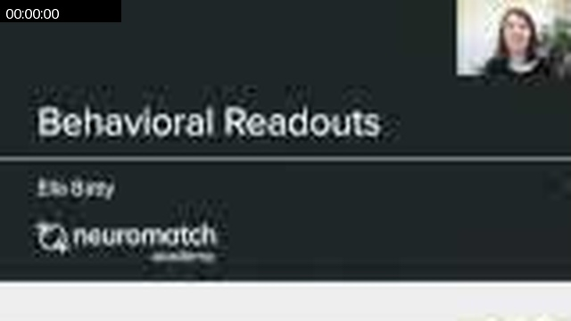

### 00:01:19

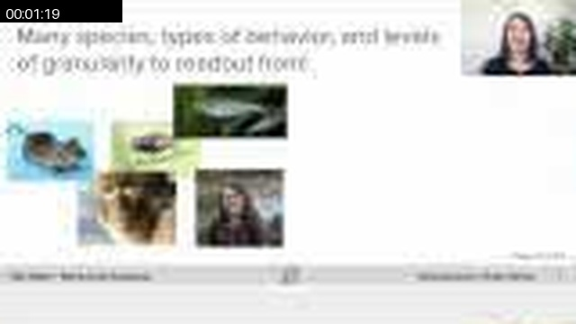

### 00:01:58

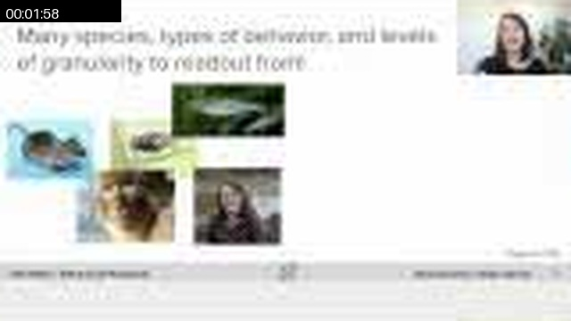

### 00:02:28

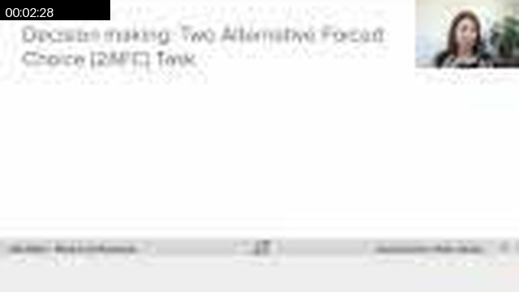

### 00:03:57

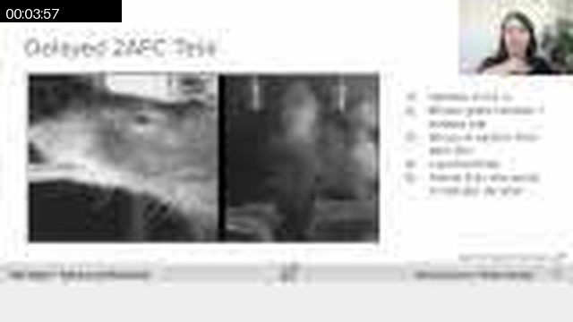

### 00:05:55

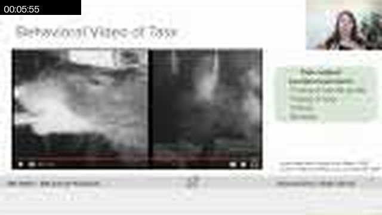

### 00:07:14

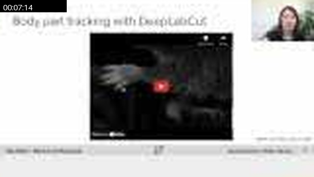

### 00:07:54

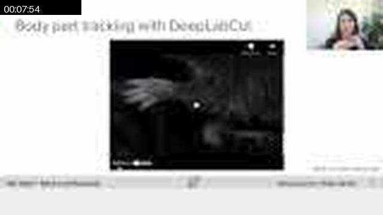

### 00:08:14

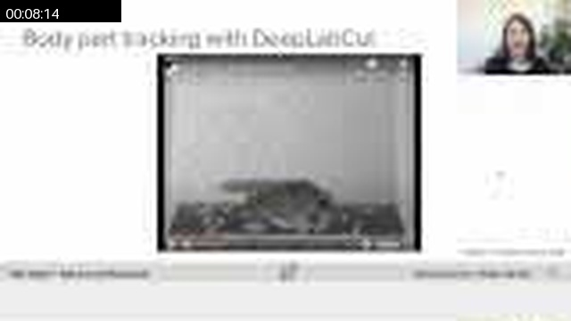

### 00:09:43

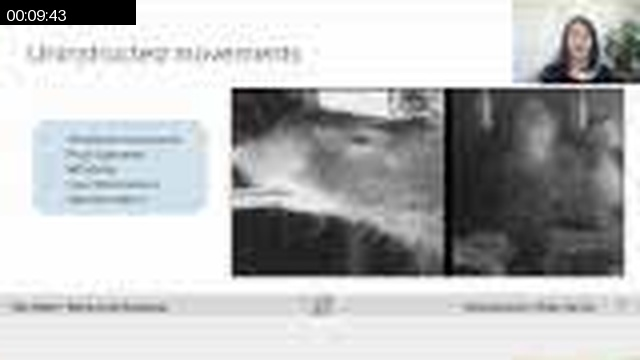

### 00:11:31

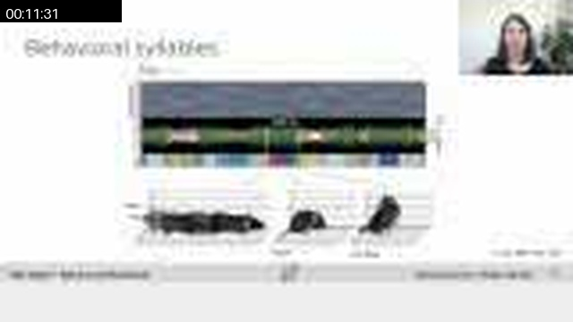

### 00:11:41

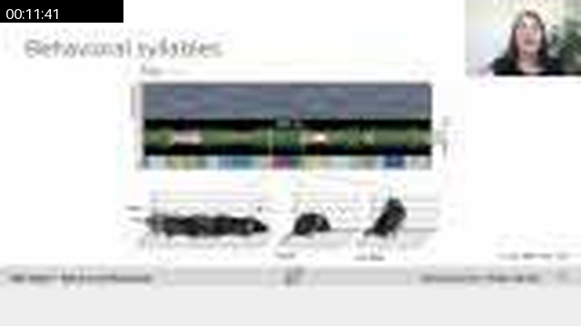

### 00:12:11

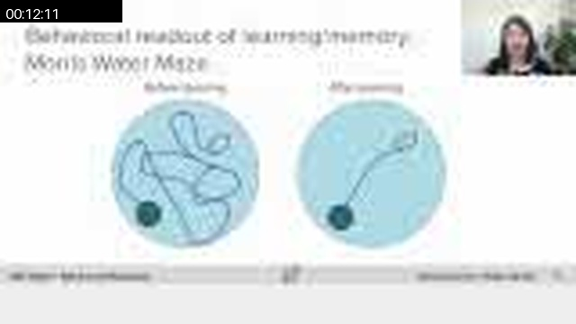

### 00:13:40

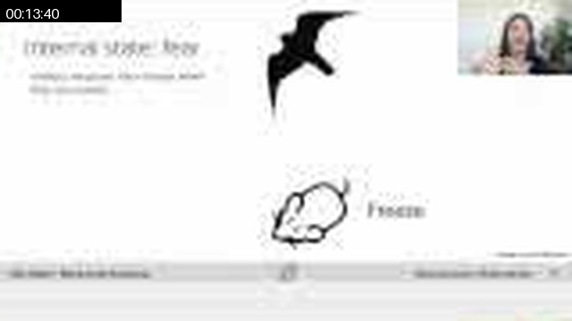

### 00:14:20

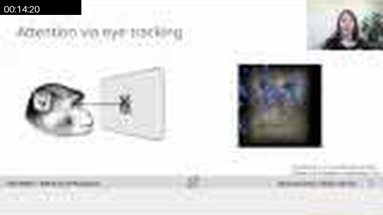

### 00:15:19

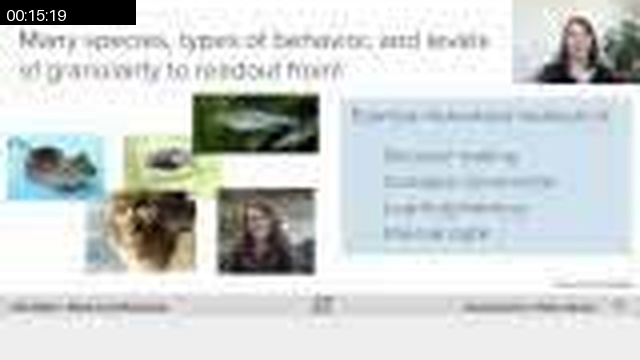

### 00:15:39

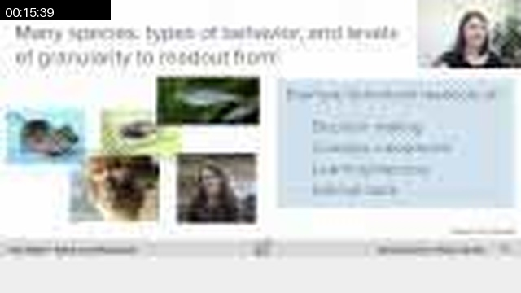

## Full Timeline Contact Sheet / 完整时间线联系表

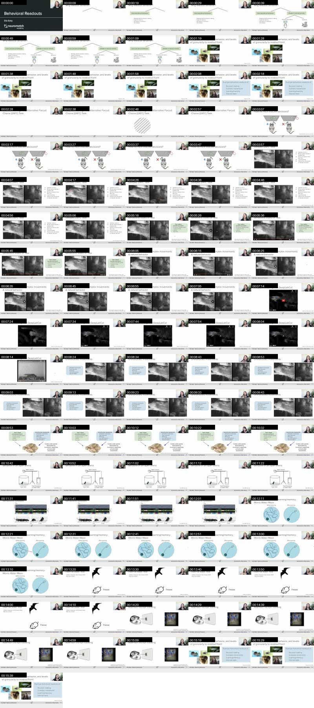
