# W0D0 Live in Lab - Structural Note / 结构化笔记

- Status / 状态: AI-generated draft based on the video captions; verify important scientific claims against primary sources. / 基于视频字幕生成的 AI 草稿；重要科学主张需回查一手来源。
- Course page / 课程页: https://compneuro.neuromatch.io/tutorials/W0D0_NeuroVideoSeries/student/W0D0_Tutorial4.html
- Video / 视频: https://youtube.com/watch?v=HCx-sOp9R7M
- Caption basis / 字幕依据: `../summaries/04-live-in-lab.summary.bilingual.md`

## Core Problem / 核心问题

Understanding the neural circuits underlying decision-making requires recording large-scale brain activity simultaneously while animals perform behavioral tasks.  
理解决策的神经环路需要在对动物进行行为任务的同时，大规模同步记录脑活动。

## Thesis / 核心论点

Wide-field imaging of the mouse dorsal cortex, combined with synchronized behavior and open-source tools, provides a high-throughput method to study neural population dynamics during decision-making.  
小鼠背侧皮层的宽场成像，结合同步行为记录与开源工具，为研究决策期间的神经群体动态提供了高通量方法。

## Argument Structure / 论证结构

1. **00:00:00.640 – 00:00:20.800**  
   **Role:** Context setting – lab introduction  
   **中文:** Anne Churchland 介绍她在 UCLA 的实验室，研究决策的神经环路，并计划展示宽场成像技术。  
   **English:** Anne Churchland introduces her UCLA lab that studies neural circuits of decision-making and plans to demonstrate wide-field imaging.

2. **00:00:22.800 – 00:01:48.400**  
   **Role:** Method overview – behavioral setup and recording modalities  
   **中文:** 实验室使用 Neuropixel 电生理记录、DeepLabCut 视频追踪，以及隔音箱内的行为范式，同步采集多种信号。  
   **English:** The lab uses Neuropixel electrophysiology, DeepLabCut video tracking, and a sound-proof chamber for behavioral paradigms, synchronizing multiple signals.

3. **00:01:51.120 – 00:02:39.920**  
   **Role:** Integration – combining behavior with imaging  
   **中文:** 头固定装置配备视听刺激传感器，可直接放入宽场成像系统中，实现行为与神经活动的同步成像。  
   **English:** A head-fixed apparatus with audiovisual stimulus sensors is placed directly into the wide-field imaging setup for synchronized behavior and neural imaging.

4. **00:02:47.120 – 00:03:47.520**  
   **Role:** Behavior demonstration – daily training and control  
   **中文:** Ashley 展示小鼠训练：左右喷口提供视听刺激，小鼠舔左或右做决策，自制电路板控制行为，并与成像系统相连。  
   **English:** Ashley demonstrates mouse training: left/right spouts deliver audiovisual stimuli, mice lick to indicate decisions, a custom circuit board controls behavior, connected to the imaging system.

5. **00:03:48.400 – 00:04:49.840**  
   **Role:** Hardware explanation – wide-field imaging setup  
   **中文:** Joao Couto 介绍宽场成像装置：蓝色 LED 激发 GCaMP，紫色 LED 校正血流动力学，绿色荧光经滤波后由相机采集。  
   **English:** Joao Couto explains the wide-field imaging setup: blue LED excites GCaMP, purple LED corrects hemodynamics, green fluorescence is filtered and captured by the camera.

6. **00:04:52.000 – 00:07:12.960**  
   **Role:** Data and resources – example results and open science  
   **中文:** 同步交替波长采集数据，示例显示左侧试验激活右侧皮层；团队开发 NeuroCAAS 云端分析平台，并公开搭建协议和大量数据。  
   **English:** Data acquired with synchronized alternating wavelengths; example shows left-side trials activate right cortex; the team developed the NeuroCAAS cloud analysis platform, and publicly releases setup protocols and large datasets.

## Mechanism and Objects / 机制与对象

- **Wide-field imaging (宽场成像):** Uses blue (470 nm) and purple (405 nm) LEDs for GCaMP excitation and hemodynamic correction, respectively. GCaMP emits green fluorescence that passes through a filter to a camera.  
- **Neuropixel electrophysiology (Neuropixel电生理):** Records neural spikes during behavior.  
- **DeepLabCut (DeepLabCut):** Video-based markerless pose estimation for tracking animal movement.  
- **Behavioral apparatus (行为装置):** Head-fixed, with left/right lick spouts delivering audiovisual stimuli; custom circuit board controls trials.  
- **NeuroCAAS (NeuroCAAS):** Cloud-based analysis framework for wide-field imaging data.  
- **Allen atlas alignment (Allen图谱对齐):** Example images of dorsal cortex are aligned to identify brain regions.

**Interpretation note:** The videos demonstrate established teaching content; no novel claims are made beyond the described methods and example data.

## Evidence and Method / 证据与方法

- **Method (方法):** Synchronized acquisition with alternating blue/purple wavelengths to separate GCaMP signal from hemodynamic artifacts.  
- **Example data (示例数据):** A left-side trial in the decision-making task evokes activation in the right hemisphere (contralateral cortex).  
- **Open resources (开放资源):** Public protocols for building the microscope, performing hemodynamic correction, and skull preparation; cloud-based analysis via NeuroCAAS; large datasets freely available online.

*All evidence is drawn directly from the demonstration and description in the provided captions.*

## Limits and Misconceptions / 局限与易错点

- **局限 – Only dorsal cortex (仅背侧皮层):** Wide-field imaging records the entire dorsal cortex, but cannot access deeper brain structures.  
- **局限 – Hemodynamic correction required (需血流动力学校正):** The purple LED channel is used to correct for blood flow artifacts, meaning raw fluorescence is not purely neural.  
- **易错点 – Not single-cell resolution (非单细胞分辨率):** Wide-field imaging is a population-level technique; it does not resolve individual neurons.  
- **易错点 – Data interpretation (数据解读):** Activity is measured from the cortical surface; subcortical contributions may be missed.

## NeuroAI Connection / NeuroAI 连接

- **Analogy / 类比:** The large-scale neural recordings (wide-field imaging across dorsal cortex) resemble the “big data” approach in AI, where models learn from high-dimensional inputs.  
- **Interpretation / 解读:** The decision-making task (audiovisual cues, lick choice) parallels reinforcement learning paradigms; the open datasets could serve as training or validation targets for AI models predicting neural dynamics.  
- **Analogy / 类比:** The NeuroCAAS cloud platform mirrors the trend of centralized AI model training and deployment.

*These connections are presented as interpretation or analogy, not as claims of equivalence between biological and artificial systems.*

## Review Questions / 复习问题

1. **中文:** 宽场成像中为什么要使用紫色 LED 通道？  
   **English:** Why is a purple LED channel used in wide-field imaging?  
   *(Answer: To correct for hemodynamic artifacts.)*

2. **中文:** 该实验室如何同时记录动物行为和神经活动？  
   **English:** How does the lab simultaneously record animal behavior and neural activity?  
   *(Answer: By integrating a head-fixed behavioral apparatus with wide-field imaging or Neuropixel, and synchronizing video tracking via DeepLabCut.)*

3. **中文:** NeuroCAAS 为宽场成像数据分析提供了哪些便利？  
   **English:** What convenience does NeuroCAAS provide for wide-field imaging data analysis?  
   *(Answer: Cloud-based processing of large-scale data, with public protocols for setup and analysis.)*

## Key Slide Guide / 关键幻灯片导读

| Time | Role | Bilingual cue |
|------|------|---------------|
| 00:00:00 – 00:00:20 | Lab introduction | Anne Churchland 介绍神经环路决策研究 / Anne Churchland introduces neural circuit decision-making research |
| 00:00:22 – 00:01:03 | Recording modalities | Neuropixel、DeepLabCut、宽场成像同步 / Neuropixel, DeepLabCut, wide-field imaging synchronization |
| 00:01:05 – 00:01:48 | Behavior chamber | 隔音箱：声音隔离、光照控制、视频追踪 / Sound-attenuating chamber: isolation, light control, video tracking |
| 00:01:51 – 00:02:39 | Head-fixed apparatus | 头固定装置整合听觉/视觉刺激，放入成像系统 / Head-fixed apparatus with audiovisual stimuli, placed into imaging setup |
| 00:02:47 – 00:03:47 | Behavioral training | Ashley 展示小鼠训练：喷口、舔决策、自制电路板 / Ashley shows mouse training: spouts, lick decision, custom circuit board |
| 00:03:48 – 00:04:49 | Wide-field hardware | 蓝色/紫色 LED、GCaMP 激发、血流校正、滤波相机 / Blue/purple LEDs, GCaMP excitation, hemodynamic correction, filtered camera |
| 00:04:52 – 00:05:39 | Data acquisition example | 同步交替波长；左侧试验激活右侧皮层 / Synchronized alternating wavelengths; left trial activates right cortex |
| 00:05:42 – 00:06:39 | Analysis and protocols | NeuroCAAS 云端分析、公开搭建与校正协议 / NeuroCAAS cloud analysis, public setup and correction protocols |
| 00:06:40 – 00:07:12 | Open data and throughput | 高通量全背侧皮层记录，数据免费公开 / High-throughput whole dorsal cortex recording, data freely available online |

## Key Slide Screenshots / 关键幻灯片截图

These are representative frames from YouTube's public 10-second storyboard, not original-resolution stills. / 以下为 YouTube 公开 10 秒分镜中的代表帧，并非原始分辨率截图。

### 00:00:00

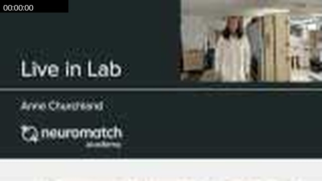

### 00:00:24

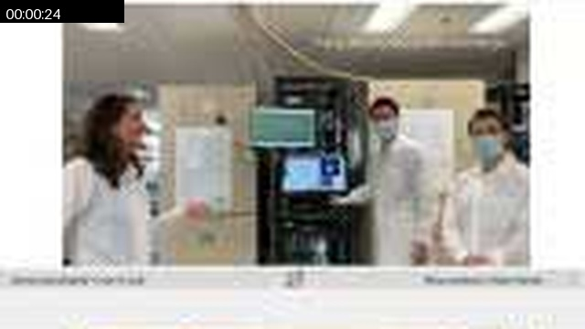

### 00:00:34

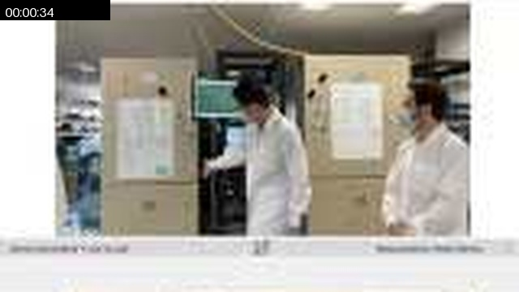

### 00:00:54

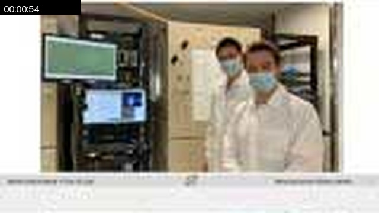

### 00:01:03

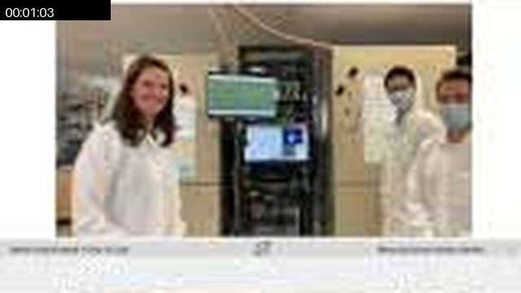

### 00:01:13

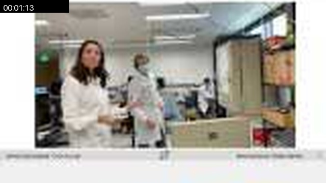

### 00:01:23

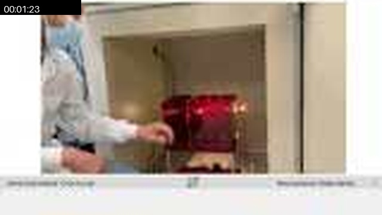

### 00:01:33

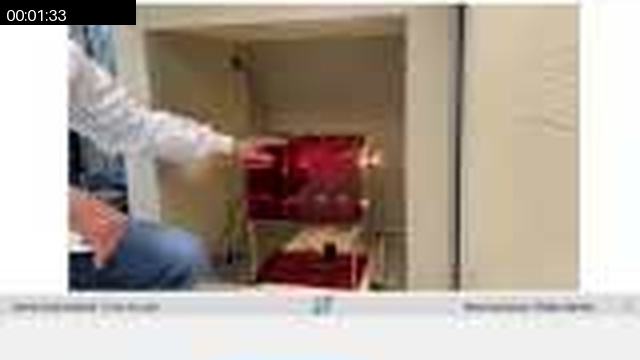

### 00:01:43

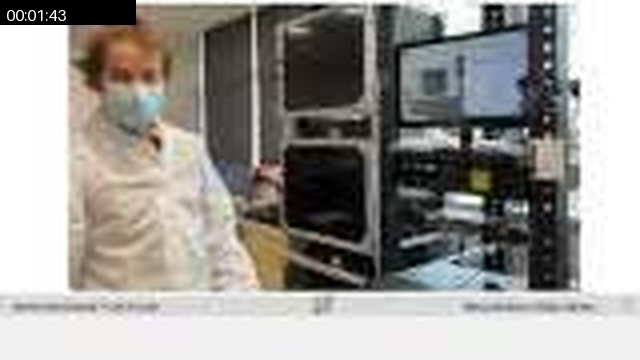

### 00:01:48

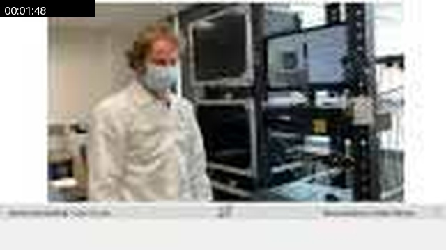

### 00:01:58

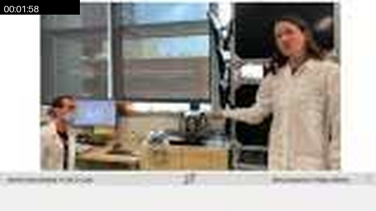

### 00:02:07

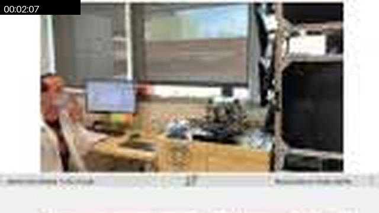

### 00:02:17

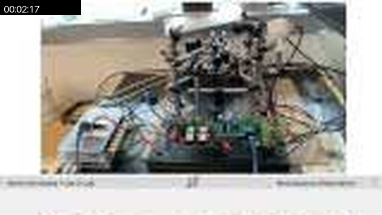

### 00:02:27

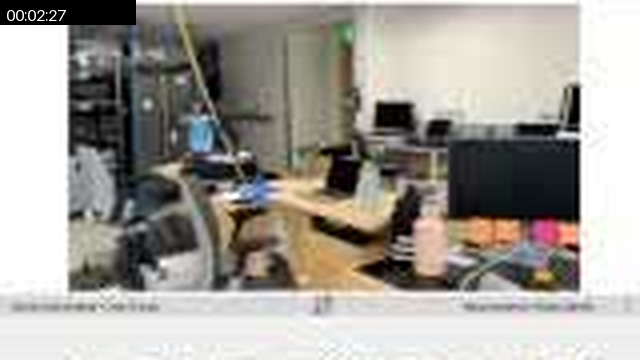

### 00:02:37

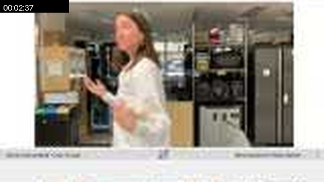

### 00:02:42

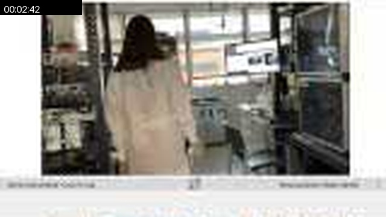

### 00:02:52

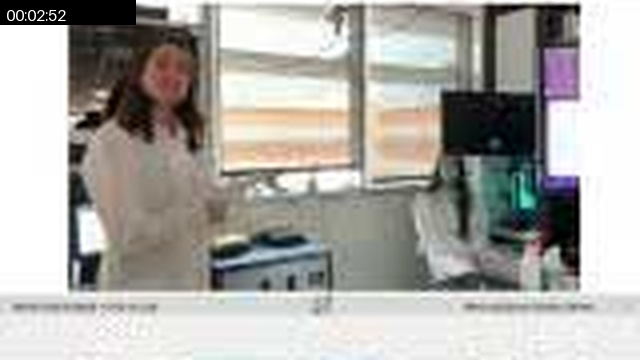

### 00:03:02

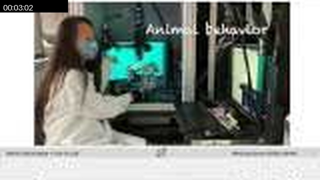

### 00:03:11

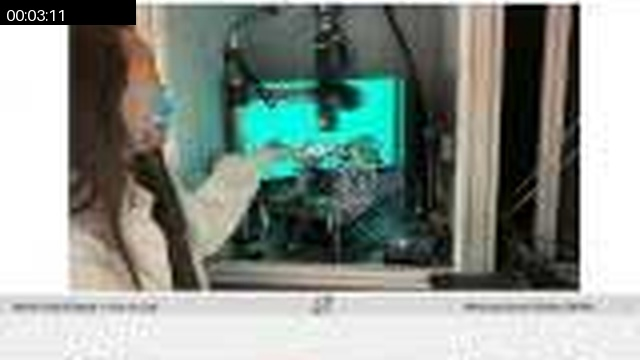

### 00:03:21

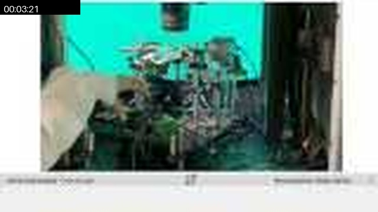

### 00:03:31

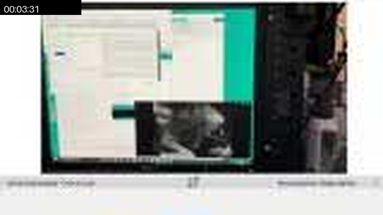

### 00:03:36

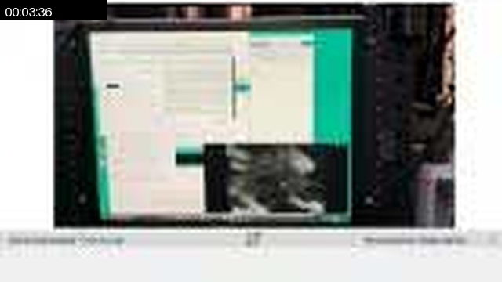

### 00:03:46

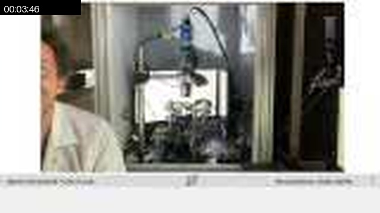

### 00:03:56

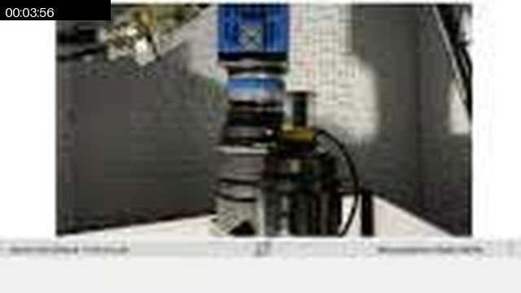

### 00:04:06

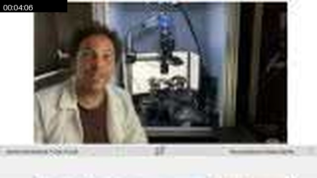

### 00:04:20

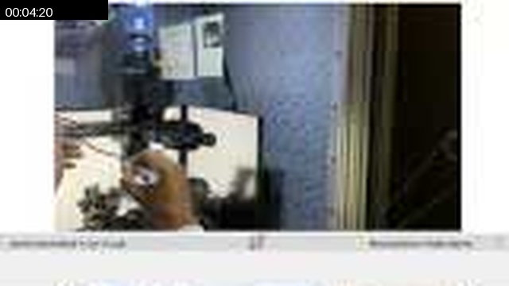

### 00:04:25

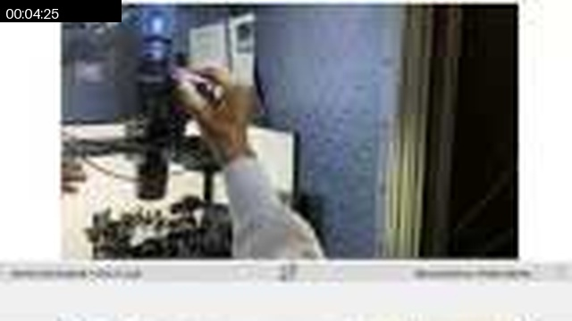

### 00:04:45

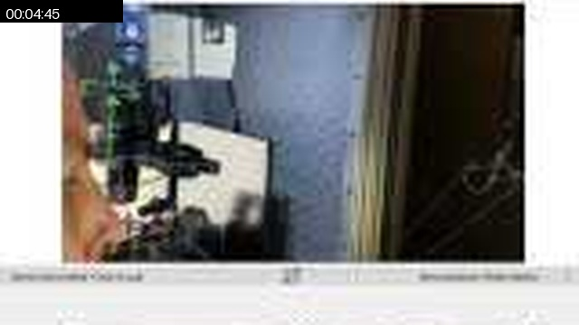

### 00:04:55

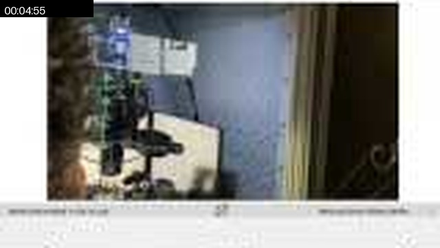

### 00:05:05

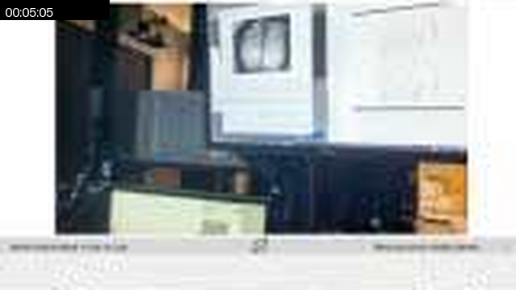

### 00:05:19

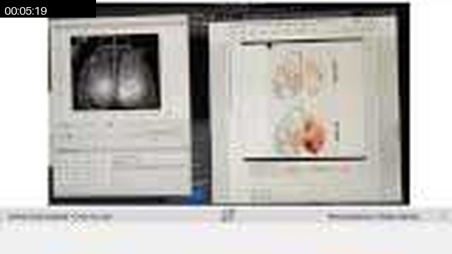

### 00:05:29

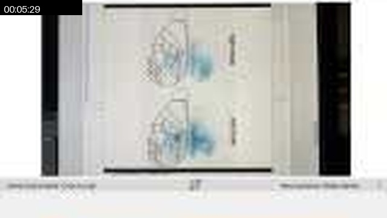

### 00:05:39

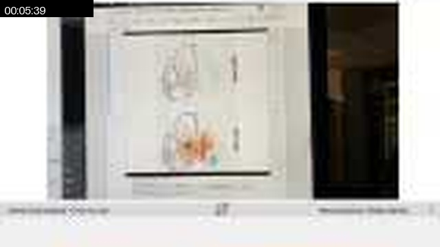

### 00:05:49

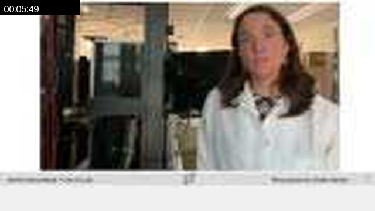

### 00:06:13

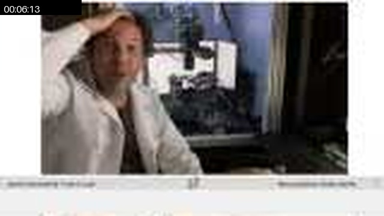

### 00:06:23

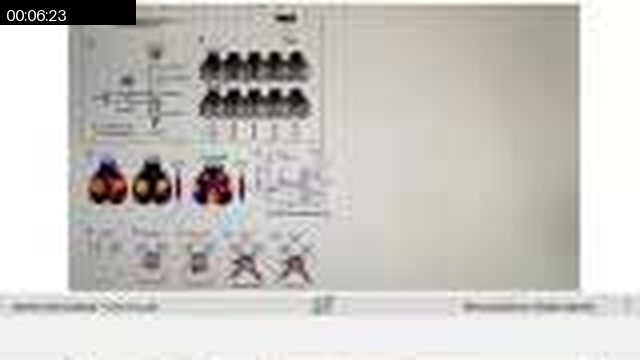

### 00:06:33

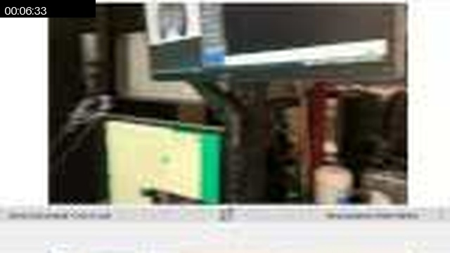

### 00:06:53

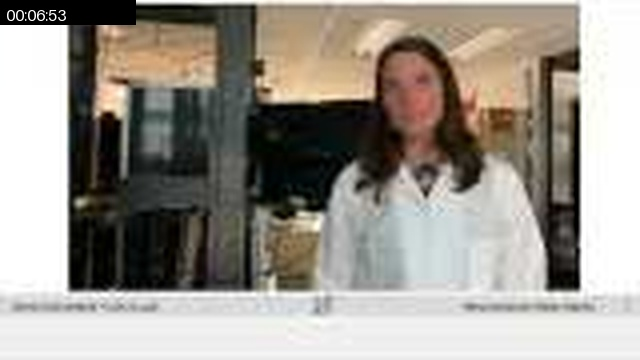

### 00:07:08

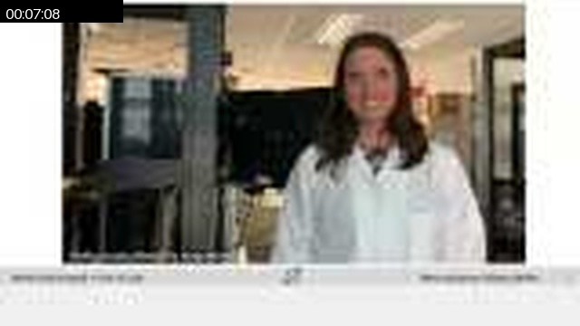

## Full Timeline Contact Sheet / 完整时间线联系表

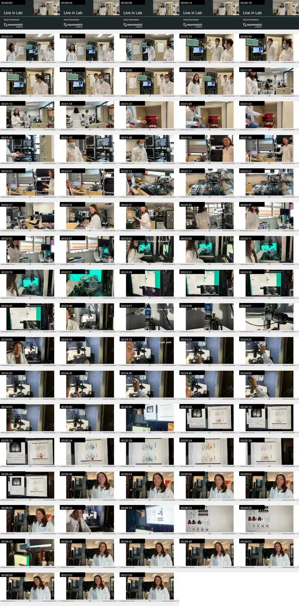
