# W0D0 Brain Signals: Spiking Activity - Structural Note / 结构化笔记

- Status / 状态: AI-generated draft based on the video captions; verify important scientific claims against primary sources. / 基于视频字幕生成的 AI 草稿；重要科学主张需回查一手来源。
- Course page / 课程页: https://compneuro.neuromatch.io/tutorials/W0D0_NeuroVideoSeries/student/W0D0_Tutorial5.html
- Video / 视频: https://youtube.com/watch?v=1nhioy3f9BY
- Caption basis / 字幕依据: `../summaries/05-brain-signals-spiking-activity.summary.bilingual.md`

```markdown
## Core Problem / 核心问题

- 神经元如何通过电信号（动作电位）进行通信？动作电位的产生、记录及其在神经编码中的作用是核心问题。  
  How do neurons communicate via electrical signals (action potentials)? The generation, recording, and role of action potentials in neural encoding are the core issues.

## Thesis / 核心论点

- 动作电位是“全或无”的固定事件，信息编码于其发放频率和时间模式中；神经元特性可塑且多样，神经回路通过兴奋/抑制和反馈产生丰富动态。  
  Action potentials are all‑or‑none fixed events, with information encoded in their firing rate and temporal pattern; neuronal properties are plastic and diverse, and neural circuits generate rich dynamics through excitation, inhibition, and feedback.

## Argument Structure / 论证结构

1. **00:00:29 – 00:02:05 · 引入与基础结构**  
   **中文**：神经元通过树突收集信号、胞体整合，若达到阈值则沿轴突传递动作电位。  
   **English**: Neurons collect signals via dendrites, integrate at the soma, and if threshold is reached, propagate an action potential along the axon.

2. **00:02:05 – 00:05:42 · 分级电位与阈值**  
   **中文**：分级电位强度可变，必须超过约‑55 mV阈值才能触发全或无的动作电位。  
   **English**: Graded potentials vary in amplitude; they must exceed the threshold of approximately ‑55 mV to trigger an all‑or‑none action potential.

3. **00:05:43 – 00:07:42 · 动作电位的全或无特性与不应期**  
   **中文**：一旦达到阈值，动作电位固定地升至约+30 mV再回落，且有不定期限制最大频率。  
   **English**: Once threshold is crossed, the action potential invariably rises to about +30 mV and repolarizes; a refractory period limits the maximum frequency.

4. **00:08:11 – 00:10:08 · 记录方法与编码**  
   **中文**：用微电极记录微小的电信号，经放大、数字化；信息编码于spike发放频率和模式中。  
   **English**: Tiny signals are recorded with microelectrodes, then amplified and digitized; information is encoded in spike firing rate and pattern.

5. **00:11:03 – 00:13:19 · 生理可变性：漏通道与不同发放模式**  
   **中文**：漏通道使膜缓慢去极化至阈值；不同神经元对刺激呈现规则、快速或适应的发放模式。  
   **English**: Leaky channels slowly depolarize the membrane to threshold; different neurons exhibit regular, fast, or adapting firing patterns to stimuli.

6. **00:14:08 – 00:17:08 · 与刺激及疾病的关系**  
   **中文**：视觉神经元在感受野中心光刺激下发放增强；听觉中疾病状态导致不规则、低频发放。  
   **English**: Visual neurons increase spiking to light at receptive field center; in auditory system, disease states cause irregular, lower‑frequency spikes.

7. **00:17:10 – 00:20:49 · 可塑性与回路动态**  
   **中文**：经验改变神经元特性；简单兴奋/抑制连接可形成反馈振荡或中枢模式发生器。  
   **English**: Experience alters neuronal properties; simple excitatory/inhibitory connections can form feedback oscillations or central pattern generators.

## Mechanism and Objects / 机制与对象

**教学内容（Established teaching content）：**
- **动作电位（Action potential）**：膜电位快速反转（‑70→+30 mV），依赖电压门控Na⁺内流和K⁺外流。  
  Rapid membrane potential reversal, dependent on voltage‑gated Na⁺ influx and K⁺ efflux.
- **分级电位（Graded potentials）**：幅度可变，在树突和胞体整合。  
  Variable‑amplitude signals integrated at dendrites and soma.
- **阈值（Threshold）**：约‑55 mV，决定是否产生动作电位。  
  Approximately ‑55 mV, determining spike initiation.
- **不应期（Refractory period）**：限制相邻spike的最小间隔与最大频率。  
  Minimum interval between spikes, limiting maximum frequency.
- **漏通道（Leaky channels）**：持续允许少量正离子内流，缓慢去极化。  
  Continuous small positive ion influx causing slow depolarization.
- **微电极记录（Microelectrode recording）**：金属或玻璃微电极拾取单细胞电信号，需放大、数字化。  
  Metal or glass micropipettes pick up single‑cell signals; amplification and digitization required.
- **感受野（Receptive field）**：视觉神经元对外部空间特定位置的刺激反应。  
  Visual neurons respond to stimuli at specific spatial locations.

**解释性说明（Stated interpretation）：**
- 视频用冲厕所类比说明“全或无”特性：阈值不达到则无输出，达到后输出完整固定。  
  The toilet‑flush analogy illustrates the all‑or‑none nature: insufficient force yields no output, sufficient force yields a complete, stereotyped response.

## Evidence and Method / 证据与方法

- **记录方法**：使用导电金属或玻璃微电极刺入或贴近神经元，信号经放大、数字化后由采集单元处理（00:08:11–00:09:11）。  
  Recording method: Conductive metal or glass microelectrodes penetrate or approach neurons; signals are amplified, digitized, and processed by an acquisition unit.
- **视觉系统实例**：感受野中心光刺激增强spiking，外周刺激抑制spiking（00:14:08–00:15:58）。  
  Visual example: Center light stimulus increases spiking; peripheral stimulus suppresses spiking.
- **听觉系统实例**：健康神经元在低/高刺激下规则发放，疾病状态下不规则且最大频率降低（00:15:59–00:17:08）。  
  Auditory example: Healthy neurons fire regularly at low/high stimuli; diseased neurons fire irregularly with lower max frequency.
- **人工刺激实验**：通过调整刺激强度可研究不同神经元的发放频率与模式（00:12:25–00:13:19）。  
  Artificial stimulation: Adjusting stimulus intensity reveals firing frequency and patterns of different neurons.

## Limits and Misconceptions / 局限与易错点

- **记录局限**：spike记录需要专业技能，通常只记录单个细胞，无法获得网络全貌（00:20:49–00:21:38）。  
  Recording spike requires expertise; typically captures only single‑cell activity, not the network‑wide picture.
- **电极干扰**：电极刺入可能改变细胞性质，细胞易死亡，存活时间差异大（00:21:39–00:22:24）。  
  Electrode insertion may alter cell properties; cells are prone to death with variable survival times.
- **数据真实性**：长时间记录可能影响数据真实性，且产生海量数据需自动化处理（00:22:25–00:22:56）。  
  Long‑term recording may compromise data authenticity; massive data requires automated processing.
- **常见误解**：动作电位强度不变，信息不编码在幅度中，而是编码在频率和模式中（00:09:12–00:10:08）。  
  Common misconception: Spike amplitude is fixed; information is not encoded in amplitude but in firing frequency and pattern.
- **可塑性并非短期**：神经元特性因先前活动（药物、学习等）发生微妙变化，并非固定不变（00:17:10–00:18:08）。  
  Plasticity is dynamic: prior activity (drugs, learning, memory) subtly changes neuronal properties, which are not fixed.

## NeuroAI Connection / NeuroAI 连接

**类比与解释（Analogy and interpretation），非等价声明：**
- 人工神经元中的激活函数（如ReLU）采用阈值机制，与生物神经元的“全或无”类似，但生物过程涉及复杂的离子动力学。  
  The threshold mechanism in artificial neuron activation functions (e.g., ReLU) is analogous to the biological all‑or‑none spike, though biology involves complex ion dynamics.
- 不应期相当于人工神经元的“重置”或时间延迟，避免连续无限制发射，可类比于时间步长限制。  
  The refractory period is analogous to “reset” or temporal delay in artificial neurons, preventing unlimited successive firing.
- 中枢模式发生器（CPG）的振荡回路可类比于循环神经网络（RNN）中的自维持动态，但生物机制依赖离子通道而非权重更新。  
  Oscillatory circuits in central pattern generators are analogous to self‑sustaining dynamics in recurrent neural networks, yet biological mechanisms rely on ion channels rather than weight updates.

## Review Questions / 复习问题

1. **动作电位的“全或无”性质是什么意思？请描述达到阈值后膜电位的变化过程。**  
   What does the “all‑or‑none” property of action potentials mean? Describe the membrane potential changes after threshold is reached.

2. **为什么单个神经元的spike幅度和时程是固定的，而信息仍然可以编码在spike中？举出两种编码方式。**  
   Why are the amplitude and duration of a single neuron’s spike fixed, yet information can still be encoded in spikes? Give two encoding schemes.

3. **使用微电极记录单个神经元的spike有哪些主要局限性？这些局限性对解释神经回路功能有何影响？**  
   What are the main limitations of using microelectrodes to record single‑neuron spikes? How do these limitations affect the interpretation of neural circuit function?

## Key Slide Guide / 关键幻灯片导读

| Time (approx.) | Role | Bilingual cue |
|----------------|------|----------------|
| 00:00:00 – 00:02:05 | 引入与结构 | 神经元 → 树突 → 胞体 → 轴丘 → 轴突 → 突触；Neuron structure: dendrite → soma → axon hillock → axon → synapse |
| 00:02:05 – 00:05:42 | 分级电位与阈值 | 分级电位需超‑55 mV阈值；Graded potentials must exceed ~‑55 mV threshold |
| 00:05:43 – 00:07:42 | 全或无与不应期 | 动作电位固定升至+30 mV；不应期限制频率；All‑or‑none rise to +30 mV; refractory period limits frequency |
| 00:08:11 – 00:10:08 | 记录与编码 | 微电极→放大→数字化；频率/模式编码；Microelectrode → amplification → digitization; rate/pattern coding |
| 00:11:03 – 00:13:19 | 漏通道与发放模式 | 漏通道缓慢去极化；规则/适应/快速模式；Leaky channels cause slow depolarization; regular/adapting/fast patterns |
| 00:14:08 – 00:17:08 | 刺激与疾病实例 | 视觉感受野；听觉健康 vs 疾病；Visual receptive field; auditory healthy vs diseased |
| 00:17:10 – 00:20:49 | 可塑性与回路动态 | 经验改变特性；兴奋/抑制/反馈循环/CPG；Experience alters properties; excitation/inhibition/feedback loops/CPG |
| 00:20:49 – 00:23:52 | 局限与总结 | 单细胞记录不全；网络机制有待发现；Single‑cell recording incomplete; network mechanisms await discovery |
```

## Key Slide Screenshots / 关键幻灯片截图

These are representative frames from YouTube's public 10-second storyboard, not original-resolution stills. / 以下为 YouTube 公开 10 秒分镜中的代表帧，并非原始分辨率截图。

### 00:00:00

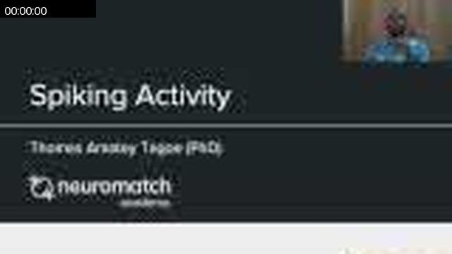

### 00:00:19

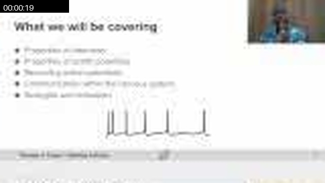

### 00:00:59

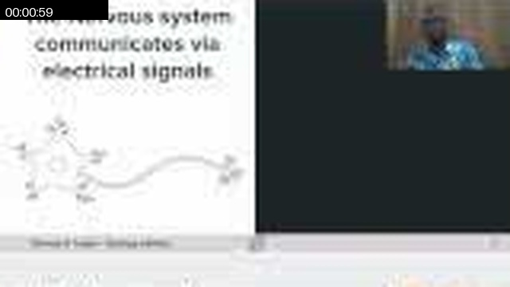

### 00:02:57


### 00:05:55

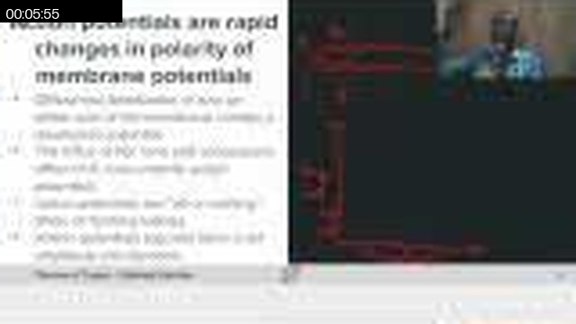

### 00:08:53

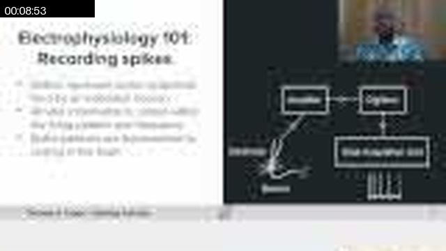

### 00:11:51

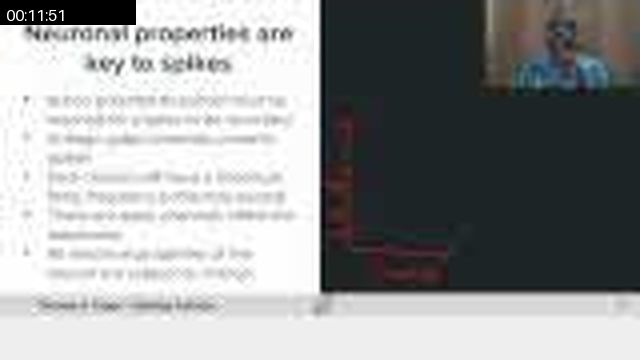

### 00:14:00

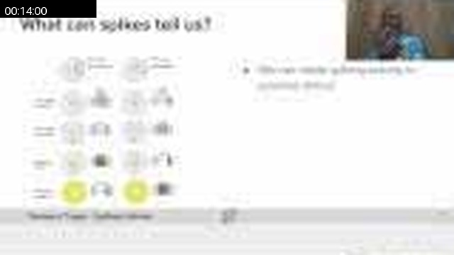

### 00:14:49

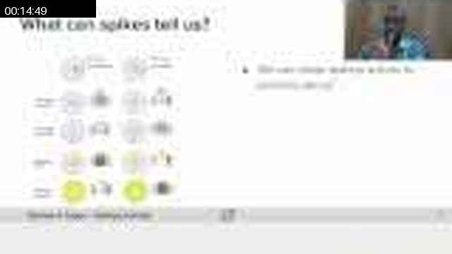

### 00:17:47

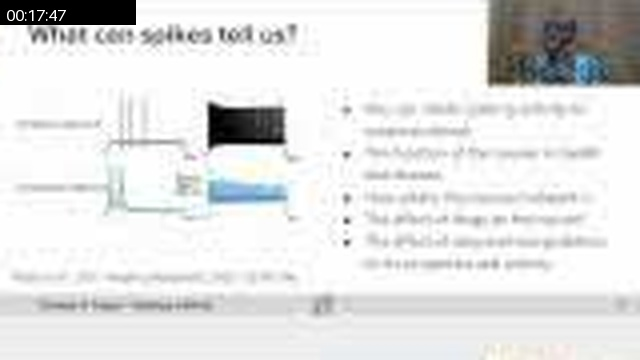

### 00:18:07

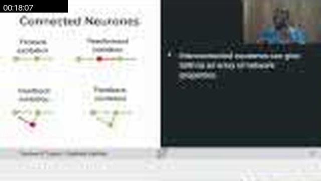

### 00:20:45

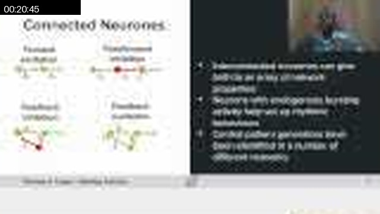

### 00:22:43

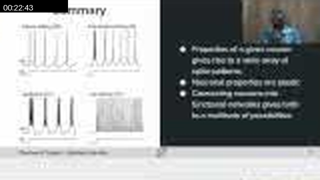

### 00:23:43

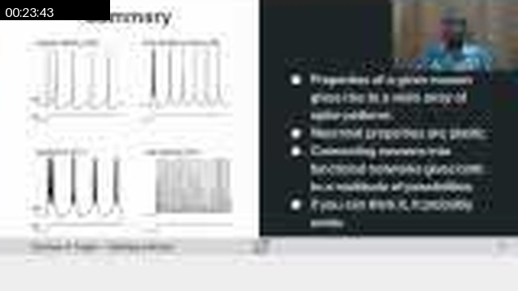

## Full Timeline Contact Sheet / 完整时间线联系表

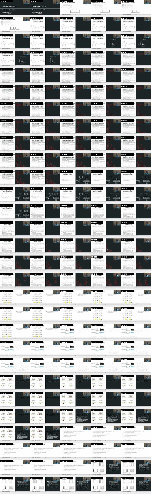
