# W0D0 Brain Signals: LFP - Structural Note / 结构化笔记

- Status / 状态: AI-generated draft based on the video captions; verify important scientific claims against primary sources. / 基于视频字幕生成的 AI 草稿；重要科学主张需回查一手来源。
- Course page / 课程页: https://compneuro.neuromatch.io/tutorials/W0D0_NeuroVideoSeries/student/W0D0_Tutorial6.html
- Video / 视频: https://youtube.com/watch?v=PwkYgrTE2fU
- Caption basis / 字幕依据: `../summaries/06-brain-signals-lfp.summary.bilingual.md`

```markdown
## Core Problem / 核心问题

局部场电位（LFP）信号的解读难题：由于LFP反映群体神经元的亚阈值突触输入，其波形高度依赖突触位置和群体排列，无法直接等同于特定的神经事件；同时，单独依赖spike记录受限于可同时测量的神经元数量（约70-80个），信号不稳健。  
*The difficulty of interpreting local field potential (LFP) signals: because LFP reflects subthreshold synaptic inputs from neuronal populations, its waveform is highly dependent on synaptic location and population alignment, and cannot be directly equated to specific neural events; meanwhile, relying solely on spike recordings is limited by the number of simultaneously measurable neurons (about 70–80), resulting in non-robust signals.*

## Thesis / 核心论点

将LFP与spike信号结合，能够更严格地约束生物物理神经网络模型，从而建立可同时解释多种实验数据的通用模型。  
*Combining LFP with spike signals can better constrain biophysically detailed neural network models, enabling the construction of versatile models that explain multiple experimental features.*

## Argument Structure / 论证结构

1. **00:00:00 – 00:01:12 · 引出多种脑信号**  
   - 中文：介绍LFP、EEG、ECoG、MEG等多种测量脑活动的方法。  
   - English: Introduces multiple methods for measuring brain activity: LFP, EEG, ECoG, MEG.

2. **00:01:13 – 00:02:29 · LFP的传统地位与解读困难**  
   - 中文：LFP是低频带信号，历史上常被忽略，因为它测量群体突触输入的亚阈值活动，难以直接解释。  
   - English: LFP is a low-frequency band signal, historically often ignored because it measures subthreshold activity from synaptic inputs of neuronal populations, making direct interpretation difficult.

3. **00:02:47 – 00:04:19 · 生物物理基础：跨膜电流与容积导体**  
   - 中文：神经元跨膜电流与胞外电位的关系通过无限均匀各向同性容积导体模型（电导率σ常数）建立。  
   - English: The relationship between transmembrane currents and extracellular potentials is established via an infinite homogeneous isotropic volume conductor model (constant conductivity σ).

4. **00:05:02 – 00:06:51 · LFP与spike的对比：标准化 vs 位置依赖**  
   - 中文：动作电位的胞外波形相对固定（标准化），而LFP的波形高度依赖于突触在树突上的位置，可导致极性反转。  
   - English: The extracellular waveform of action potentials is relatively fixed (standardized), whereas LFP waveforms are highly dependent on the location of synapses on dendrites, which can cause polarity reversal.

5. **00:07:27 – 00:09:23 · 模拟演示：LFP的抵消与极性变化**  
   - 中文：使用10,000个无内部连接的生物物理模型神经元，展示不同位置施加突触输入时LFP极性反转，均匀分布时信号几乎完全抵消。  
   - English: Using a model of 10,000 biophysically detailed neurons with no internal connections, it is shown that LFP polarity reverses when synaptic inputs are applied at different dendritic locations, and uniformly distributed inputs almost cancel the signal.

6. **00:10:50 – 00:13:20 · 正向建模工具与两步法**  
   - 中文：开发了LFPy工具，采用两步法：先模拟点神经元记录spike，再结合多房室神经元计算LFP和EEG。  
   - English: The LFPy tool was developed, using a two-step method: first simulating point neurons to obtain spikes, then combining with multi-compartment neurons to compute LFP and EEG.

## Mechanism and Objects / 机制与对象

- **教学内容**：（所有以下均为该视频中介绍的既定知识）  
  - 局部场电位（LFP）：从脑内电极记录的低频信号，反映群体突触输入的亚阈值活动。  
  - 跨膜电流：动作电位和突触电流产生胞外电位的基础。  
  - 容积导体模型：无限均匀各向同性介质，电导率σ设为常数（在皮层中近似准确）。  
  - 电缆方程：解释电流从一处流入后必须从其他区域流出，导致极性反转。  
  - 多频带划分：高频带（多单元活动MUA）测量spike，低频带为LFP。  
  - LFPy：基于模型正向计算LFP、EEG、MEG的工具。  
  - Potjans & Diesmann模型：80,000点神经元简化皮层模型，分四层。  
  - 两步模拟法：先跑点神经元得到spike序列，再代入多房室神经元产生胞外电位。  

- **附带解释**：（视频中明确表述的观点，非独立事实）  
  - 视频指出LFP的解读比spike更复杂，因为LFP波形没有标准化模式，必须依赖更细致的先验分析。  
  - *The video states that LFP is more difficult to interpret than spikes because its waveform lacks a standardized pattern and requires more prior analysis.*

## Evidence and Method / 证据与方法

- 10,000神经元模型实验（timestamp 08:24–09:23）：展示不同突触位置导致LFP极性反转，均匀分布时信号减弱甚至消失。  
- 两步法计算LFP/EEG（timestamp 12:30–13:20）：基于Potjans & Diesmann点神经元模型，先存储spike，再重模拟计算胞外电位。  
- Allen研究所大模型（timestamp 16:26–17:47）：250,000个神经元模拟小鼠初级视觉皮层，同时记录spike与LFP，用于约束多用途模型。

## Limits and Misconceptions / 局限与易错点

- 不能直接从LFP波形判断某个波峰对应特定突触输入（timestamp 02:29–02:45）。  
  *It is not possible to directly determine from an LFP waveform that a particular peak corresponds to a specific synaptic input.*  
- spike记录受限于同时测量的神经元数量（如Neuropixel约70-80个），各群体样本少且信号不稳健（timestamp 15:06–15:42）。  
  *Spike recordings are limited by the number of simultaneously recorded neurons (e.g., Neuropixel ~70–80), leading to small sample sizes and non-robust signals.*  
- 即使有很强的突触驱动，若突触位置安排适当，产生的LFP可能很弱甚至为零（timestamp 08:00–08:21）。  
  *Even strong synaptic inputs arranged appropriately can produce a very weak LFP.*  
- 常见误解：认为LFP波形直接反映某种神经计算。实际上，LFP需要结合模型和先验知识才能解释。  
  *Common misconception: LFP waveform directly reflects a neural computation. In reality, LFP requires models and prior knowledge for interpretation.*

## NeuroAI Connection / NeuroAI 连接

- **类比**：LFP可以类比为人工神经网络中某一层的聚合激活（如平均激活或低频成分），它反映了群体活动模式，但不能直接解码单个神经元的功能。正如同在AI中，我们通过聚合统计量（如梯度、损失函数）来指导模型优化，神经科学也需要将LFP等宏观信号与微观spike结合来约束模型。  
  *Analogy: LFP can be likened to aggregated activations (e.g., average activation or low-frequency components) of a layer in artificial neural networks, reflecting population activity patterns without directly decoding single-neuron function. Just as in AI we use aggregate statistics (gradients, loss) to guide optimization, neuroscience needs to combine macroscopic signals like LFP with microscopic spikes to constrain models.*  
- **解释**：视频中提到传统网络模型只与spike比较，但spike采样有限；类比到AI，仅用少量神经元输出来验证模型是不充分的，而LFP提供了类似“全局损失”的信号来弥补。  
  *Interpretation: The video notes that traditional network models compare only with spikes, but spike sampling is limited; analogously in AI, validating a model with only a few neuron outputs is insufficient, and LFP provides a “global loss”-like signal to compensate.*

## Review Questions / 复习问题

1. 什么是LFP？它与EEG和spike在记录方式和生理意义上有什么区别？  
   *What is LFP? How does it differ from EEG and spikes in recording method and physiological meaning?*  
2. 为什么LFP的波形解读比spike更复杂？请至少给出两个原因。  
   *Why is LFP waveform interpretation more complex than spike interpretation? Give at least two reasons.*  
3. 如何利用LFP和spike数据共同约束神经网络的模型？请简述视频中给出的模拟方法。  
   *How can LFP and spike data be used together to constrain neural network models? Briefly describe the simulation method given in the video.*

## Key Slide Guide / 关键幻灯片导读

| Time (timestamp) | Role | Bilingual cue / 双语提示 |
|-----------------|------|--------------------------|
| 00:00:00 – 00:01:12 | 介绍多种脑信号方法 | 多种方法测量脑活动：LFP, EEG, ECoG, MEG / Multiple brain signal methods: LFP, EEG, ECoG, MEG |
| 00:01:13 – 00:02:29 | LFP定义与历史 | 低频带，亚阈值突触活动，曾常被忽略 / Low-frequency band, subthreshold synaptic activity, often ignored |
| 00:02:47 – 00:04:19 | 生物物理基础 | 跨膜电流 → 胞外电位；容积导体模型电导率σ / Transmembrane current → extracellular potential; volume conductor conductivity σ |
| 00:05:02 – 00:06:51 | LFP vs spike | spike波形标准化；LFP依赖突触位置，极性反转 / Spike waveform standardized; LFP depends on synapse location, polarity reversal |
| 00:07:27 – 00:09:23 | 模拟演示 | 10,000神经元模型：不同位置输入→极性变化；均匀分布→抵消 / 10,000-neuron model: different input locations → polarity change; uniform → cancellation |
| 00:10:50 – 00:13:20 | 建模工具与方法 | LFPy；两步法：点神经元spike → 多房室LFP/EEG / LFPy; two-step: point neuron spikes → multi-compartment LFP/EEG |
| 00:15:43 – 00:17:47 | 未来方向 | 结合spike+LFP约束模型；Allen研究所250,000神经元模型 / Combine spike + LFP to constrain models; Allen Institute 250,000 neuron model |
```

## Key Slide Screenshots / 关键幻灯片截图

These are representative frames from YouTube's public 10-second storyboard, not original-resolution stills. / 以下为 YouTube 公开 10 秒分镜中的代表帧，并非原始分辨率截图。

### 00:00:00


### 00:00:19

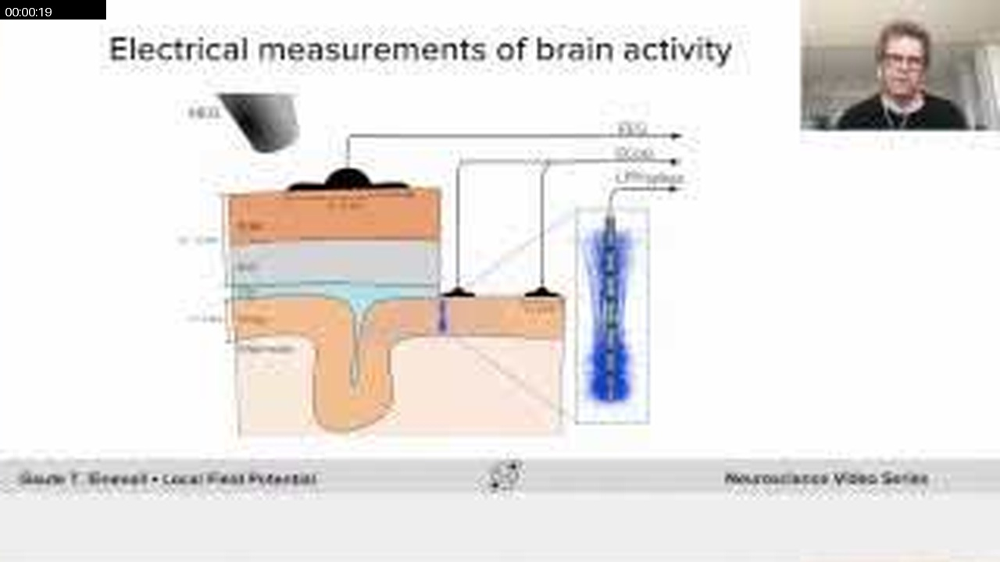

### 00:02:08

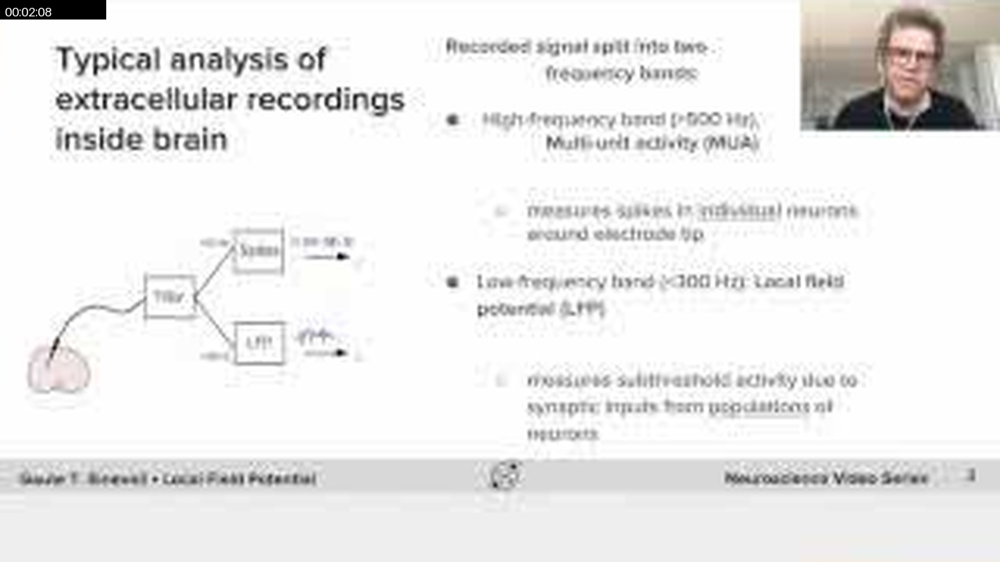

### 00:04:27

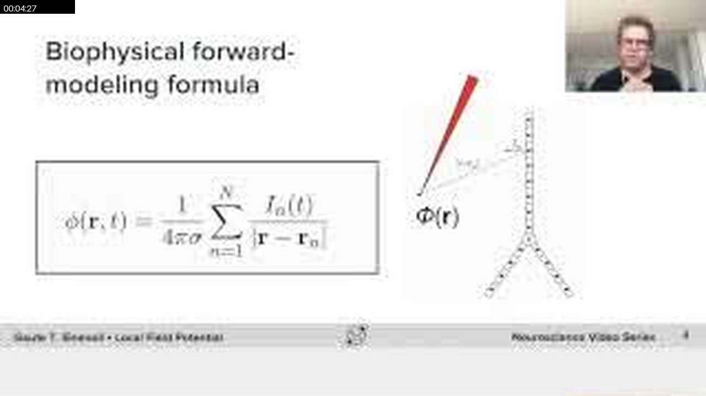

### 00:06:35

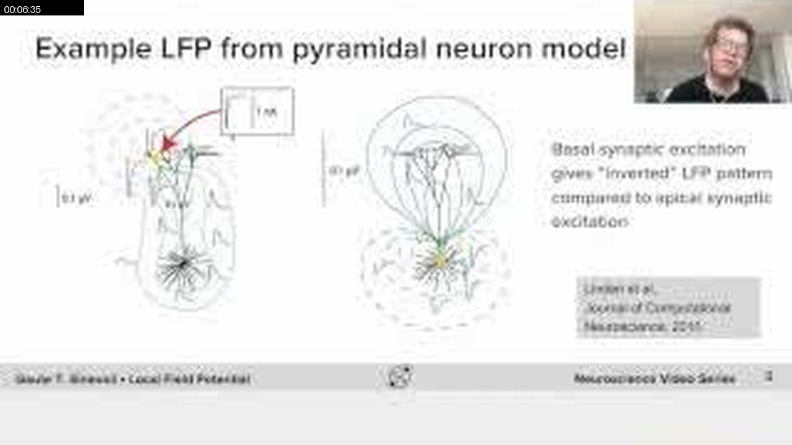

### 00:08:54

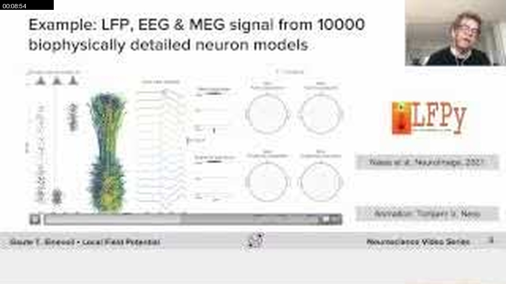

### 00:11:02

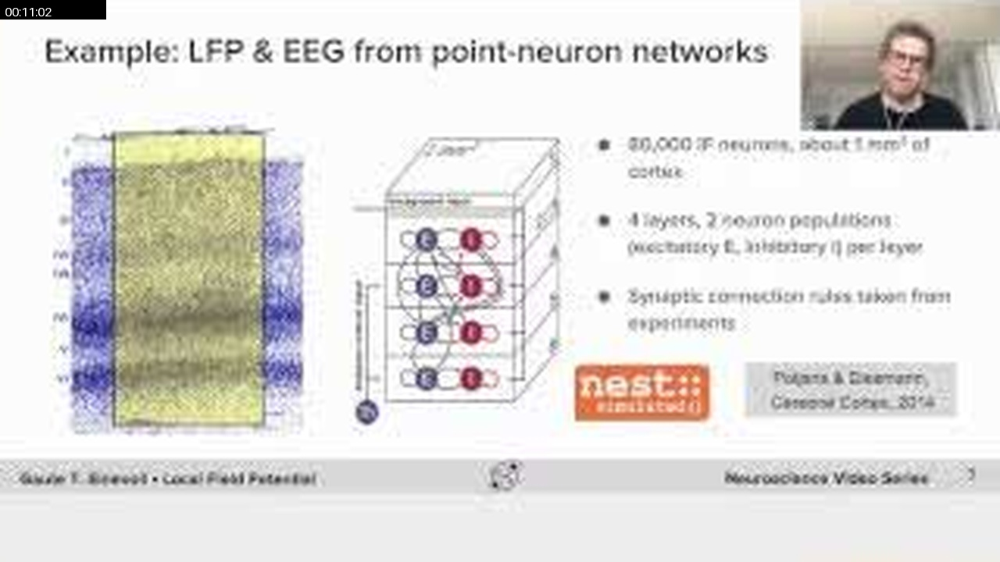

### 00:12:51

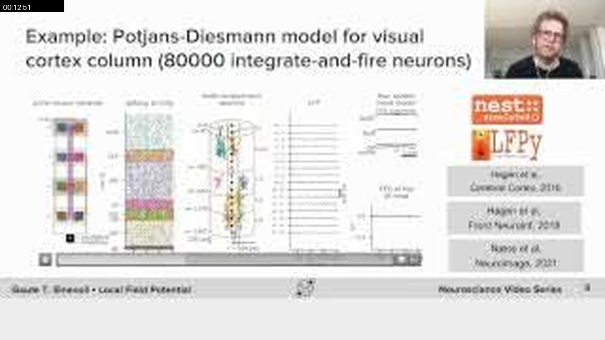

### 00:13:11

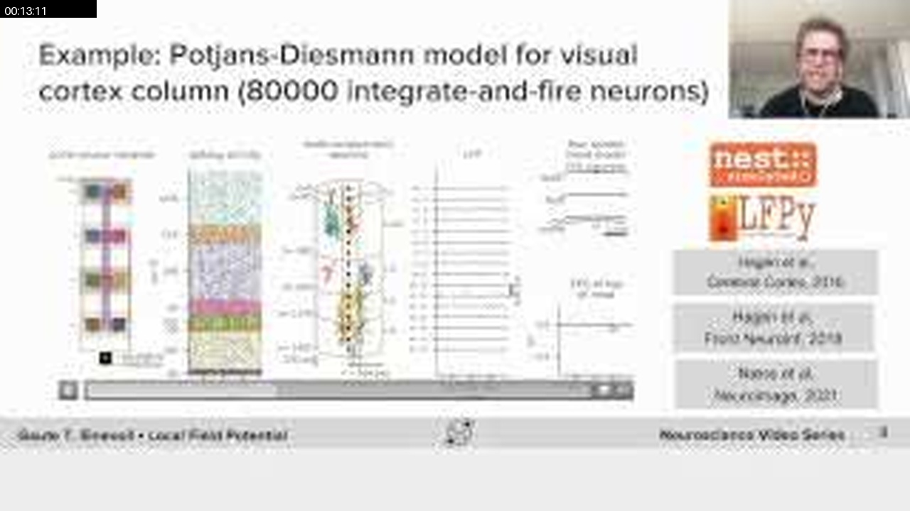

### 00:15:29

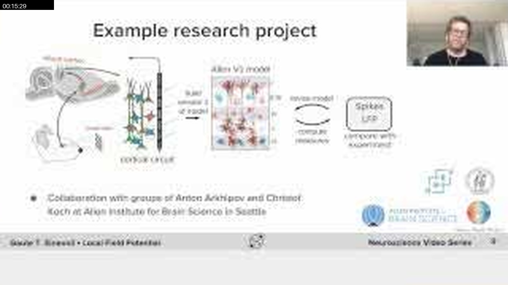

### 00:17:38

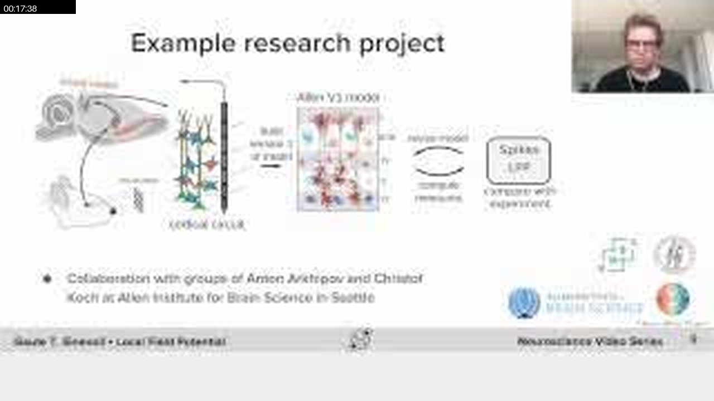

## Full Timeline Contact Sheet / 完整时间线联系表

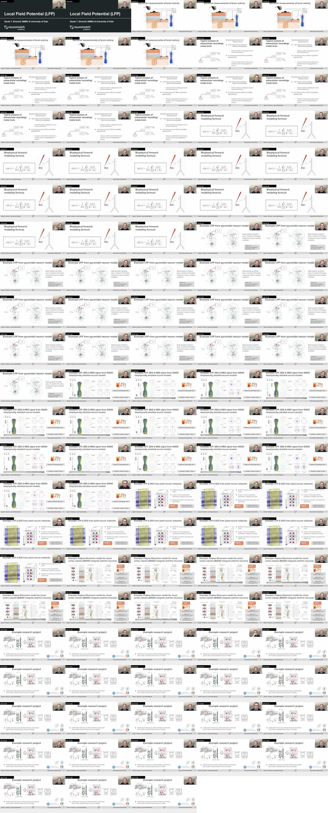
