# W0D0 Brain Signals: EEG & MEG - Structural Note / 结构化笔记

- Status / 状态: AI-generated draft based on the video captions; verify important scientific claims against primary sources. / 基于视频字幕生成的 AI 草稿；重要科学主张需回查一手来源。
- Course page / 课程页: https://compneuro.neuromatch.io/tutorials/W0D0_NeuroVideoSeries/student/W0D0_Tutorial7.html
- Video / 视频: https://youtube.com/watch?v=W-Zk6hrjj44
- Caption basis / 字幕依据: `../summaries/07-brain-signals-eeg-meg.summary.bilingual.md`

```markdown
## Core Problem / 核心问题

如何非侵入性地记录和解释大脑的电信号（EEG）和磁信号（MEG），特别是从头皮测量推断神经源的位置。  
How to non-invasively record and interpret the brain’s electrical (EEG) and magnetic (MEG) signals, especially inferring neural source locations from scalp measurements.

## Thesis / 核心论点

EEG和MEG提供毫秒级时间分辨率，直接测量神经电活动，但空间分辨率有限，源定位需解决不适定的逆问题。  
EEG and MEG offer millisecond-level temporal resolution and direct neural measurement, but have limited spatial resolution; source localization requires solving the ill-posed inverse problem.

## Argument Structure / 论证结构

1. **00:00:00 – 00:02:19** | 历史与引言  
   **角色**：介绍EEG的起源与测量原理  
   **中文**：19世纪末Caton在动物中记录电活动，20世纪Berger首次在人类头皮记录EEG，通过两点间电压差测量。  
   **English**: Caton recorded electrical activity in animals in the late 19th century; Berger first recorded human EEG by measuring voltage difference between two points.

2. **00:02:19 – 00:03:37** | MEG的发明与物理基础  
   **角色**：说明MEG依赖电流产生磁场的物理原理  
   **中文**：奥斯特发现电流产生圆形磁场；Cohen在屏蔽室内用超导磁力计发明MEG测量脑磁场。  
   **English**: Oersted discovered current produces circular magnetic fields; Cohen invented MEG using a superconducting magnetometer in a shielded room.

3. **00:03:37 – 00:05:06** | 神经生物基础  
   **角色**：解释EEG/MEG信号的细胞来源  
   **中文**：锥体神经元平行树突使兴奋性和抑制性突触后电位时空叠加，产生足够大的信号被头皮电极捕获，如α振荡（8-13 Hz）。  
   **English**: Parallel dendrites of pyramidal neurons enable spatiotemporal summation of postsynaptic potentials, producing signals large enough for scalp electrodes; e.g., alpha oscillations (8–13 Hz).

4. **00:07:38 – 00:09:28** | 正问题与逆问题  
   **角色**：阐述源定位的核心数学模型  
   **中文**：正问题由已知源模拟电极信号（如皮影）；逆问题由表面测量反推源，但解不唯一（不适定）。  
   **English**: Forward problem models electrode signals from known sources (like shadow puppetry); inverse problem infers sources from surface measurements, but solutions are non-unique (ill-posed).

5. **00:11:12 – 00:12:29** | 事件相关电位（ERP）  
   **角色**：展示时间锁定平均提高信噪比的方法  
   **中文**：多次试验平均后得到典型ERP波形，如约100ms正波和170ms负波（N170）。  
   **English**: Averaging multiple trials yields typical ERP waveforms, e.g., a positive wave at ~100 ms and a negative wave at ~170 ms (N170).

6. **00:14:01 – 00:17:41** | 稳态视觉诱发电位与频率标记  
   **角色**：介绍利用频率标记追踪主观感知的实验范式  
   **中文**：使用闪烁频率f1、f2刺激，脑产生基频和谐波及互调频率（SSVEP）；Parkkonen等人用12Hz和15Hz标记花瓶和脸，时频谱追踪被试感知切换。  
   **English**: Flickering stimuli at frequencies f1, f2 elicit fundamental, harmonic, and intermodulation frequencies (SSVEPs); Parkkonen et al. tagged vase at 12 Hz and face at 15 Hz, tracking perceptual switches via time-frequency spectrum.

## Mechanism and Objects / 机制与对象

- **生物机制**：锥体神经元的平行树突实现突触后电位（兴奋性和抑制性）的时空叠加；动作电位为全或无、快速的神经冲动。  
  **Biological mechanism**: Parallel dendrites of pyramidal neurons enable spatiotemporal summation of postsynaptic potentials (excitatory and inhibitory); action potentials are all-or-none, fast neural impulses.
- **测量信号**：EEG记录头皮两点间电压差；MEG用超导量子干涉器件（SQUID）测量脑磁场。  
  **Measurement signals**: EEG records voltage difference between two scalp points; MEG uses superconducting quantum interference devices (SQUIDs) to measure brain magnetic fields.
- **数学/计算对象**：正问题（已知源预测信号）与逆问题（信号反推源，不适定）；傅里叶变换分解时间信号为频率成分；事件相关电位（ERP）和稳态视觉诱发电位（SSVEP）的平均与频率标记。  
  **Mathematical/computational objects**: Forward problem (predict signal from known source) and inverse problem (infer source from signal, ill-posed); Fourier transform to decompose time signal into frequency components; event-related potentials (ERP) and steady-state visual evoked potentials (SSVEP) via averaging and frequency tagging.
- **解译说明**：频率标记（如12Hz、15Hz）用于客观追踪主观感知（如双稳态图像），是一种分析工具，并非宣称神经活动等同感知。  
  **Interpretation**: Frequency tagging (e.g., 12 Hz, 15 Hz) is used to objectively track subjective perception (e.g., bistable image) as an analytical tool, not a claim that neural activity equals perception.

## Evidence and Method / 证据与方法

- **历史证据**：Caton（兔、猴电活动）、Berger（人类EEG）、Oersted（电流-磁场）、Cohen（屏蔽室MEG）。  
  **Historical evidence**: Caton (rabbit/monkey electrical activity), Berger (human EEG), Oersted (current–magnetic field), Cohen (shielded-room MEG).
- **实验方法**：
  - 典型ERP实验：呈现刺激（数百ms）后间隔，多次试验平均，获得锁相活动。  
    Typical ERP experiment: present stimulus (hundreds of ms) with blank interval, average multiple trials to obtain phase-locked activity.
  - SSVEP：周期性闪烁刺激（如面孔或形状）诱发稳态响应，用傅里叶变换分析频率成分。  
    SSVEP: periodic flickering stimuli (e.g., faces, shapes) elicit steady-state responses analyzed by Fourier transform.
  - 频率标记双稳态：Parkkonen等人以12Hz标记花瓶、15Hz标记脸，被试报告感知，时频谱显示对应频率活动。  
    Frequency tagging of bistable perception: Parkkonen et al. tagged vase at 12 Hz, face at 15 Hz; participants reported percept; time-frequency spectrum showed corresponding frequency activity.
- **经典发现**：Bertamini等人发现对称性图案诱发持续后部负波（SPN），刺激偏移后持续>400 ms，且与任务无关。  
  **Classic findings**: Bertamini et al. found symmetric patterns elicit sustained posterior negativity (SPN) persisting >400 ms after stimulus offset, task-independent.
- **信号预处理**：需识别并清除伪迹（生理性：眨眼、咬牙；非生理性：手机干扰）。  
  **Signal preprocessing**: Artifacts (physiological: blinks, jaw clenching; non-physiological: mobile phone interference) must be identified and removed.

## Limits and Misconceptions / 局限与易错点

- **空间分辨率有限**：源定位困难，逆问题无唯一解。  
  **Limited spatial resolution**: Source localization is difficult; the inverse problem has no unique solution.
- **信号衰减与噪声**：EEG信号须穿过颅骨等保护层而减弱，数据含有噪声和伪迹，预处理步骤无共识。  
  **Signal attenuation and noise**: EEG signals weaken after passing through protective layers like skull; data contain noise and artifacts; no consensus on preprocessing steps.
- **误解示例**：不要认为单个神经元活动能被头皮记录（需大量同步突触后电位）；不要忽视参考电极的重要性（如海平面类比）。  
  **Misconception examples**: Do not assume single-neuron activity is recordable at scalp (requires large synchronized postsynaptic potentials); do not ignore the importance of reference electrode (like sea level analogy).
- **非侵入性**：EEG/MEG均为非侵入性（无注射或植入），但MEG需要屏蔽室和液氦冷却的SQUID，成本高。  
  **Non-invasiveness**: Both EEG and MEG are non-invasive (no injection or implantation), but MEG requires shielded room and liquid-helium-cooled SQUIDs, incurring high cost.

## NeuroAI Connection / NeuroAI 连接

- **类比**：EEG/MEG信号处理中的傅里叶变换和频率标记类似于AI中的特征提取方法（如频谱特征）。  
  **Analogy**: Fourier transform and frequency tagging in EEG/MEG signal processing resemble feature extraction methods (e.g., spectral features) in AI.
- **类比**：逆问题的不适定性与AI中的隐状态推断问题（如从观测反推潜变量）有相似之处，但并非等同。  
  **Analogy**: The ill-posed inverse problem shares similarity with hidden state inference in AI (e.g., inferring latent variables from observations), but this is an analogy, not equivalence.

## Review Questions / 复习问题

1. **中文**：EEG和MEG分别测量什么物理量？它们的共同点和主要区别是什么？  
   **English**: What physical quantities do EEG and MEG measure, respectively? What are their commonalities and key differences?

2. **中文**：为什么逆问题是“不适定的”？请用皮影戏的比喻解释正问题和逆问题。  
   **English**: Why is the inverse problem “ill-posed”? Explain the forward and inverse problems using the shadow-puppetry analogy.

3. **中文**：在频率标记双稳态感知实验中，如何从神经信号中推断被试的主观感知？  
   **English**: In the frequency-tagging bistable perception experiment, how can subjective perception be inferred from neural signals?

## Key Slide Guide / 关键幻灯片导读

| Time (start–end) | Role | Bilingual cue |
|------------------|------|---------------|
| 00:00:00 – 00:02:19 | 引言与历史 | EEG的起源与Berger首次记录 / Origin of EEG and Berger’s first recording |
| 00:02:19 – 00:03:37 | MEG物理基础 | 奥斯特实验与Cohen的MEG发明 / Oersted’s experiment and Cohen’s MEG invention |
| 00:03:37 – 00:05:06 | 神经生物机制 | 锥体神经元与突触后电位叠加 / Pyramidal neurons and postsynaptic potential summation |
| 00:05:06 – 00:06:35 | 电极系统与伪迹 | 10-20系统、生理性与非生理性伪迹 / 10-20 system, physiological and non-physiological artifacts |
| 00:06:35 – 00:07:38 | MEG测量敏感性 | 单神经元磁场微弱，需叠加大量神经元 / Single-neuron field too weak; summation of many neurons needed |
| 00:07:38 – 00:09:48 | 正问题与逆问题 | 皮影戏比喻；逆问题不适定 / Shadow-puppetry analogy; ill-posed inverse problem |
| 00:09:48 – 00:10:45 | 硬件：主动/被动电极与SQUID | 主动电极抗噪；MEG用SQUID / Active electrodes noise-resistant; MEG uses SQUIDs |
| 00:10:45 – 00:12:29 | 试验设计与ERP | 多次试验平均得到ERP（N170等） / Averaging trials to obtain ERP (e.g., N170) |
| 00:12:29 – 00:14:01 | 时间分辨率与连续刺激 | 毫秒级时间分辨率；SSVEP频率标记 / Millisecond temporal resolution; SSVEP frequency tagging |
| 00:14:01 – 00:15:56 | SSVEP与SPN | 对称性诱发持续后部负波（SPN） / Symmetry elicits sustained posterior negativity (SPN) |
| 00:15:56 – 00:17:41 | 频率标记双稳态感知 | Parkkonen实验：12Hz/15Hz追踪感知 / Parkkonen experiment: 12/15 Hz tracks perception |
| 00:17:41 – 00:19:36 | 优缺点与结语 | 非侵入、高时间分辨率 vs 空间分辨率低 / Non-invasive, high temporal resolution vs low spatial resolution |
```

## Key Slide Screenshots / 关键幻灯片截图

These are representative frames from YouTube's public 10-second storyboard, not original-resolution stills. / 以下为 YouTube 公开 10 秒分镜中的代表帧，并非原始分辨率截图。

### 00:00:00

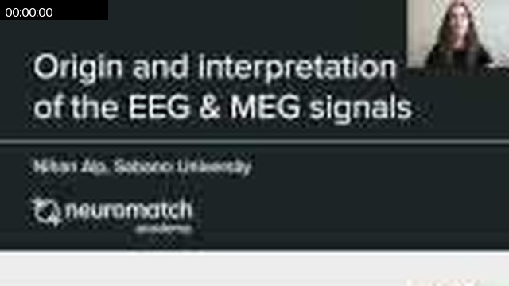

### 00:00:39

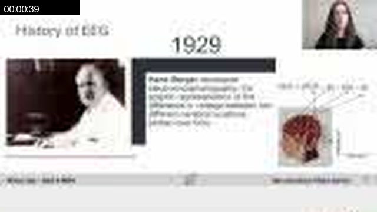

### 00:02:18

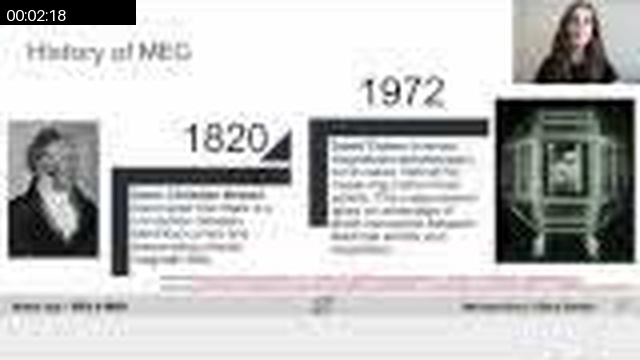

### 00:02:28

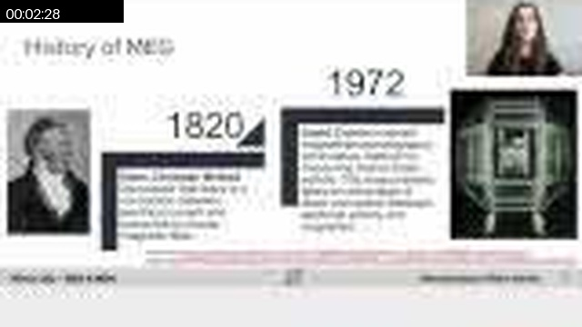

### 00:03:17

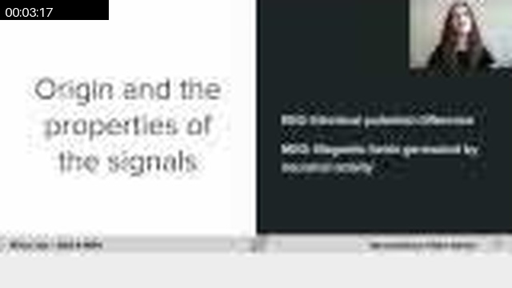

### 00:04:56

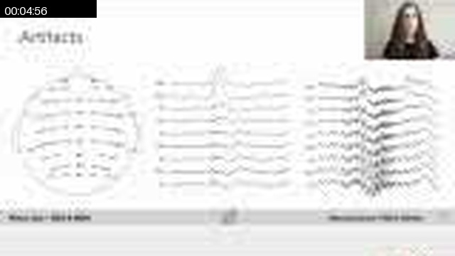

### 00:07:15

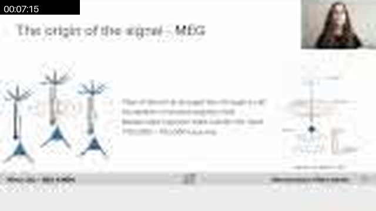

### 00:09:33


### 00:09:43

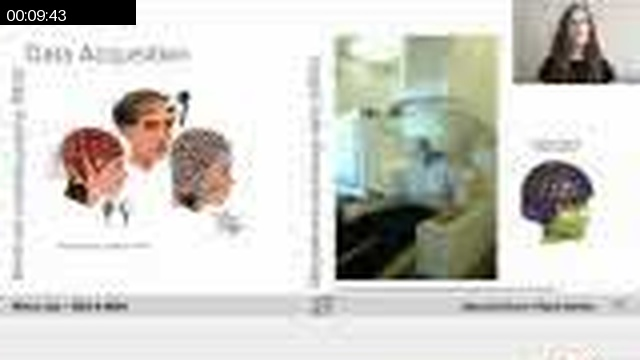

### 00:10:52

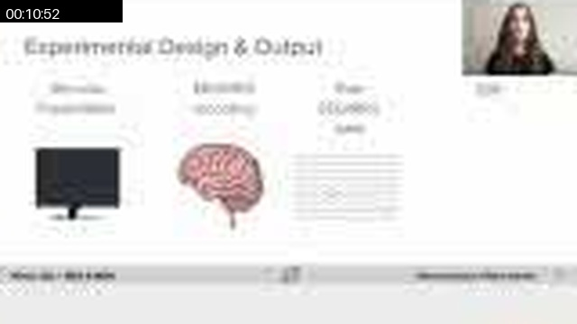

### 00:12:11

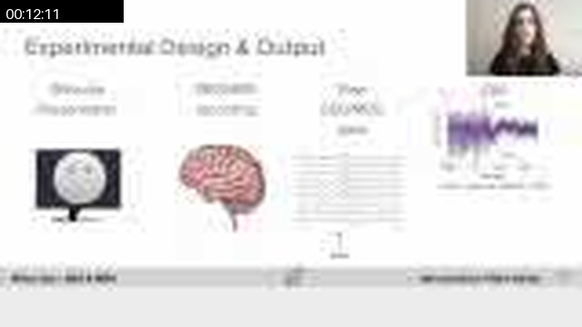

### 00:14:30

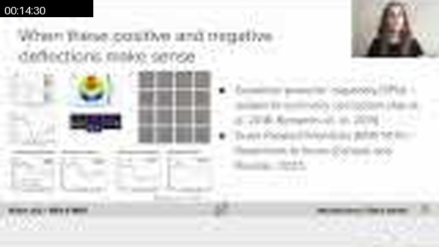

### 00:16:58

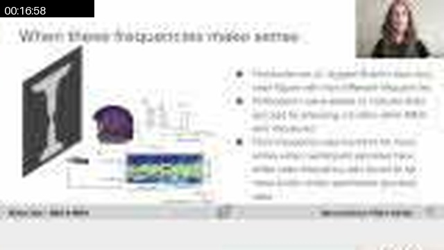

### 00:17:48

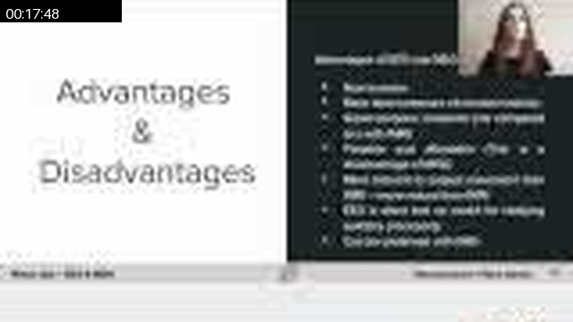

### 00:19:27


## Full Timeline Contact Sheet / 完整时间线联系表

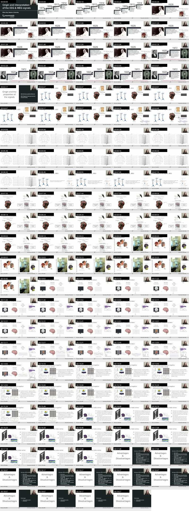
