# W0D0 Brain Signals: fMRI - Structural Note / 结构化笔记

- Status / 状态: AI-generated draft based on the video captions; verify important scientific claims against primary sources. / 基于视频字幕生成的 AI 草稿；重要科学主张需回查一手来源。
- Course page / 课程页: https://compneuro.neuromatch.io/tutorials/W0D0_NeuroVideoSeries/student/W0D0_Tutorial8.html
- Video / 视频: https://youtube.com/watch?v=8hhQGHYsXOY
- Caption basis / 字幕依据: `../summaries/08-brain-signals-fmri.summary.bilingual.md`

## Core Problem / 核心问题

如何在活体、介观层面无创地测量大脑动力学，并获得良好的空间与时间分辨率？fMRI 凭借血氧水平依赖（BOLD）信号成为核心工具。  
How to noninvasively measure brain dynamics at the in‑vivo mesoscale with good spatial and temporal resolution? fMRI, based on the blood oxygenation level‑dependent (BOLD) signal, is the key tool.

## Thesis / 核心论点

1990 年 Ogawa 发现的 BOLD 效应使 fMRI 成为广泛使用的脑功能成像方法，它通过检测血氧变化间接反映神经活动，可在活体上分辨到皮层柱层。  
The BOLD effect discovered by Ogawa in 1990 made fMRI a widely used functional brain imaging technique. It indirectly reflects neural activity by measuring blood oxygenation changes and can resolve down to the cortical column level in vivo.

## Argument Structure / 论证结构

1. **00:00:20 – 00:00:59 · Historical context / 历史背景**  
   1990 年 Ogawa 首次发现 BOLD 效应，并利用该信号发表了人类视觉皮层功能图像。  
   In 1990, Ogawa first discovered the BOLD effect and used this signal to publish functional images of the human visual cortex.

2. **00:01:36 – 00:02:14 · Why fMRI is popular / fMRI 为何流行**  
   fMRI 能在活体介观层面研究大脑动力学，兼具空间和时间分辨率。  
   fMRI can study brain dynamics at the in vivo mesoscale with both spatial and temporal resolution.

3. **00:03:35 – 00:04:35 · How MRI works / MRI 的工作原理**  
   MRI 机器是巨大磁铁（如 3 特斯拉，约为地球磁场 60,000 倍），强磁场对齐氢核自旋，通过梯度位移和射频发射获得空间定位信号。  
   An MRI machine is a giant magnet (e.g., 3 Tesla, ~60,000 times Earth’s field); the strong field aligns hydrogen nuclei spins, and spatial localization is obtained through gradient displacement and radiofrequency emission.

4. **00:07:39 – 00:08:31 · BOLD mechanism / BOLD 机制**  
   神经元无内部能量储备，活动时快速供能导致血氧过剩，称为血氧动力学响应。  
   Neurons have no internal energy reserves; rapid energy supply during activity leads to excess blood oxygen, termed the hemodynamic response.

5. **00:10:07 – 00:11:24 · BOLD signal generation / BOLD 信号产生**  
   突触活动引起小动脉扩张和血流量增加，血容量增加与去氧血红蛋白减少共同产生 BOLD 响应。  
   Synaptic activity causes arteriole dilation and increased blood flow; increased blood volume and decreased deoxyhemoglobin together generate the BOLD response.

6. **00:12:31 – 00:15:25 · Experimental designs / 实验设计**  
   主要有三种范式：block 设计（比较条件间 BOLD 效应）、event‑related 设计（比较不同刺激）和静息态 fMRI（测量无外部刺激时的脑活动，进而发现功能连接网络）。  
   Three main paradigms: block design (compare BOLD effects across conditions), event‑related design (compare different stimuli), and resting‑state fMRI (measure brain activity without external stimuli, revealing functional connectivity networks).

## Mechanism and Objects / 机制与对象

**已确立的教学内容**  
- **BOLD 信号**：血氧水平依赖信号，由去氧血红蛋白扭曲磁场、氧合血红蛋白不扭曲磁场而产生 MRI 信号变化。  
  **BOLD signal**: blood oxygenation level‑dependent signal; deoxyhemoglobin distorts the magnetic field while oxyhemoglobin does not, causing MRI signal changes.  
- **血液动力学响应**：神经活动后数秒出现 MRI 信号峰值，包含初始下降与恢复过程。  
  **Hemodynamic response**: MRI signal peaks seconds after neural activation, including an initial dip and recovery.  
- **MRI 设备**：3 特斯拉磁铁，通过梯度与射频序列实现结构 MRI（高分辨率，4–6 min）和功能 MRI（动态序列，每帧 <3 s）。  
  **MRI setup**: 3 Tesla magnet; gradient and radiofrequency sequences produce structural MRI (high resolution, 4–6 min) and functional MRI (dynamic series, each frame <3 s).  
- **实验范式**：block 设计、event‑related 设计、静息态 fMRI。  
  **Experimental paradigms**: block design, event‑related design, resting‑state fMRI.  

**与解释无关**：无附加解释。

## Evidence and Method / 证据与方法

- **Ogawa (1990)**：首次发现 BOLD 效应并发表人类视觉皮层功能图像。  
  Ogawa (1990) first discovered the BOLD effect and published functional images of human visual cortex.  
- **Biswal (1994)**：发现静息态下不同脑区活动相关性可揭示广泛的功能连接网络。  
  Biswal (1994) discovered that activity correlations across brain regions during rest reveal widespread functional connectivity networks.  
- **典型实验示例**：睁眼‑闭眼对比激活视觉皮层；Navon 图形分离整体与局部注意加工的脑效应。  
  Example experiments: eyes‑open vs. closed contrast activates visual cortex; Navon figures dissociate brain effects of global vs. local attention.

## Limits and Misconceptions / 局限与易错点

字幕未明确讨论局限性或常见误解。基于内容可推断：fMRI 时间分辨率低于 MEG/EEG（仅为秒级），且 BOLD 信号是间接测量（反映血氧变化而非直接神经活动）。  
No explicit limitations or misconceptions are discussed in the captions. Inferences from content: fMRI has lower temporal resolution than MEG/EEG (only seconds‑scale), and the BOLD signal is an indirect measure (reflecting blood oxygenation changes, not direct neural activity).

## NeuroAI Connection / NeuroAI 连接

**解释/类比**：  
- 静息态 fMRI 揭示的功能连接网络（Biswal, 1994）可类比于 AI 中的表示学习，其中模型从无标注数据中捕捉特征间的关系。  
  Resting‑state fMRI functional connectivity networks (Biswal, 1994) can be analogized to representation learning in AI, where models capture relationships among features from unlabeled data.  
- Event‑related 设计中整体与局部注意的分离（Navon 图形）与注意力机制的层级处理有概念相似性。  
  The dissociation of global vs. local attention in event‑related designs (Navon figures) conceptually parallels hierarchical processing in attention mechanisms.  

**非等价声明**：以上仅为类比，不暗示脑与 AI 机制的等同。

## Review Questions / 复习问题

1. BOLD 效应是什么？它与神经活动之间有何关系？  
   What is the BOLD effect and how does it relate to neural activity?

2. 请比较 block 设计与 event‑related fMRI 设计的区别。  
   Compare block design and event‑related fMRI design.

3. Bharat Biswal 在 1994 年关于静息态 fMRI 发现了什么？  
   What did Bharat Biswal discover in 1994 regarding resting‑state fMRI?

## Key Slide Guide / 关键幻灯片导读

| Time | Role | Bilingual cue / 中英文提示 |
|------|------|----------------------------|
| 00:00:00–00:00:18 | 介绍 Speaker introduction | Pedro Valdez‑Sosa 自介 / Pedro Valdez‑Sosa introduces himself |
| 00:00:20–00:01:16 | 历史 History | 1990 Ogawa BOLD 效应首次发现 / First discovery of BOLD effect in 1990 |
| 00:01:36–00:02:27 | 流行原因 Why popular | 介观、空间/时间分辨率 / Mesoscale, spatial & temporal resolution |
| 00:03:35–00:04:35 | MRI 物理原理 MRI physics | 3T 磁铁、氢核自旋、射频 / 3T magnet, hydrogen spins, radiofrequency |
| 00:05:13–00:06:22 | 结构 vs 功能MRI Structural vs functional MRI | 结构MRI 4–6 min, 功能MRI <3 s 每帧 / Structural MRI 4–6 min, functional MRI <3 s per frame |
| 00:07:39–00:08:31 | BOLD机制 BOLD mechanism | 神经元无能量储备、血氧动力学响应 / No energy reserves, hemodynamic response |
| 00:09:56–00:10:42 | 氧合与去氧血红蛋白 Oxy vs deoxyhemoglobin | 氧合不扭曲磁场、去氧扭曲 / Oxy does not distort field, deoxy distorts |
| 00:10:43–00:11:24 | BOLD响应产生 BOLD generation | 小动脉扩张、血容量增加、去氧Hb减少 / Arteriole dilation, increased blood volume, decreased deoxyHb |
| 00:12:31–00:13:15 | Block设计 Block design | 比较条件间BOLD效应 / Compare BOLD across conditions |
| 00:13:15–00:14:31 | Event‑related设计 Event‑related design | Navon 图形、整体 vs 局部注意 / Navon figures, global vs local attention |
| 00:14:31–00:15:25 | 静息态 fMRI Resting‑state fMRI | 无外部刺激、心智游移 / No external stimuli, mind‑wandering |
| 00:15:25–00:16:04 | 功能连接 Functional connectivity | Biswal 1994 脑区间活动相关 / Biswal 1994 activity correlations across regions |

## Key Slide Screenshots / 关键幻灯片截图

These are representative frames from YouTube's public 10-second storyboard, not original-resolution stills. / 以下为 YouTube 公开 10 秒分镜中的代表帧，并非原始分辨率截图。

### 00:00:00

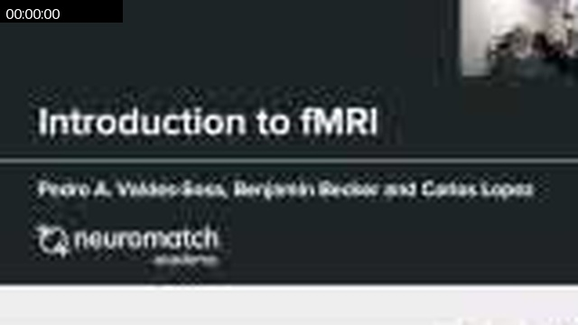

### 00:00:19

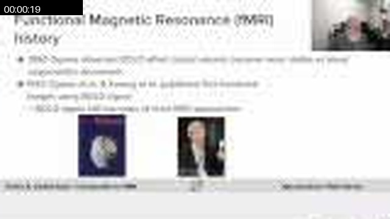

### 00:01:38

### 00:01:58

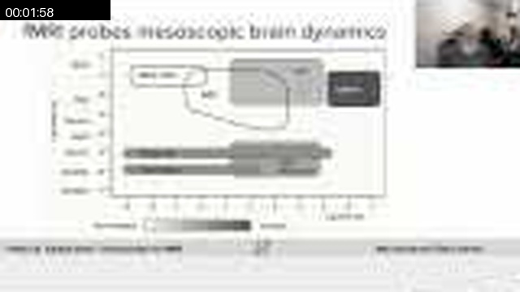

### 00:03:27

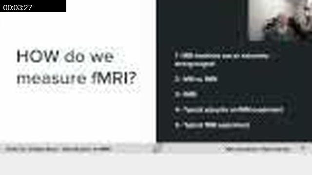

### 00:04:06

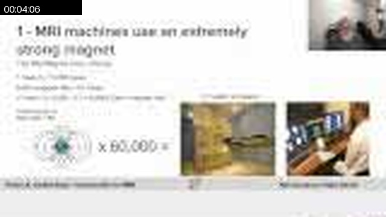

### 00:04:36

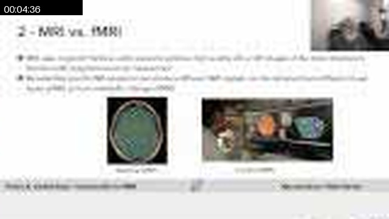

### 00:05:45

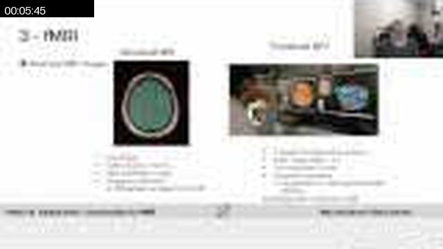

### 00:06:05

### 00:06:44

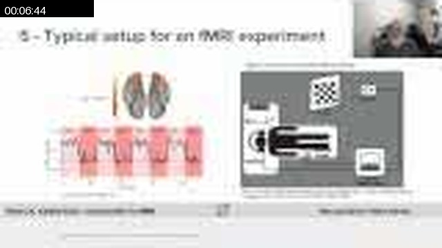

### 00:07:34

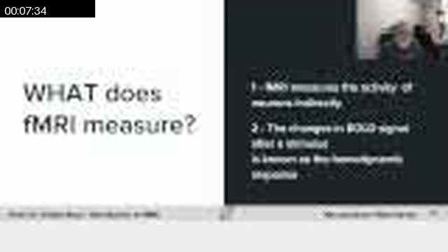

### 00:08:13

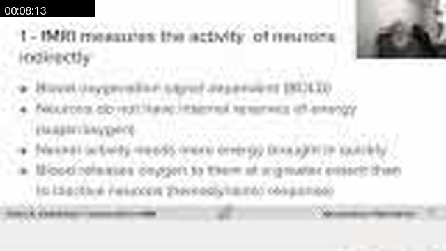

### 00:10:11

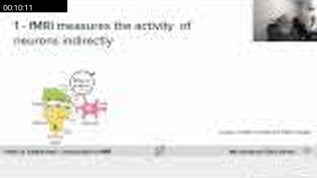

### 00:12:00

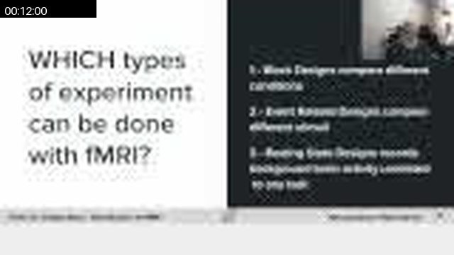

### 00:12:10

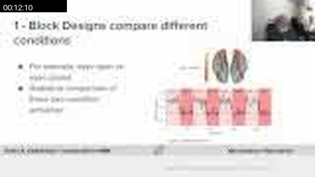

### 00:14:18

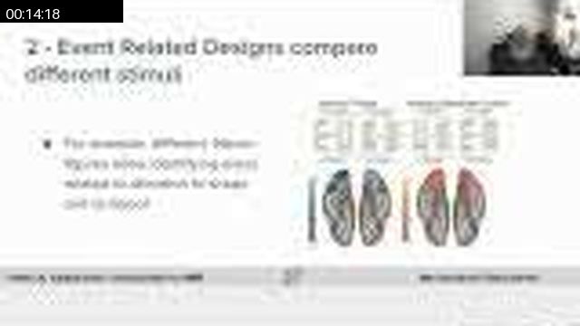

### 00:14:48

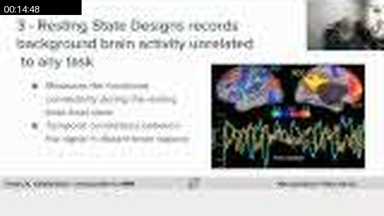

### 00:15:57

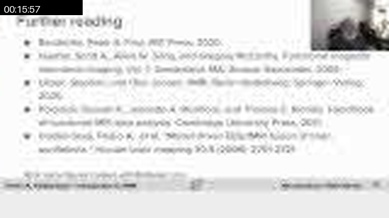

### 00:16:17

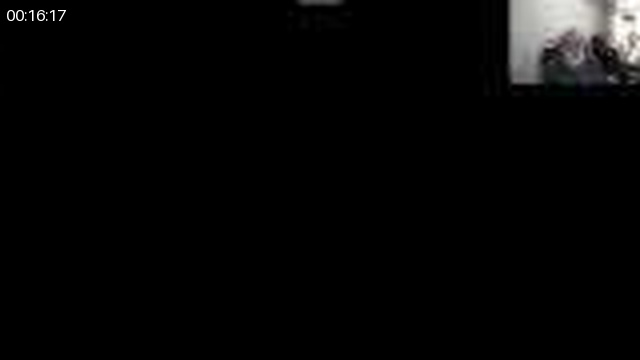

## Full Timeline Contact Sheet / 完整时间线联系表

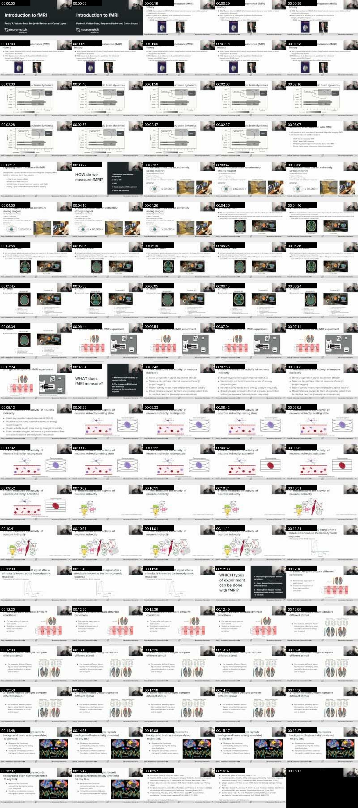
