# W0D0 Brain Signals: Calcium Imaging - Structural Note / 结构化笔记

- Status / 状态: AI-generated draft based on the video captions; verify important scientific claims against primary sources. / 基于视频字幕生成的 AI 草稿；重要科学主张需回查一手来源。
- Course page / 课程页: https://compneuro.neuromatch.io/tutorials/W0D0_NeuroVideoSeries/student/W0D0_Tutorial9.html
- Video / 视频: https://youtube.com/watch?v=_eJ-HvecSzU
- Caption basis / 字幕依据: `../summaries/09-brain-signals-calcium-imaging.summary.bilingual.md`

## Core Problem / 核心问题

如何将神经活动与特定行为动态相关联，特别是在深部脑区（如下丘脑）中，实现细胞类型特异性的长期记录？

How to correlate neural activity with specific behavioral dynamics, especially in deep brain regions (e.g., hypothalamus), achieving cell-type-specific long-term recording.

## Thesis / 核心论点

通过结合基因编码钙指示剂（GCaMP）、Cre依赖的病毒工具和微内窥镜成像系统，能够在小鼠自由行为过程中，对深部脑结构中遗传定义的神经元群体进行多会话记录，从而建立神经活动模式与生存行为（如进食）之间的相关图。

By combining genetically encoded calcium indicators (GCaMP), Cre-dependent viral tools, and microendoscopic imaging systems, it is possible to perform multi-session recording of genetically defined neuronal populations in deep brain structures during freely moving mouse behavior, thereby establishing correlation maps between neural activity patterns and survival behaviors (e.g., feeding).

## Argument Structure / 论证结构

1. **00:00:14.640 – 00:01:15.120** | 建立研究背景 |
   **中文：** 下丘脑包含多种功能各异的细胞类型，是研究行为神经基础的理想环路。
   **English:** The hypothalamus contains diverse functionally distinct cell types, making it an ideal circuit for studying the neural basis of behavior.

2. **00:01:15.680 – 00:02:44.080** | 引入细胞类型特异性工具 |
   **中文：** 开发了基于病毒和Cre-lox系统的FLEX-switch方法，实现对特定神经元（如AGRP）的紧密调控转基因表达和光遗传操控。
   **English:** A virus-based cell-type-specific method (FLEX-switch) using Cre-lox system was developed for tightly regulated transgene expression and optogenetic manipulation of specific neurons (e.g., AGRP).

3. **00:03:27.440 – 00:05:12.880** | 指出电生理的局限与挑战 |
   **中文：** 光遗传结合硅探针电生理可精确测量spiking，但下游神经元的光响应会干扰识别，且长时间记录多神经元存在困难。
   **English:** Optogenetics combined with silicon probe electrophysiology can precisely measure spiking, but light-evoked downstream responses complicate identification, and long-term multi-neuron recording is challenging.

4. **00:05:12.880 – 00:06:33.920** | 提出钙成像的优势 |
   **中文：** 钙成像能长期记录大量相同神经元群体，可在深部脑区成像，配合病毒策略和荧光微内窥镜建立活动-行为相关图。
   **English:** Calcium imaging enables long-term recording of large, identical neuronal populations, can image deep brain regions, and together with viral strategies and fluorescence microendoscopy establishes activity-behavior correlation maps.

5. **00:06:33.920 – 00:08:17.360** | 讲解核心成像原理和工具 |
   **中文：** GCaMP（由GFP、钙调蛋白和M13肽组成）在神经元活动时钙浓度升高，构象改变导致荧光增强；利用Cre转基因小鼠和Cre依赖AAV驱动GCaMP6在特定细胞类型中表达。
   **English:** GCaMP (composed of GFP, calmodulin, and M13 peptide) undergoes a conformational change and brightness increase upon neuronal activity-driven calcium rise; Cre transgenic mice and Cre-dependent AAV drive GCaMP6 expression in specific cell types.

6. **00:08:18.240 – 00:09:32.560** | 比较不同成像系统的适用场景 |
   **中文：** 双光子成像提供亚细胞分辨率（树突、轴突），适合头部固定实验；单光子微型显微镜和光纤光度法更适合自由活动小鼠。
   **English:** Two-photon imaging offers subcellular resolution (dendrites, axons) for head-fixed experiments; one-photon miniature microscopes and fiber photometry are more suitable for freely moving mice.

7. **00:10:40.400 – 00:12:37.840** | 展示实际应用范例 |
   **中文：** 使用单光子微型显微镜在自由活动小鼠进食时记录外侧下丘脑抑制性神经元，观察到荧光变化与舔舐事件时间锁定的动态。
   **English:** Using one-photon miniature microscopy in freely moving mice during feeding, lateral hypothalamic inhibitory neurons showed fluorescence changes time-locked to licking events.

## Mechanism and Objects / 机制与对象

**已建立的教学内容（Established teaching content）：**

- **GCaMP**：由绿色荧光蛋白（GFP）、钙结合蛋白Calmodulin和M13肽段组成的荧光钙传感器。神经元活动引发胞内钙快速升高，导致GCaMP构象改变、亮度增加，荧光变化（Δf/f）作为神经活动的代理指标。
- **Cre/lox系统与FLEX-switch**：利用Cre重组酶依赖的AAV载体，仅在表达Cre的神经元中驱动GCaMP或光遗传蛋白（如Channelrhodopsin）表达，实现细胞类型特异性标记和操控。
- **成像系统**：GRIN透镜结合单光子微型显微镜用于深部脑结构自由活动成像；双光子显微镜用于亚细胞分辨率（树突、轴突）头部固定成像；光纤光度法记录群体动态，无单细胞分辨率。
- **实验对象**：小鼠下丘脑弓状核AGRP神经元、POMC神经元；外侧下丘脑抑制性神经元；使用Agrp-Cre转基因小鼠品系。

**已说明的解释（Stated interpretation）：** 该演讲明确将钙成像方法描述为“神经活动的代理指标”（proxy for neural activity），并强调其无法像细胞外电生理那样可靠检测单个spike（00:11:19.280 – 00:12:03.360）。

## Evidence and Method / 证据与方法

- **工具开发证据**：开发了FLEX-switch病毒策略，实现紧密调控的转基因表达（00:01:15.680 – 00:02:22.400）；植入光纤的深部脑光传递系统结合硅探针电极进行光遗传与电生理记录（00:03:27.440 – 00:04:07.680）。
- **成像对比证据**：高密度电极记录多神经元困难，钙成像可长期记录相同群体（00:05:12.880 – 00:05:55.120）。
- **行为实验范例**：在自由活动小鼠进食行为中，使用单光子微型显微镜记录外侧下丘脑GCaMP6阳性抑制性神经元，观察到荧光动态变化与舔舐事件时间锁定（00:12:17.360 – 00:12:37.840）。
- **数据分析工具**：提到有多种免费数据提取和分析方法可供下载（00:12:38.880 – 00:12:52.560）。

## Limits and Misconceptions / 局限与易错点

- **钙成像无法可靠检测单个spike**：与细胞外电生理相比，钙成像通过荧光变化测量神经活动，无法像电生理那样可靠地检测单动作电位（00:11:19.280 – 00:12:03.360）。
- **光刺激引起的下游神经元spike**：光遗传刺激不仅激活Channelrhodopsin阳性神经元，还会引起下游神经元的短潜伏期spike，给阳性神经元的识别和分析带来挑战（00:04:52.640 – 00:05:12.880）。
- **细胞类型特异性电生理随时间推进的挑战**：基因定义的细胞外电生理记录存在长期稳定性问题（00:04:07.680 – 00:04:52.640）。
- **成像系统的权衡**：双光子系统昂贵、体积大，通常用于头部固定实验；单光子微型显微镜虽可自由活动但分辨率较低；光纤光度法无单细胞分辨率（00:09:32.560 – 00:10:39.440）。

## NeuroAI Connection / NeuroAI 连接

钙成像能够同时记录大量神经元的群体活动，生成高维时空数据，这与人工智能中处理大规模数据集（如图像、序列）的需求类似。然而，这是作为一种**类比**，而非功能等价：钙成像数据需要专用的提取和分析工具（如去噪、信号分离、行为对齐），这些方法中的部分技术（如降维、去卷积）与机器学习方法共享数学基础，但该讲座并未直接提及AI模型。

Calcium imaging records population activity from many neurons simultaneously, generating high-dimensional spatiotemporal data—analogous to the large datasets (e.g., images, sequences) processed in AI. However, this is presented as an **analogy**, not a claim of equivalence: the data require specialized extraction and analysis tools (denoising, demixing, behavior alignment), and some of these techniques (dimensionality reduction, deconvolution) share mathematical foundations with machine learning, but the lecture does not directly reference AI models.

## Review Questions / 复习问题

1. **中文：** 为什么在该研究中，钙成像相比细胞外电生理更适合长期记录深部脑区的神经元活动？请列出至少两个原因。
   **English:** Why is calcium imaging more suitable than extracellular electrophysiology for long-term recording of deep brain neural activity in this study? List at least two reasons.

2. **中文：** GCaMP荧光变化的原理是什么？它如何作为神经活动的代理指标？
   **English:** What is the principle behind GCaMP fluorescence change? How does it serve as a proxy for neural activity?

3. **中文：** 比较单光子微型显微镜和双光子显微镜在下丘脑钙成像中的优缺点。
   **English:** Compare the advantages and disadvantages of one-photon miniature microscopy and two-photon microscopy for hypothalamic calcium imaging.

## Key Slide Guide / 关键幻灯片导读

| Time | Role | Bilingual cue |
|------|------|---------------|
| 00:00:00 – 00:01:15 | 引入下丘脑模型 | 下丘脑是研究行为神经基础的理想环路 / Hypothalamus is an ideal circuit for studying the neural basis of behavior |
| 00:01:15 – 00:02:44 | 展示细胞类型特异性工具 | FLEX-switch实现紧密调控的转基因表达 / FLEX-switch enables tightly regulated transgene expression |
| 00:02:44 – 00:05:12 | 光遗传电生理及其挑战 | 光刺激引发下游神经元spike，识别困难 / Light stimulation evokes downstream spikes, complicating identification |
| 00:05:12 – 00:07:44 | 钙成像的优势与GCaMP原理 | 钙成像长期记录相同群体；GCaMP由GFP、钙调蛋白和M13组成 / Calcium imaging enables long-term recording of same population; GCaMP consists of GFP, calmodulin, and M13 |
| 00:07:44 – 00:08:17 | GCaMP表达策略 | Cre依赖AAV驱动GCaMP6在特定神经元表达 / Cre-dependent AAV drives GCaMP6 expression in specific neurons |
| 00:08:17 – 00:09:32 | 成像系统对比 | 双光子：亚细胞分辨率；单光子微型显微镜：自由活动 / Two-photon: subcellular resolution; one-photon miniscope: freely moving |
| 00:09:32 – 00:10:39 | 成像系统权衡 | 光纤光度法：群体动态，无细胞分辨率；双光子：昂贵、头部固定 / Fiber photometry: population dynamics, no single-cell resolution; two-photon: expensive, head-fixed |
| 00:10:40 – 00:12:37 | 行为实验结果 | 自由活动小鼠进食中，外侧下丘脑抑制性神经元荧光变化与舔舐事件锁时 / Freely moving mice feeding: lateral hypothalamus inhibitory neuron fluorescence time-locked to licking |
| 00:12:38 – 00:13:43 | 数据工具与总结 | 多种免费数据分析方法可用；总结功能性成像十年进展 / Multiple free analysis methods available; summary of decade of functional imaging progress |

## Key Slide Screenshots / 关键幻灯片截图

These are representative frames from YouTube's public 10-second storyboard, not original-resolution stills. / 以下为 YouTube 公开 10 秒分镜中的代表帧，并非原始分辨率截图。

### 00:00:00

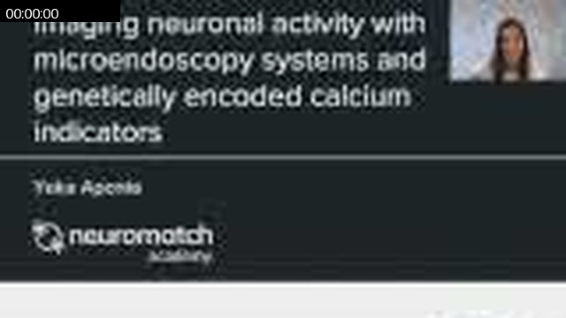

### 00:00:14

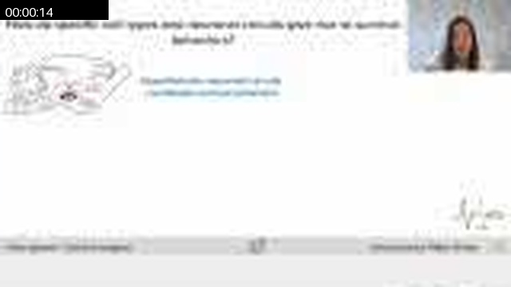

### 00:01:44

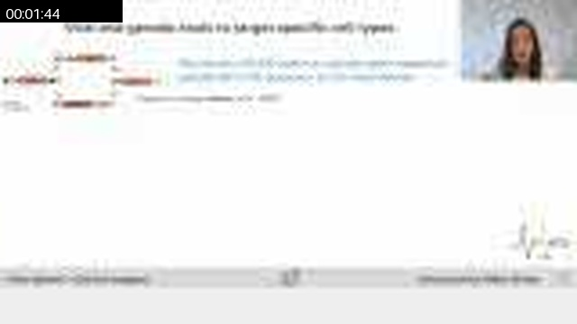

### 00:03:23

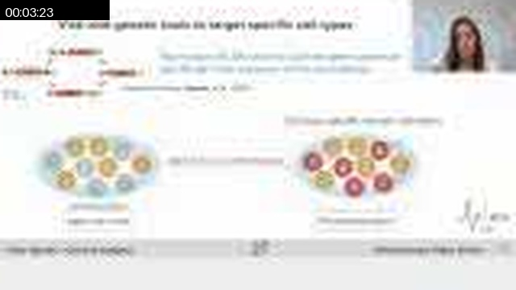

### 00:05:07

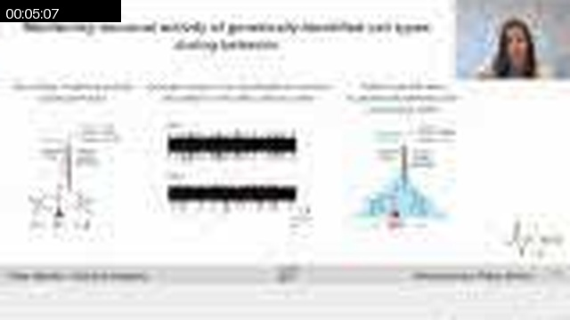

### 00:06:47

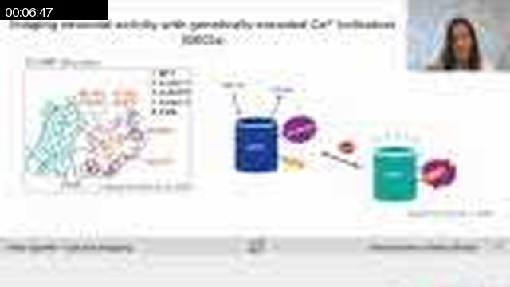

### 00:08:31

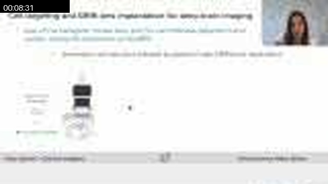

### 00:09:01

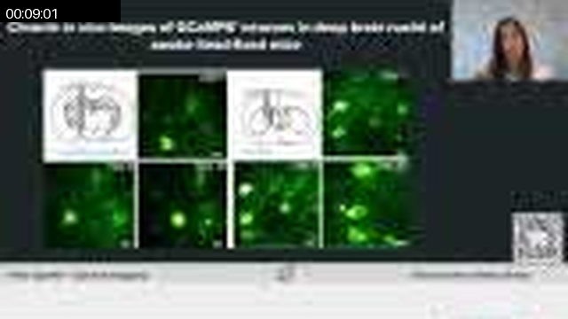

### 00:09:15

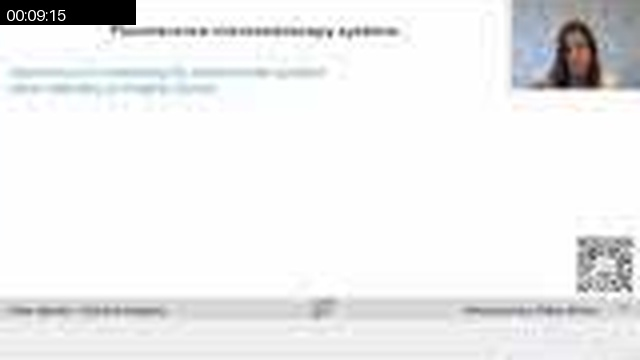

### 00:10:15

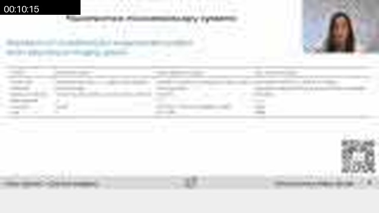

### 00:11:00

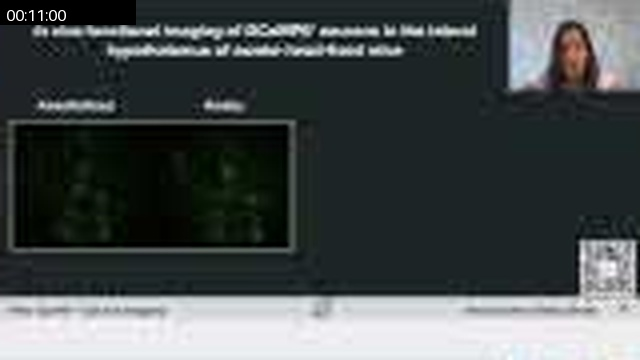

### 00:11:15

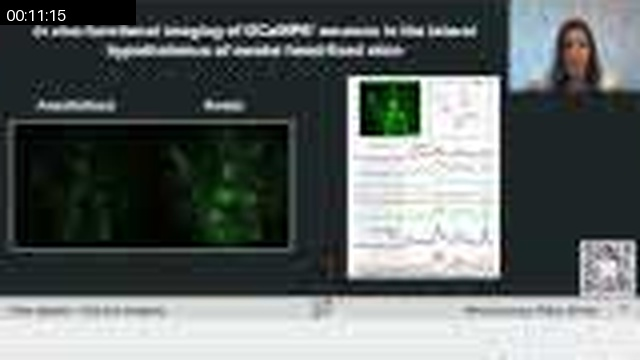

### 00:11:54

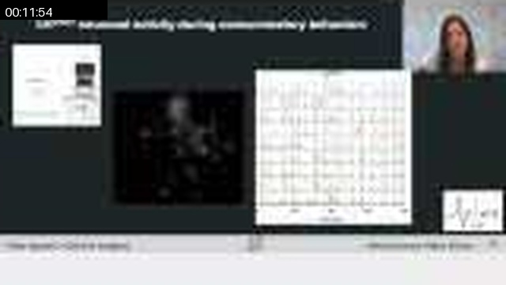

### 00:12:34

### 00:13:39

## Full Timeline Contact Sheet / 完整时间线联系表

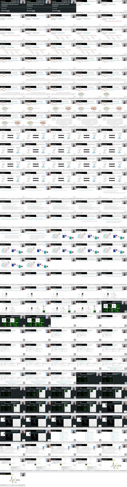
