# W0D0 Stimulus Representation - Structural Note / 结构化笔记

- Status / 状态: AI-generated draft based on the video captions; verify important scientific claims against primary sources. / 基于视频字幕生成的 AI 草稿；重要科学主张需回查一手来源。
- Course page / 课程页: https://compneuro.neuromatch.io/tutorials/W0D0_NeuroVideoSeries/student/W0D0_Tutorial10.html
- Video / 视频: https://youtube.com/watch?v=-BUM4JcT9WA
- Caption basis / 字幕依据: `../summaries/10-stimulus-representation.summary.bilingual.md`

## Core Problem / 核心问题
大脑如何表征感觉信息？尤其是早期视觉系统中的神经元如何将环境刺激编码为神经活动？  
How does the brain represent sensory information, specifically how do neurons in the early visual system encode environmental stimuli into neural activity?

## Thesis / 核心论点
大脑通过高度结构化、有组织的功能表征（如感受野、拓扑映射、调谐曲线和功能图）来表征感觉信息，这些表征在不同层级之间存在紧密联系，并且根据系统需求（如中央凹的高分辨率）进行定制。  
The brain represents sensory information via highly structured, organized functional representations (receptive fields, topographic maps, tuning curves, and functional maps) that are tightly linked across levels and tailored to system demands (e.g., high foveal resolution).

## Argument Structure / 论证结构

1. **00:00:29 – 00:01:50** · 角色：聚焦问题与系统  
   **中文**：讲座以视觉系统为例，提出如何找出视觉通路中神经元如何表征感觉信息的问题。  
   **English**: The lecture uses the visual system as an example and raises the question of how neurons in visual pathways represent sensory information.

2. **00:01:52 – 00:03:07** · 角色：方法引入  
   **中文**：采用系统（黑箱）方法：系统性输入视觉刺激（如光栅），记录早期视觉系统的神经活动，以推断表征机制。  
   **English**: A systems (black-box) approach is introduced: systematically presenting visual stimuli (e.g., gratings) and recording neural activity in the early visual system to infer representation mechanisms.

3. **00:03:09 – 00:04:30** · 角色：核心概念一—感受野与拓扑映射  
   **中文**：引入感受野概念——神经元只响应视觉场的局部区域；相邻神经元的感受野相邻，形成视网膜拓扑图。  
   **English**: The receptive field concept is introduced—a neuron responds only to a local region of the visual field; neighboring neurons have adjacent receptive fields, forming a retinotopic map.

4. **00:04:32 – 00:06:52** · 角色：测量方法  
   **中文**：详细演示 spike-triggered averaging 方法：对多个 spike 前的随机棋盘格刺激进行平均，噪声被消除，感受野结构显现。  
   **English**: The spike-triggered averaging method is demonstrated: averaging random checkerboard stimuli preceding multiple spikes eliminates noise and reveals the receptive field structure.

5. **00:07:13 – 00:08:38** · 角色：拓扑图的非均匀性  
   **中文**：视网膜拓扑图在视觉皮层中是非均匀的——中央凹（前16度）占据近一半皮层面积，体现高空间分辨率需求。  
   **English**: The retinotopic map in visual cortex is nonuniform—the fovea (central 16°) occupies nearly half the cortical area, reflecting the demand for high spatial acuity.

6. **00:08:46 – 00:11:22** · 角色：核心概念二—中心-周围感受野  
   **中文**：介绍 ON-Center/OFF-Surround 和 OFF-Center/ON-Surround 细胞，它们对光点和光环的兴奋/抑制响应不同，是经典感受野结构。  
   **English**: ON-center/OFF-surround and OFF-center/ON-surround cells are introduced; their distinct excitatory/inhibitory responses to spots and annuli illustrate the classic center-surround receptive field structure.

7. **00:12:03 – 00:16:57** · 角色：核心概念三—调谐曲线与功能图  
   **中文**：讲解调谐曲线（朝向、运动方向、空间频率）及其选择性，并说明视觉皮层中偏好朝向并非随机分布，而是形成朝向偏好图（含 pinwheels）。  
   **English**: Tuning curves (orientation, motion direction, spatial frequency) and their selectivity are explained; preferred orientations are not random but form orientation preference maps featuring pinwheels.

## Mechanism and Objects / 机制与对象

- **生物机制**：视网膜光感受器、视网膜神经节细胞、丘脑 LGN、初级视觉皮层 V1 简单细胞与复杂细胞。  
  **Biological mechanisms**: photoreceptors, retinal ganglion cells, thalamic LGN, simple and complex cells in V1.
- **测量信号**：神经元动作电位（spike）记录，采用在体电生理技术。  
  **Measured signal**: neuronal action potentials (spikes) recorded via in vivo electrophysiology.
- **数学/计算对象**：Spike-triggered averaging (STA)、Difference of Gaussians 模型（DoG）、Gabor 滤波器、调谐曲线（朝向、运动方向、空间频率）、视网膜拓扑图、朝向偏好图、眼优势图、颜色斑点。  
  **Mathematical/computational objects**: Spike-triggered averaging (STA), Difference of Gaussians (DoG) model, Gabor filter, tuning curves (orientation, motion direction, spatial frequency), retinotopic map, orientation preference map, ocular dominance map, color blobs.
- **区分**：以上均为讲座直接介绍的教学内容。无额外解释性陈述。

## Evidence and Method / 证据与方法

- **方法**：系统呈现视觉刺激（条状光栅、随机棋盘格、移动光栅），在早期视觉系统（视网膜、LGN、V1）记录神经活动；使用 spike-triggered averaging 计算感受野；通过改变刺激参数（如朝向、空间频率）记录发放率以绘制调谐曲线；使用多电极阵列记录多个位点以构建功能图。  
  **Methods**: Systematic presentation of visual stimuli (oriented gratings, random checkerboards, drifting gratings); recording neural activity in retina, LGN, and V1; computing receptive fields via spike-triggered averaging; plotting tuning curves by varying stimulus parameters (orientation, spatial frequency); using multi-electrode arrays to construct functional maps.
- **证据**：动画展示 STA 随 spike 数增加而显现感受野结构；Hubel 和 Wiesel 发现 V1 神经元方向选择性并获诺贝尔奖；多电极记录表明 ON/OFF 视网膜输入到皮层的拓扑映射是朝向图组织的基础；简单细胞的 ON/OFF 响应叠加呈现边缘检测器形态（类似 Gabor 滤波器），且其偏好朝向与移动条测得的调谐曲线匹配。  
  **Evidence**: Animation showing receptive field structure emerging via STA as spike count increases; Hubel & Wiesel’s discovery of orientation selectivity (Nobel Prize); multi-electrode recordings revealing that ON/OFF retinal topographic mapping underlies orientation map organization; simple cells’ ON/OFF responses summing into edge-detector shapes (Gabor-like) matching tuning curves from moving bars.

## Limits and Misconceptions / 局限与易错点

- **局限**：感受野是动态的，并有交互作用（00:11:42）。视网膜拓扑图在视觉皮层中非均匀，不似相机均匀扫描视野（00:07:21）。视觉系统从低级到高级表征逐渐复杂，单一概念（如感受野或调谐曲线）无法概括更高层次的物体识别机制。  
  **Limits**: Receptive fields are dynamic and undergo interactions (00:11:42). The retinotopic map in visual cortex is nonuniform, not like a camera scanning the field uniformly (00:07:21). Visual representations become increasingly complex from low to high levels; single concepts (e.g., receptive field or tuning curve) cannot fully capture high-level object recognition.
- **易错点**：误以为感受野是均匀固定的（实际上有动态调节）；忽略视网膜拓扑图是非均匀的（中央凹占据更大皮层）；混淆 ON-center 和 OFF-center 细胞对同一刺激的响应；简单地将调谐曲线视为唯一表征形式，忽略功能图与不同表征层次的关联。  
  **Misconceptions**: Treating receptive fields as fixed and uniform (they are dynamic); ignoring the nonuniformity of retinotopic maps (foveal magnification); confusing ON-center and OFF-center cell responses; viewing tuning curves as the only form of representation and overlooking functional maps and cross-level links.

## NeuroAI Connection / NeuroAI 连接

（以下为基于字幕的解释或类比，非等价宣称）  
(The following are interpretations or analogies based on captions, not claims of equivalence.)

- 视觉皮层简单细胞常被建模为 **Gabor 滤波器**，其在计算机视觉中用作定向边缘检测器（00:19:30–00:19:58）。这类似于卷积神经网络第一层学习到的 Gabor-like 滤波器。  
  Simple cells in visual cortex are often modeled as **Gabor filters**, which are important as oriented edge detectors in computer vision (00:19:30–00:19:58). This parallels Gabor-like filters learned in the first layers of convolutional neural networks.
- **调谐曲线**的概念可以类比于人工神经元对不同输入特征的敏感性（如朝向、运动方向、空间频率），类似深度学习中特征检测器对特定模式的激活。  
  The concept of **tuning curves** can be analogized to the sensitivity of artificial neurons to different input features (e.g., orientation, motion direction, spatial frequency), similar to feature detectors in deep learning that activate for specific patterns.
- 视觉系统中的**层次化处理**（低级分解朝向、颜色、对比→中级形状/纹理→高级物体识别，00:22:33–00:23:25）与深度神经网络的层级特征提取架构在抽象思路上一致。  
  The **hierarchical processing** in the visual system (low-level decomposition of orientation, color, contrast → intermediate shape/texture → high-level object recognition, 00:22:33–00:23:25) conceptually aligns with the layered feature extraction architecture in deep neural networks.

## Review Questions / 复习问题

1. **问题**：什么是神经元的感受野？如何通过 spike-triggered averaging 方法测量感受野？  
   **Question**: What is a neuron’s receptive field? How is it measured using spike-triggered averaging?  
   【参考：00:03:09–00:06:52】

2. **问题**：ON-center 细胞和 OFF-center 细胞对光点和光环的响应有何不同？这种 center-surround 结构有何功能意义？  
   **Question**: How do ON-center and OFF-center cells respond differently to a spot of light versus an annulus? What is the functional significance of this center-surround structure?  
   【参考：00:08:46–00:11:22】

3. **问题**：调谐曲线描述了什么？以朝向选择性或运动方向选择性为例，说明如何从神经放电数据构建调谐曲线。  
   **Question**: What does a tuning curve describe? Using orientation selectivity or motion direction selectivity as an example, explain how to construct a tuning curve from neural spike data.  
   【参考：00:12:56–00:16:22】

## Key Slide Guide / 关键幻灯片导读

| Time | Role / 角色 | Bilingual cue / 双语提示 |
|------|-------------|--------------------------|
| 00:00:29–00:01:50 | 引入问题与系统焦点 | 视觉通路如何表征感觉信息？/ How do visual pathway neurons represent sensory information? |
| 00:01:52–00:03:07 | 系统方法 | 黑箱方法：提供输入刺激，测量输出神经活动 / Black-box approach: present stimuli, measure neural output |
| 00:03:09–00:04:30 | 感受野与拓扑映射 | 感受野概念；视网膜拓扑图 / Receptive field; retinotopic map |
| 00:04:32–00:06:52 | spike-triggered averaging | STA方法：对spike前刺激平均，显现感受野 / STA: average stimuli preceding spikes to reveal RF |
| 00:07:13–00:08:38 | 非均匀视网膜映射 | 中央凹高放大倍数，占据一半皮层面积 / Foveal magnification: central 16° occupies half cortex |
| 00:08:46–00:11:22 | 中心-周围感受野 | ON/OFF中心-周围细胞的光点与光环响应 / ON/OFF center-surround cells: spot vs. annulus responses |
| 00:11:24–00:11:47 | 动态感受野模型 | 差分高斯模型；感受野动态交互 / DoG model; dynamic RF interactions |
| 00:12:03–00:12:55 | 朝向选择性发现 | Hubel & Wiesel发现方向选择性 / Hubel & Wiesel discovered orientation selectivity |
| 00:13:26–00:14:37 | 调谐曲线 | 调谐曲线定义；窄曲线高选择性 / Tuning curve definition; narrow curve = high selectivity |
| 00:15:08–00:16:22 | 其他调谐曲线 | 运动方向调谐极坐标图；空间频率调谐曲线 / Motion direction tuning (polar plot); spatial frequency tuning |
| 00:16:33–00:17:55 | 朝向偏好图 | 颜色编码的皮层顶视图；pinwheel 结构 / Color-coded orientation preference map; pinwheels |
| 00:18:30–00:19:58 | 简单细胞与Gabor滤波器 | 简单细胞感受野类似边缘检测器；Gabor滤波器 / Simple cell RFs as edge detectors; Gabor filter |
| 00:19:59–00:20:59 | 视网膜拓扑是功能图基础 | 多电极记录显示ON/OFF拓扑映射是朝向图起源 / Multi-electrode: ON/OFF topography underlies orientation maps |
| 00:21:37–00:22:32 | 复杂细胞与层次处理 | 复杂细胞对光暗相位不变；视觉层次分解 / Complex cells phase-invariant; visual hierarchy decomposes features |
| 00:22:33–00:23:25 | 高级视觉处理 | 形状、纹理、物体识别 / Shape, texture, object recognition |
| 00:23:25–00:24:09 | 其他功能图 | 眼优势图、颜色斑点 / Ocular dominance maps, color blobs |

## Key Slide Screenshots / 关键幻灯片截图

These are representative frames from YouTube's public 10-second storyboard, not original-resolution stills. / 以下为 YouTube 公开 10 秒分镜中的代表帧，并非原始分辨率截图。

### 00:00:00

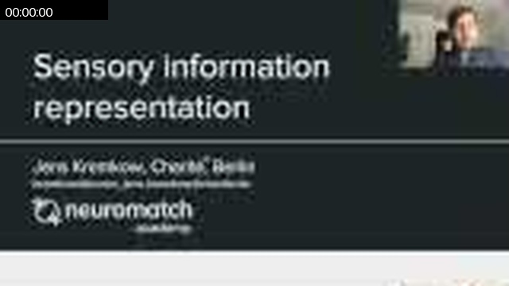

### 00:03:07

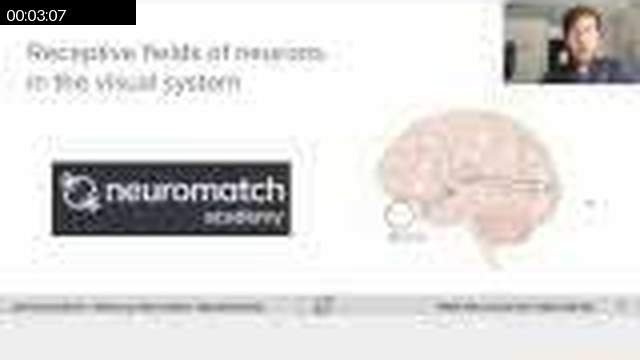

### 00:05:26

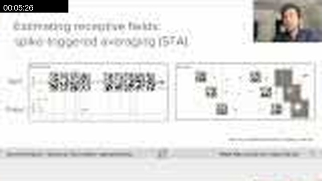

### 00:05:56

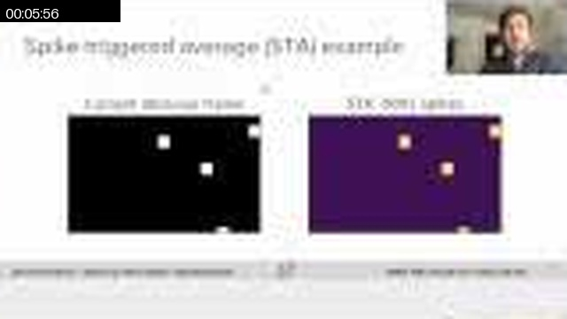

### 00:06:25

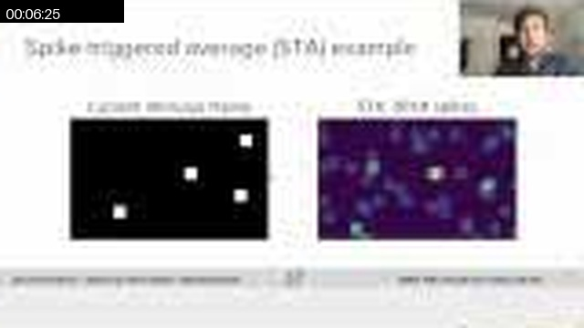

### 00:07:05

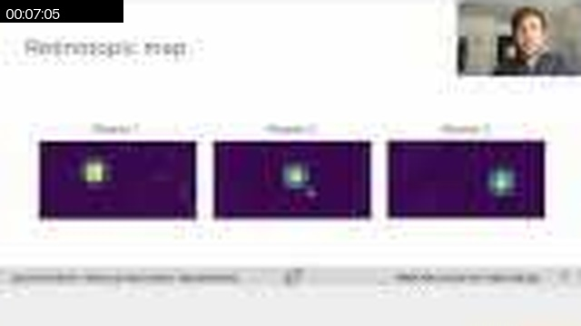

### 00:07:25

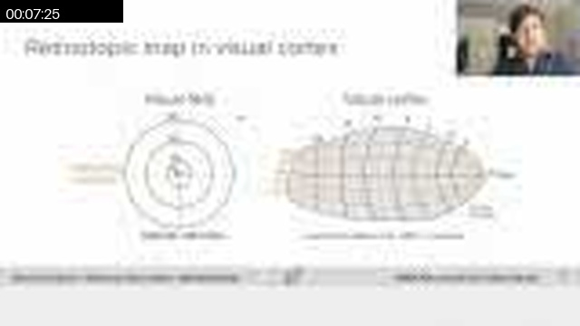

### 00:09:33

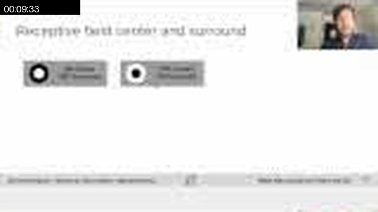

### 00:10:42

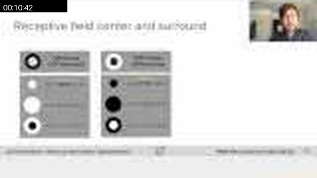

### 00:12:02

### 00:12:51

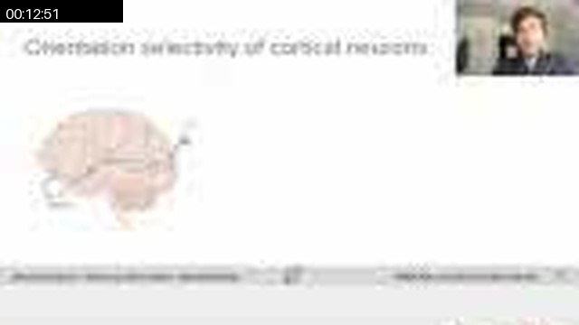

### 00:15:59

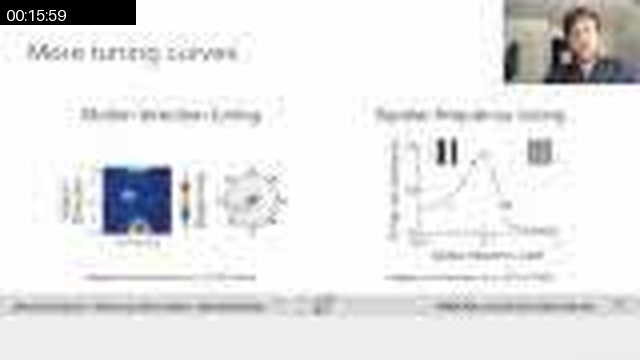

### 00:19:07

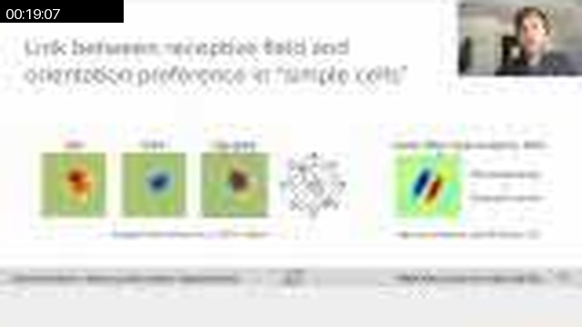

### 00:22:25

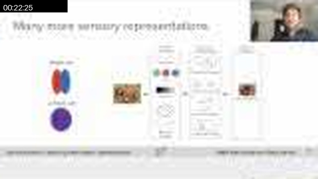

### 00:25:33

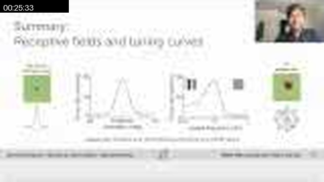

## Full Timeline Contact Sheet / 完整时间线联系表

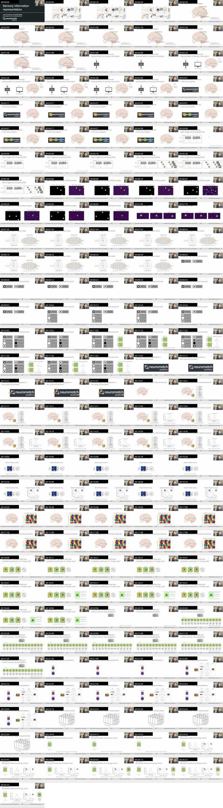
