# W0D0 Neurotransmitters - Structural Note / 结构化笔记

- Status / 状态: AI-generated draft based on the video captions; verify important scientific claims against primary sources. / 基于视频字幕生成的 AI 草稿；重要科学主张需回查一手来源。
- Course page / 课程页: https://compneuro.neuromatch.io/tutorials/W0D0_NeuroVideoSeries/student/W0D0_Tutorial11.html
- Video / 视频: https://youtube.com/watch?v=yik9AePHZ1A
- Caption basis / 字幕依据: `../summaries/11-neurotransmitters.summary.bilingual.md`

## Core Problem / 核心问题

**如何通过神经递质实现神经元间的通信，并由此解释学习与行为？**  
How do neurotransmitters enable communication between neurons, and how does this explain learning and behavior?

## Thesis / 核心论点

**神经元通过动作电位将电信号转化为化学信号（神经递质释放），递质与突触后受体结合产生兴奋或抑制；神经调质（如多巴胺）可调控突触强度，而长时程增强（LTP）是学习的细胞机制。**  
Neurons convert electrical signals into chemical signals (neurotransmitter release) via action potentials; transmitters bind to postsynaptic receptors to excite or inhibit. Neuromodulators (e.g., dopamine) can regulate synaptic strength, and long-term potentiation (LTP) is the cellular mechanism of learning.

## Argument Structure / 论证结构

1. **00:00:01 – 00:01:58** | **背景与基本结构**  
   中文：Emanuela Santini 实验室研究动机行为的分子机制；神经元由胞体、树突、轴突组成，少突胶质细胞形成髓鞘。  
   English: Emanuela Santini's lab studies molecular mechanisms of motivated behavior; neurons consist of soma, dendrites, axon; oligodendrocytes form myelin sheaths.

2. **00:02:11 – 00:04:39** | **静息膜电位的概念与维持**  
   中文：膜电位是神经元内外的电荷差；静息时内负外正，约–70 mV，由钠钾泵和选择性离子通道维持。  
   English: Membrane potential is the charge difference across the neuron; resting state is ~–70 mV (inside negative), maintained by Na⁺/K⁺ ATPase and selective ion channels.

3. **00:04:40 – 00:06:56** | **动作电位的产生与传播**  
   中文：足够刺激使膜去极化达阈值（约–55 mV），钠通道开放引起上升相，钾通道开放引起复极化和不应期。  
   English: Sufficient stimulation depolarizes membrane to threshold (~–55 mV); Na⁺ channels open (rising phase), K⁺ channels open (repolarization, refractory period).

4. **00:07:33 – 00:09:13** | **突触传递：电‑化学‑电转换**  
   中文：动作电位到达突触前终端，钙内流触发神经递质释放；递质与突触后离子型受体结合，离子流入改变膜电位。  
   English: Action potential reaches presynaptic terminal, Ca²⁺ influx triggers transmitter release; transmitters bind to postsynaptic ionotropic receptors, ion influx alters membrane potential.

5. **00:09:13 – 00:11:13** | **兴奋性与抑制性突触后电位**  
   中文：正离子内流产生EPSP（去极化），负离子内流产生IPSP（超极化）；代谢型受体通过G蛋白慢速调节功能。  
   English: Influx of positive ions creates EPSP (depolarization), negative ions create IPSP (hyperpolarization); metabotropic receptors use G proteins for slow modulation.

6. **00:11:38 – 00:17:31** | **主要神经递质与突触可塑性**  
   中文：谷氨酸（兴奋性，通过AMPA/NMDA等受体）、GABA（抑制性，通过GABA_A/GABA_B）、多巴胺（神经调质，容积传递）；重复刺激可增强突触强度（LTP），被视为学习机制。  
   English: Glutamate (excitatory via AMPA/NMDA), GABA (inhibitory via GABA_A/GABA_B), dopamine (neuromodulator via volume transmission); repeated stimulation enhances synaptic strength (LTP), considered a learning mechanism.

## Mechanism and Objects / 机制与对象

**建立的教学内容（established teaching content）：**

| 机制/对象 | 说明（双语） |
|-----------|--------------|
| 膜电位 | 神经元内外电荷差，静息时约–70 mV。Membrane potential: charge difference, ~–70 mV at rest. |
| 离子通道 | 选择性（Na⁺、K⁺、Cl⁻、Ca²⁺等）和电压门控/配体门控。Ion channels: selective and voltage‑gated/ligand‑gated. |
| 动作电位 | 全或无事件，由阈值触发，含上升相、下降相、不应期。Action potential: all‑or‑none, triggered at threshold, with rising/falling phases and refractory period. |
| 突触传递 | 电信号→化学信号（递质释放）→电信号。Synaptic transmission: electrical→chemical→electrical. |
| 离子型受体 | 配体门控离子通道，快速产生EPSP/IPSP。Ionotropic receptors: ligand‑gated ion channels, fast EPSP/IPSP. |
| 代谢型受体 | G蛋白耦联受体，慢速调节。Metabotropic receptors: GPCRs, slow modulation. |
| 谷氨酸 | 主要兴奋性递质，通过AMPA、NMDA、kainate受体。Glutamate: main excitatory transmitter via AMPA, NMDA, kainate. |
| GABA | 主要抑制性递质，通过GABA_A（Cl⁻通道）和GABA_B（代谢型）。GABA: main inhibitory transmitter via GABA_A (Cl⁻ channel) and GABA_B (metabotropic). |
| 多巴胺 | 神经调质，容积传递，通过D1/D2样G蛋白受体调控突触强度。Dopamine: neuromodulator, volume transmission, regulates synaptic strength via D1/D2‑like GPCRs. |
| 长时程增强（LTP） | 持续（分钟至月）的突触强度增加，学习的细胞机制。Long‑term potentiation (LTP): persistent enhancement of synaptic strength, cellular mechanism of learning. |

**解释区分（stated interpretation）：**  
- 多巴胺的容积传递被比喻为“化学广播信号”。Volume transmission of dopamine is analogized as a “chemical broadcast signal”.  
- LTP被明确提出为“学习的细胞机制”。LTP is explicitly stated as “cellular mechanism of learning”.

## Evidence and Method / 证据与方法

- **定性描述**：通过示意图展示静息膜电位（–70 mV）、阈值（–55 mV）、动作电位波形（上升相、复极化、超极化）。Illustrations show resting potential, threshold, action potential waveform.  
- **分类方法**：根据药物激活剂命名谷氨酸受体亚型（AMPA、NMDA、kainate）；根据结构差异区分离子型与代谢型受体。Receptor subtypes named after activating drugs; distinction between ionotropic and metabotropic based on structure.  
- **测量指标**：突触强度通过比较突触前刺激与突触后电位幅度来测量。Synaptic strength measured by comparing presynaptic stimulus to postsynaptic potential amplitude.  
- **因果推理**：重复刺激导致更大突触后电位（可能因递质释放量增加或受体数目增多），该持久增强被定为LTP。Repeated stimulation yields larger postsynaptic potentials; persistent enhancement termed LTP.

**注意**：字幕未提供定量实验数据或统计方法，仅有概念性证据。No quantitative experimental data or statistical methods provided; only conceptual evidence.

## Limits and Misconceptions / 局限与易错点

- **易错点：动作电位并非唯一信号方式**  
  中文：视频仅详细介绍动作电位作为电信号，但神经元也可产生局部电位（EPSP/IPSP）而不触发动作电位，容易忽略。  
  English: The video focuses on action potentials, but local potentials (EPSP/IPSP) without triggering APs also occur; learners may overlook subthreshold events.

- **易错点：代谢型受体并非直接产生电流**  
  中文：代谢型受体本身不含离子通道，通过G蛋白间接调节，学生可能混淆为直接离子通道。  
  English: Metabotropic receptors lack ion channels and modulate indirectly via G proteins; students may mistakenly think they are direct channels.

- **局限：未讨论突触后电位的时间总和与空间总和**  
  中文：视频未解释多个EPSP/IPSP如何在时间与空间上整合以决定是否触发动作电位。  
  English: The video does not cover temporal and spatial summation of postsynaptic potentials to determine AP initiation.

- **局限：LTP仅被定性介绍**  
  中文：LTP被提及为学习机制，但未解释分子通路（如NMDA受体依赖、钙信号）或实验证据。  
  English: LTP is stated as learning mechanism but molecular pathways (NMDA-dependent, Ca²⁺ signaling) or experimental evidence are not detailed.

## NeuroAI Connection / NeuroAI 连接

**解释/类比（interpretation/analogy），非等价：**

- **神经递质类比为AI中的“调制信号”**：就像多巴胺通过容积传递广泛调节突触强度，在强化学习中，奖励信号（如TD误差）全局调制网络权重更新。  
  Analogy: Neurotransmitters (e.g., dopamine) modulate synaptic strength globally, similar to reward signals (e.g., TD error) modulating weight updates in reinforcement learning.

- **LTP类比为“权重长期增强”**：生物LTP对应人工神经网络中通过Hebbian学习或反向传播实现的长期突触权重增加，但机制不同。  
  Analogy: LTP corresponds to long-term weight increase in ANNs via Hebbian learning or backpropagation, though mechanisms differ.

- **离子型与代谢型受体类比为“快速推理与缓慢学习”**：离子型受体提供瞬时响应（类似前馈计算），代谢型受体引发长时间信号级联（类似学习率调整或元学习）。  
  Analogy: Ionotropic receptors → fast feedforward computation; metabotropic receptors → slow modulatory cascades (like learning rate adjustment or meta‑learning).

## Review Questions / 复习问题

1. **中文**：静息膜电位大约是多少毫伏？主要由什么离子分布差异造成？  
   **English**: What is the approximate value of the resting membrane potential? Which ion distribution differences primarily cause it?  
   （答案：–70 mV；主要是K⁺内高外低，Na⁺和Cl⁻外高内低。）

2. **中文**：请分别说明谷氨酸和GABA在突触后神经元中产生何种电位（EPSP或IPSP），并指出它们对应的典型受体类型（离子型或代谢型）。  
   **English**: Describe whether glutamate and GABA produce EPSP or IPSP in the postsynaptic neuron, and name their typical receptor types (ionotropic or metabotropic).  
   （答案：谷氨酸→EPSP，离子型受体（AMPA/NMDA）；GABA→IPSP，离子型（GABA_A）和代谢型（GABA_B）。）

3. **中文**：什么是长时程增强（LTP）？视频中将其与什么认知功能联系起来？  
   **English**: What is long‑term potentiation (LTP)? With what cognitive function is it associated in the video?  
   （答案：持续的突触强度增强；学习与记忆。）

## Key Slide Guide / 关键幻灯片导读

| Time | Role | Bilingual Cue |
|------|------|---------------|
| 00:00:00 – 00:01:10 | 介绍实验室与神经元基本结构 | 中文：介绍Emanuela实验室及神经元（胞体、树突、轴突） English: Introduce lab and neuron structure (soma, dendrites, axon) |
| 00:01:10 – 00:04:40 | 膜电位定义与维持机制 | 中文：静息膜电位约–70 mV，由离子浓度差与泵/通道维持 English: Resting membrane potential ~–70 mV, maintained by ion gradients and pumps/channels |
| 00:04:40 – 00:06:56 | 动作电位产生与各时相 | 中文：阈值 –55 mV，钠通道开放（上升相），钾通道开放（复极化），不应期 English: Threshold –55 mV, Na⁺ channels open (rising phase), K⁺ channels open (repolarization), refractory period |
| 00:06:56 – 00:09:13 | 突触传递的电‑化学‑电转换 | 中文：钙内流触发递质释放，递质结合离子型受体，离子流入改变电位 English: Ca²⁺ influx triggers release; transmitter binds ionotropic receptors, ion influx changes potential |
| 00:09:13 – 00:11:13 | 兴奋/抑制性突触电位与受体类型 | 中文：EPSP（去极化）vs.IPSP（超极化）；代谢型受体通过G蛋白慢调 English: EPSP (depolarization) vs. IPSP (hyperpolarization); metabotropic receptors slow modulation via G proteins |
| 00:11:38 – 00:12:40 | 谷氨酸系统 | 中文：主要兴奋性递质，AMPA/NMDA/kainate受体，介导EPSP，参与学习记忆 English: Main excitatory transmitter, AMPA/NMDA/kainate receptors, mediates EPSP, involved in learning/memory |
| 00:12:42 – 00:14:00 | GABA系统 | 中文：主要抑制性递质，GABA_A是氯通道，GABA_B是代谢型，产生IPSP English: Main inhibitory transmitter, GABA_A is Cl⁻ channel, GABA_B is metabotropic, produces IPSP |
| 00:14:02 – 00:15:32 | 多巴胺神经调质 | 中文：容积传递，通过D1/D2 G蛋白受体调控递质释放与突触强度；参与运动、奖赏 English: Volume transmission, via D1/D2 GPCRs regulates transmitter release and synaptic strength; involved in movement, reward |
| 00:15:33 – 00:17:31 | 突触强度与长时程增强 | 中文：突触强度由突触后电位幅度衡量；重复刺激增强强度（LTP），学习的细胞机制 English: Synaptic strength measured by postsynaptic potential amplitude; repeated stimulation increases strength (LTP), cellular mechanism of learning |

## Key Slide Screenshots / 关键幻灯片截图

These are representative frames from YouTube's public 10-second storyboard, not original-resolution stills. / 以下为 YouTube 公开 10 秒分镜中的代表帧，并非原始分辨率截图。

### 00:00:00

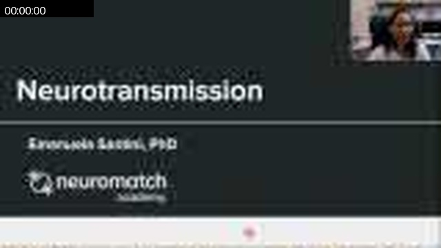

### 00:00:59

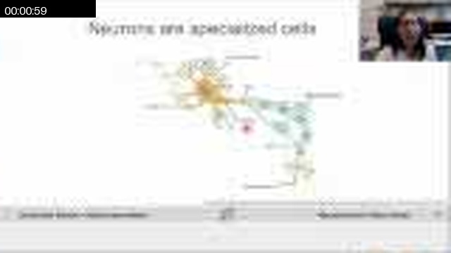

### 00:02:08

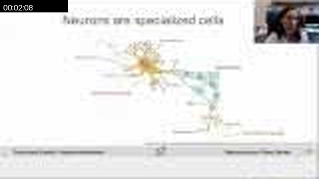

### 00:04:16

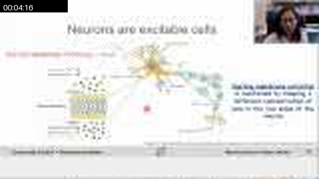

### 00:06:34

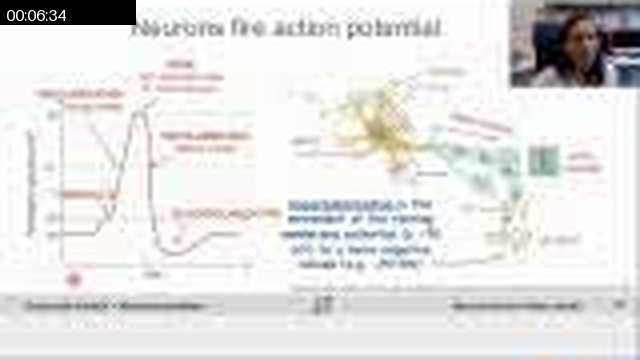

### 00:08:42

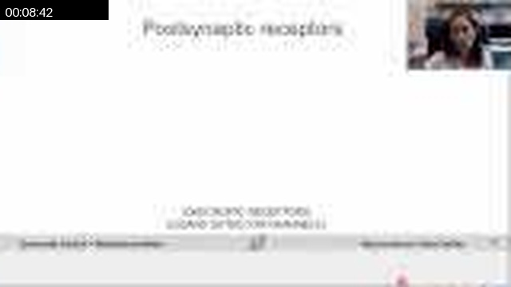

### 00:10:50

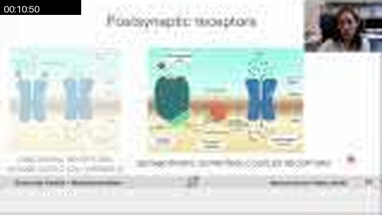

### 00:13:08

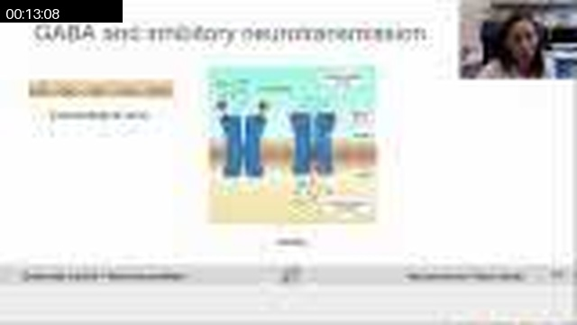

### 00:15:16

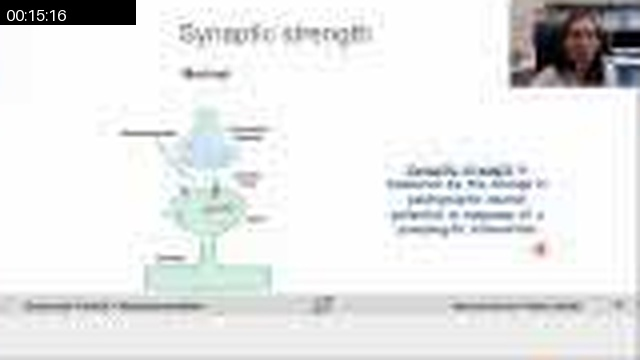

### 00:17:25

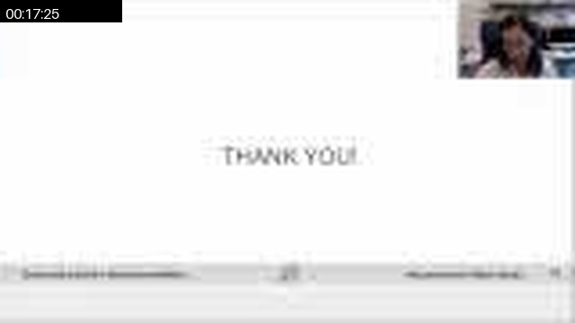

## Full Timeline Contact Sheet / 完整时间线联系表

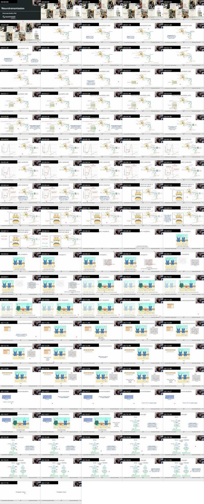
