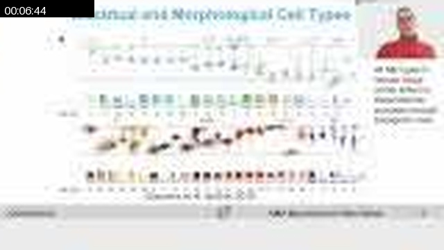
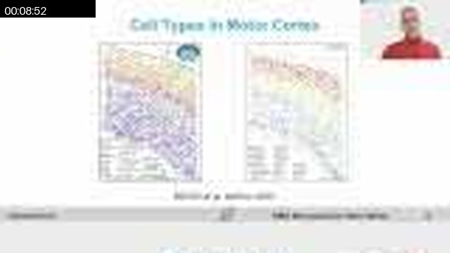
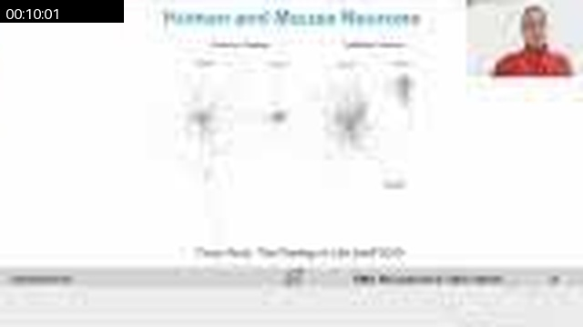
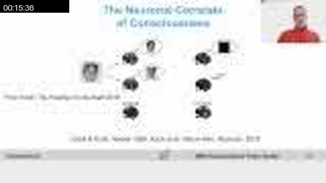
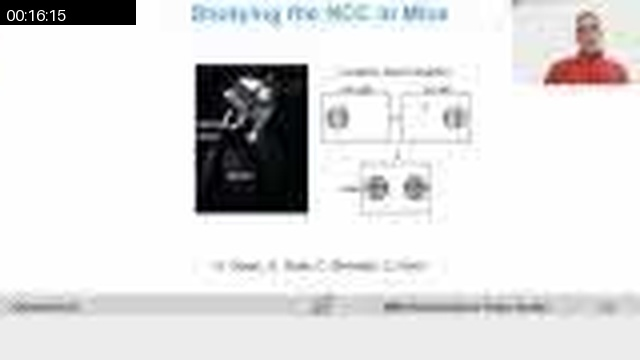
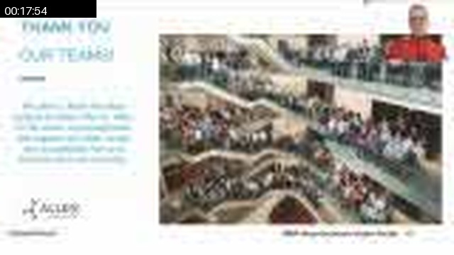
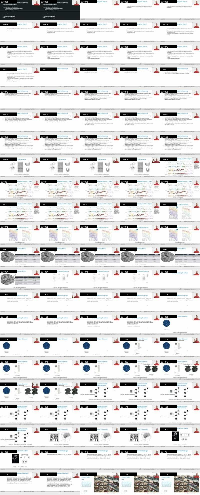

# W0D0 Neurons to Consciousness - Structural Note / 结构化笔记

- Status / 状态: AI-generated draft based on the video captions; verify important scientific claims against primary sources. / 基于视频字幕生成的 AI 草稿；重要科学主张需回查一手来源。
- Course page / 课程页: https://compneuro.neuromatch.io/tutorials/W0D0_NeuroVideoSeries/student/W0D0_Tutorial12.html
- Video / 视频: https://youtube.com/watch?v=CevNjz23pIM
- Caption basis / 字幕依据: `../summaries/12-neurons-to-consciousness.summary.bilingual.md`

```markdown
## Core Problem / 核心问题

如何从分子、细胞和系统层面理解大脑这一高度互联的器官，并最终揭示意识的神经基础。  
How to understand the brain as a highly interconnected organ at molecular, cellular and systems levels, and ultimately uncover the neural basis of consciousness.

## Thesis / 核心论点

大脑由约1000种细胞类型构成，通过高度递归连接实现功能；研究意识需要对比范式识别最小神经机制，并通过大规模记录方法（如钙成像、神经像素探针）在动物模型中探索。  
The brain consists of about 1,000 cell types connected in a highly recurrent manner; studying consciousness requires contrast paradigms to identify minimal neural mechanisms, and large-scale recording methods (e.g., calcium imaging, neural pixel probes) in animal models.

## Argument Structure / 论证结构

1. **00:00:22.720 – 00:01:57.760** · 动机  
   **中文：** 研究大脑有四个动机：医学治疗疾病、好奇心理解意识、功能增强、以及启发人工智能。  
   **English:** Four motivations drive brain research: medical treatment of disease, curiosity to understand consciousness, capability enhancement, and inspiration for artificial intelligence.

2. **00:02:38.320 – 00:04:23.520** · 细胞类型是基本构件  
   **中文：** 大脑中约有1000种细胞类型，由形态、转录组和投射目标定义；部分只在发育早期短暂存在。  
   **English:** The brain contains about 1,000 cell types defined by morphology, transcriptomics, and projection targets; some exist only transiently during development.

3. **00:05:39.840 – 00:07:45.600** · 皮层结构与细胞多样性  
   **中文：** 皮层是2–3毫米厚的薄片，有6层；仅小鼠视觉皮层就有约50种兴奋性和抑制性细胞类型，按位置、形态和电生理分类。  
   **English:** The cortex is a 2–3 mm thin sheet with 6 layers; mouse visual cortex alone has about 50 excitatory and inhibitory cell types classified by location, morphology, and electrophysiology.

4. **00:07:45.600 – 00:09:33.600** · 物种间缩放不是简单等比  
   **中文：** 小鼠和人脑神经元数量相差约1000倍，但皮层区域内的细胞类型数目大致相当（80–100种），进化差异明显。  
   **English:** Neuron numbers differ ~1000-fold between mouse and human, but per-area cell type count is similar (80–100); evolutionary divergence prevents simple scaling.

5. **00:09:33.600 – 00:11:42.000** · 研究需要大规模记录  
   **中文：** 理解认知模块需在单神经元级别记录多个脑区，因此需要建立专门的脑观测站并公开数据。  
   **English:** Understanding cognitive modules requires single-neuron recording across many brain regions, necessitating specialized brain observatories with open data.

6. **00:11:42.000 – 00:14:17.120** · 记录技术示例  
   **中文：** 双光子钙成像（30 Hz）可追踪同一神经元数小时；神经像素探针（30 kHz）记录电极周围100 μm内任意神经元的spike。  
   **English:** Two-photon calcium imaging (30 Hz) tracks the same neuron over hours; neural pixel probes (30 kHz) record spikes from any neuron within 100 μm of the electrode.

7. **00:14:51.840 – 00:16:33.040** · 意识的神经关联  
   **中文：** 通过对比范式（如清醒 vs 麻醉、可见 vs 不可见）识别意识的神经关联（NCC），必须区分背景条件与NCC。  
   **English:** Contrast paradigms (wake vs anesthesia, seen vs unseen) identify neural correlates of consciousness (NCC); background conditions must be distinguished from NCC.

## Mechanism and Objects / 机制与对象

| 类别 | 内容（均为视频中直接提到的教学内容） |
|------|----------------------------------------|
| **生物机制** | 细胞类型（兴奋性、抑制性）、皮层分层（L1–L6）、投射系统（intraencephalic, extraencephalic）、发育中的凋亡（transient cell types） |
| **测量信号** | 双光子钙成像（荧光强度，30 Hz）、神经像素探针（spike电压，30 kHz）、MERFISH（空间转录组） |
| **计算对象** | 意识的神经关联（NCC，最小神经机制）、对比范式（face vs noise, wake vs anesthesia） |
| **结构对象** | 小鼠大脑（<0.5 g, ~7400万神经元）、人类大脑（1300 g, ~860亿神经元）；皮层面积对比（小鼠<1 cm², 人1200–1300 cm²） |

无陈述性解释——所有内容均作为既定教学事实给出。

## Evidence and Method / 证据与方法

- **细胞类型计数**：通过形态学、转录组学和投射追踪，报告小鼠海马和皮层约400种细胞类型，全脑约1000种。  
- **皮层厚度与面积**：人皮层2–3 mm厚，面积1200–1300 cm²；小鼠皮层更薄、面积<1 cm²。  
- **大规模记录**：双光子钙成像记录约6万神经元同时活动；神经像素探针带300+电极、30 kHz采样。  
- **意识研究**：使用模糊图案快速闪现的对比范式，结合清醒/麻醉、掩蔽范式与光遗传学操纵。  
- **数据开放**：通过brain-map和标准SDK提供数十万神经元数据。

## Limits and Misconceptions / 局限与易错点

- **背景条件与NCC混淆**：必须区分心跳、供氧等支撑条件与足以产生意识体验的最小神经机制（00:15:50.880 – 00:16:06.000）。  
- **小鼠≠缩小的人**：小鼠和人大脑相差～1000倍神经元，但并非简单缩放，因共同祖先距今6500万年且进化分化显著（00:09:33.600 – 00:10:02.480）。  
- **大脑≠前馈网络**：皮层高度递归连接，与深度前馈网络根本不同（00:10:35.760 – 00:11:06.080, 00:16:45.680 – 00:17:14.000）。  
- **计算模型能否理解大脑**：纯计算神经网络能否理解已知宇宙中最复杂的活性物质尚无定论（00:17:35.760 – 00:18:03.840）。

## NeuroAI Connection / NeuroAI 连接

> 以下为类比或解释性连接，非等价性主张。

- **启发来源**：人脑是唯一已知的智能系统，启发了从McCulloch–Pitts到现代深度卷积网络的神经网络发展（00:01:57.760 – 00:02:36.240）。  
- **计算复杂度差异**：数字计算机用少数通用门，大脑使用约1000种神经元类型，这对神经形态计算建模提出挑战（00:17:14.000 – 00:17:35.760）。  
- **递归连接**：大脑的高度递归性提示AI架构应更关注递归而非纯前馈（00:10:35.760 – 00:11:06.080）。

## Review Questions / 复习问题

1. **中文：** 研究大脑的四个主要动机是什么？  
   **English:** What are the four main motivations for studying the brain?  
2. **中文：** 意识的神经关联（NCC）是如何定义的？它与背景条件有何区别？  
   **English:** How is the neural correlate of consciousness (NCC) defined, and how does it differ from background conditions?  
3. **中文：** 小鼠与人类大脑在细胞类型数量、神经元总数和皮层厚度方面有何异同？  
   **English:** What are the similarities and differences in cell-type count, total neurons, and cortical thickness between mouse and human brains?

## Key Slide Guide / 关键幻灯片导读

| Time | Role | Bilingual cue |
|------|------|---------------|
| 00:00:00 – 00:01:57 | Introduction & Motivations | 四个动机 / Four motivations |
| 00:02:38 – 00:04:23 | Cell types as building blocks | 约1000种细胞类型 / ~1,000 cell types |
| 00:05:39 – 00:07:12 | Cortical structure & excitatory types | 皮层6层，兴奋性细胞分类 / 6 cortical layers, excitatory cell classification |
| 00:07:12 – 00:07:45 | Inhibitory interneurons | 抑制性中间神经元（PV, somatostatin） / Inhibitory interneurons (PV, somatostatin) |
| 00:07:45 – 00:09:33 | Cross-species comparison | 小鼠 vs 人：神经元数量、面积、进化 / Mouse vs human: neuron numbers, area, evolution |
| 00:09:33 – 00:11:42 | Need for large-scale recording | 需建脑观测站 / Need for brain observatories |
| 00:11:42 – 00:14:17 | Recording technologies | 双光子钙成像 & 神经像素探针 / Two-photon calcium imaging & neural pixel probes |
| 00:14:51 – 00:16:33 | Consciousness & NCC | 对比范式、NCC定义 / Contrast paradigm, NCC definition |
| 00:16:45 – 00:18:03 | Challenges & Conclusion | 递归连接 vs 前馈网络；未解问题 / Recurrent vs feedforward; open question |
```

## Key Slide Screenshots / 关键幻灯片截图

These are representative frames from YouTube's public 10-second storyboard, not original-resolution stills. / 以下为 YouTube 公开 10 秒分镜中的代表帧，并非原始分辨率截图。

### 00:00:00


### 00:00:19


### 00:02:17


### 00:04:26


### 00:06:44



### 00:08:52



### 00:10:01



### 00:11:10


### 00:13:28


### 00:14:17


### 00:15:36



### 00:16:15



### 00:16:35


### 00:17:34


### 00:17:54



## Full Timeline Contact Sheet / 完整时间线联系表


